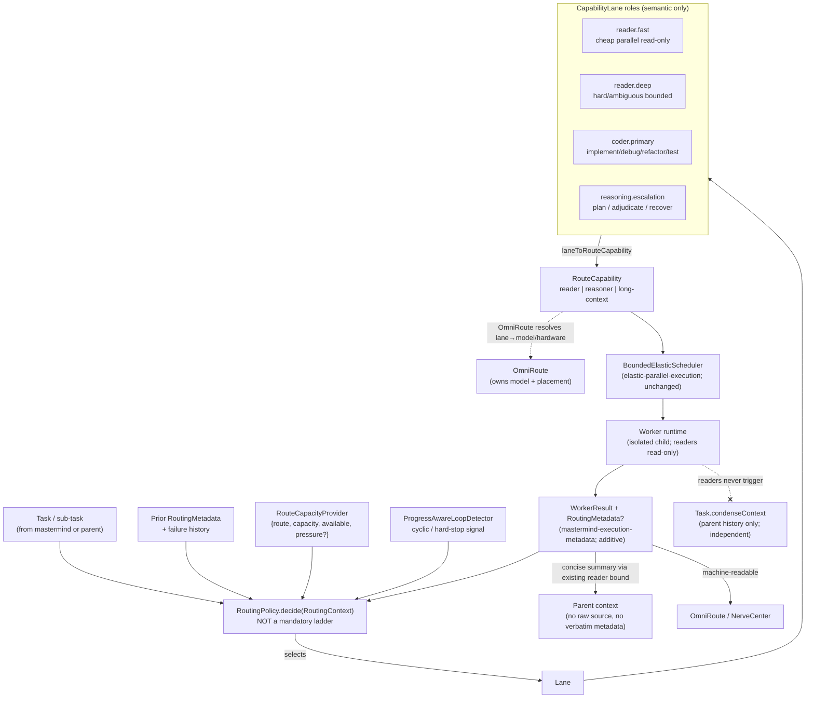
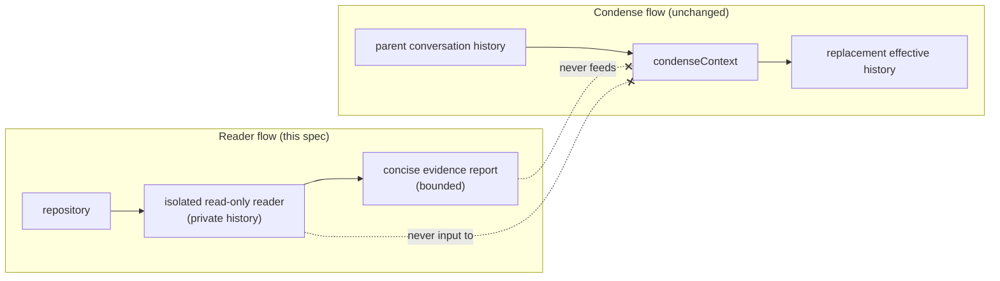

# Design Document

## Overview

This feature is the **Capability Lanes, Model Routing, and Escalation Policy** amendment to the Menagerie Autonomous Operations Lift. It adds a thin **capability-lane layer that sits *above* the elastic scheduler and the structured worker-result contract** — it decides *which cognitive role* should do a piece of work and *when to escalate*, then hands the work to the machinery that already exists. It changes neither the scheduler's mechanics (owned by `elastic-parallel-execution`), the `WorkerResult` base contract (owned by `mastermind-execution-metadata`), the `AdaptiveReasoningController`, condensation, nor the `RouteCapability` enum. Every addition is additive.

The layer is built from six pure, testable pieces plus their wiring:

1. **`CapabilityLane`** — four semantic role identifiers (`reader.fast`, `reader.deep`, `coder.primary`, `reasoning.escalation`) and a total **`laneToRouteCapability`** mapping onto the existing `RouteCapability` vocabulary. Lanes are roles; OmniRoute owns the lane→model/hardware resolution. No model name, size, quantization, or GPU identity ever appears in Menagerie's lane logic.
2. **`RoutingPolicy`** — a pure decision function that selects a lane for a `(task, context)` from task type, estimated complexity, confidence from prior `RoutingMetadata`, previous failures, context requirements, available `RouteCapacity`, model residency, latency, and queue pressure. It is explicitly **not a mandatory ladder**: a simple lookup routes `reader.fast → parent` and never touches the deeper lanes.
3. **`ReaderEscalationDecision`** — a confidence-driven decision that escalates `reader.fast → reader.deep` on investigation-quality triggers read from `RoutingMetadata`, **never** on token count. It also carries a resource-cost model so the scheduler can treat a swap as a resource-affecting operation.
4. **`PreparedContextWorkPackage`** — a compact package delivered to `coder.primary` built from reader findings plus `Worker_Bootstrap_Retrieval` evidence and `AutonomousTaskState`; concise findings only, never raw source.
5. **GLM dual-role invocation gate** — a scarcity-preserving gate that invokes `reasoning.escalation` for planning/orchestration or for adjudication/failure-recovery only when defined triggers (including the loop detector's cyclic-behavior signal) are present.
6. **`RoutingMetadata`** — the additive optional extension of `WorkerResult`, consumed by OmniRoute/NerveCenter, never injected verbatim into the parent context.

The governing principle is **the smallest model capable of obtaining reliable evidence gathers evidence; the strongest appropriate model makes decisions and modifications.** Menagerie expresses that as lane *roles*; OmniRoute schedules the silicon.

### Verified codebase grounding

| Element | Location | How this design uses it |
| --- | --- | --- |
| `parallelTaskSpecSchema` / `ParallelTaskSpec` (`name`, `mode`, `message`, `todos`, `route`) | `src/core/tools/ParallelTasksTool.ts` | Lane assignment rides **additively** on the existing spec: reader workers already use `mode: "project-reader"`; the lane is carried as additive routing metadata / via the existing `route` passthrough. `.strip()` keeps old specs valid. |
| `MAX_READER_PARENT_RESULT_CHARS = 2_400`, `MAX_WORKER_PARENT_RESULT_CHARS`, `compactParallelTasksResultForParent` | `src/core/tools/ParallelTasksTool.ts` | The existing **reader bounded-output** path is the mechanism by which reader findings reach the parent as a concise summary; this design reuses it unchanged and never adds a new parent-injection path. |
| `AUTO_READER_NAME = "m5-contract-audit"`, `mode: "project-reader"` | `src/core/task/ParallelTaskReader.ts` | Reader workers run read-only in `project-reader` mode with bounded output; reader isolation reuses this role rather than inventing a new one. |
| `runParallelTasks(parent, provider, specs)` | `src/core/task/runParallelTasks.ts` | Readers execute in isolated child runtimes with private histories; the lane layer only chooses *which* specs to build and *what* lane each carries. |
| `AttemptCompletionTool` | `src/core/tools/AttemptCompletionTool.ts` | Reader termination uses the existing short reader `attempt_completion` contract (Req 3.6). |
| `Task.condenseContext` | `src/core/task/Task.ts` | Condensation of the parent conversation history; this design keeps reader execution strictly independent of it (Req 11). |
| `ProgressAwareLoopDetector` (hard stop on no-progress across multiple completed executions) | `src/core/tools/ProgressAwareLoopDetector.ts` (`progress-aware-loop-detection`) | Its cyclic-behavior / hard-stop signal is one GLM adjudication trigger (Req 8.8). |

### Cross-spec contracts consumed (not redefined)

- **elastic-parallel-execution**: `RouteCapability = "reader" | "reasoner" | "long-context" | "vision" | "general"`; `RouteCapacity { route, capacity, available, capability, pressure? }`; `RouteCapacityProvider`; `InferenceLeasePool.acquire(priority, signal)`; `BoundedElasticScheduler { admitPlan, dispatch, onWorkerSettled, snapshotStates }`; `SchedulingPriority`; `LogicalWorker`; `ExecutionPlan`; `ParallelismMetrics`. This spec adds a lane layer **above** the scheduler; the scheduler's mechanics and the `RouteCapability` enum are untouched.
- **mastermind-execution-metadata**: `WorkerResult { status, summary, findings, evidence, changes, tests, blockers, artifacts, reasoning? }`; `WorkerReasoningPolicy`; `AdaptiveReasoningController`; `VerificationPolicy`; `AutonomousTaskState`; `ParallelTaskSpec.reasoning?/verification?`. This spec **additively** extends `WorkerResult` with optional `RoutingMetadata`; the base contract and the reasoning controller are unchanged.
- **semantic-first-retrieval**: `RetrievalGatewayClient.retrieve`, `EvidencePacket`, `SemanticFinding`, `Worker_Bootstrap_Retrieval`, `Reader_Swarm_Packet`, `Shared_Retrieval_Memory`, `ExplorationPolicy`. The prepared-context work package consumes reader findings plus `Worker_Bootstrap_Retrieval` evidence; readers consume reader-swarm packets.
- **progress-aware-loop-detection**: `ProgressAwareLoopDetector` cyclic-behavior hard stop is a GLM escalation/adjudication trigger.

## Architecture

The lane layer is an advisory decision layer. For each unit of work: `RoutingPolicy` selects a `CapabilityLane`; the lane maps to a `RouteCapability` via `laneToRouteCapability`; OmniRoute resolves that capability to a concrete model and hardware; the worker runs through the existing `BoundedElasticScheduler`; its `WorkerResult` carries optional `RoutingMetadata`; and the policy consumes that metadata to decide the next step — continue, escalate (`reader.fast → reader.deep`), or adjudicate (`reasoning.escalation`).



### Where the layer hooks relative to the existing code

- **Lane assignment** is attached to the work *before* it reaches `runParallelTasks`. `ParallelTasksTool` already builds `ParallelTaskSpec`s with `mode` and `route`; the lane rides on that spec additively (reader workers already carry `mode: "project-reader"`, and the `route` field already passes an OmniRoute route id through). The `RoutingPolicy` runs where the mastermind decomposes work and sizes the reader swarm — it chooses the lane per spec; it does **not** change how the scheduler dispatches or leases.
- **Escalation and adjudication** run *after* a `WorkerResult` settles. The policy reads the result's `RoutingMetadata` (plus failure history and the loop-detector signal), and either builds a follow-up spec in a deeper lane or invokes `reasoning.escalation`. Because the scheduler publishes a settle event (`onWorkerSettled`), the policy acts on each result as it arrives.
- **Prepared-context handoff** runs *between* reader completion and the coder spec: the package builder consumes reader findings and bootstrap evidence and becomes the `message`/context seed for the `coder.primary` spec.

### Lanes are roles; OmniRoute owns resolution

A `CapabilityLane` names *cognitive work*, not a model or a GPU. The intended current bindings (`reader.fast` ≈ a small reader model, `reader.deep` ≈ a larger reader model on shared hardware, `coder.primary` ≈ a code model, `reasoning.escalation` ≈ a high-capability reasoner) live entirely in OmniRoute's configuration. If OmniRoute remaps a lane to a different model or different hardware, Menagerie's logic is unchanged because it reads only the role name and the resulting `RouteCapability`/`RouteCapacity`. This is the architectural reason the lane logic never branches on model/GPU identity (Req 1.2, 1.3, 2.5, 10.8, 13.4).

### Reader isolation and the concise-summary boundary

Reader workers reuse the existing isolated-worker machinery: each runs in a private conversation history (its own `Task` child), stays read-only (`project-reader` mode), and terminates through the short reader `attempt_completion` contract. Their output reaches the parent through the **existing reader bounded-output path** (`compactParallelTasksResultForParent` with `MAX_READER_PARENT_RESULT_CHARS = 2_400`), which delivers a concise evidence summary — findings, evidence references, relevant symbols/paths, a confidence assessment, and optionally a requested patch — never the reader's full transcript, intermediate steps, or raw source blocks. The parent never inherits the reader's internal reasoning or tool-call history (Req 3, 4).

### Confidence-driven escalation and shared-hardware cost

`reader.fast` is the default reader lane. Escalation to `reader.deep` is driven by **investigation-quality** triggers read from `RoutingMetadata` (low confidence, contradictory/`conflicting_findings`, multi-subsystem relationships, unsuccessful bounded searches, hard type/control/data-flow analysis, architectural ambiguity, reader disagreement, or an explicit parent request via `recommended_escalation`), **never** by token count. Because `reader.fast` and `reader.deep` may currently share hardware, escalating is a *resource-affecting* operation: the decision consumes a cost model expressed purely in `RouteCapacity` terms (model-swap/load latency, interruption of parallel `reader.fast` capacity, queued reader work, expected deep-task duration, and whether another model on different hardware can answer). The threshold to escalate `reader.fast → reader.deep` is strictly higher than the threshold to spawn another `reader.fast` worker. `reader.deep` improves investigation quality; it never replaces `coder.primary` for implementation. The scheduler mechanics stay in `elastic-parallel-execution`; this layer only supplies the decision and reads capacity through `RouteCapacityProvider`/`InferenceLeasePool`.

### GLM dual roles and the scarcity gate

`reasoning.escalation` (GLM) has two roles — **planning/orchestration** (decompose a problem, identify investigation questions, assign reader scopes, define implementation constraints, synthesize findings) and **escalation/adjudication** (resolve failures, disagreements, and architectural ambiguity). It is a **scarce** resource: it is invoked only when a defined planning or adjudication trigger is present, and never required per task. The adjudication trigger set is evaluated from `RoutingMetadata` (confidence, `conflicting_findings`, `ambiguities`, `recommended_escalation`, `failure_class`), the task's **failure history** (repeated `coder.primary` failures), and the **loop detector's** cyclic/hard-stop signal (Req 8.8).

### Condense independence

Reader execution and conversation condensation are two disjoint data flows. Readers: *repository → isolated read-only worker → concise evidence report*. Condensation: *parent conversation history → `condenseContext` → replacement effective history*. Spawning readers never triggers `condenseContext`; reader evidence summaries are neither input to nor output of condense; reader histories are never condense input. The reader mechanism exists precisely to keep raw repository context *out* of the parent window, which is a different concern from condensing the parent's own transcript length.



## Components and Interfaces

### `CapabilityLane` + `laneToRouteCapability`

```ts
export type CapabilityLane = "reader.fast" | "reader.deep" | "coder.primary" | "reasoning.escalation"

/** The four lanes as an exhaustive, ordered role list (Req 1.1). */
export const CAPABILITY_LANES = ["reader.fast", "reader.deep", "coder.primary", "reasoning.escalation"] as const

/** Task-type hint used only to disambiguate coder/reasoning capability (never model identity). */
export type LaneTaskType =
	| "lookup"
	| "implementation"
	| "debugging"
	| "refactor"
	| "test"
	| "architecture"
	| "adjudication"
	| "long-horizon"

/**
 * Total, range-safe mapping from a semantic lane role onto the existing RouteCapability
 * vocabulary (elastic-parallel-execution). Readers always map to "reader"; coder.primary
 * maps to "reasoner" or "general" by task type; reasoning.escalation maps to "long-context"
 * or "reasoner" by task type. No model/GPU identity participates (Req 2.1–2.4).
 */
export function laneToRouteCapability(lane: CapabilityLane, type: LaneTaskType): RouteCapability {
	switch (lane) {
		case "reader.fast":
		case "reader.deep":
			return "reader"
		case "coder.primary":
			// code reasoning → "reasoner"; mechanical/general edits → "general"
			return type === "implementation" || type === "debugging" || type === "refactor" ? "reasoner" : "general"
		case "reasoning.escalation":
			// system-wide / long-horizon → "long-context"; adjudication/decision → "reasoner"
			return type === "long-horizon" || type === "architecture" ? "long-context" : "reasoner"
	}
}
```

`RouteCapability` is imported from `elastic-parallel-execution`; this module never redefines it (Req 2.4).

### `RoutingPolicy`

A pure decision component. It takes a `RoutingContext` and returns a `RoutingDecision`; it performs no I/O (capacity and failure history are passed in), which keeps it unit- and property-testable.

```ts
export interface RoutingContext {
	taskType: LaneTaskType
	estimatedComplexity: number // 0..1, caller-estimated
	priorMetadata?: RoutingMetadata // confidence/ambiguities/etc. from a prior WorkerResult
	previousFailures: number // count of prior coder.primary failures for this task
	contextRequirement: "small" | "large" | "system-wide"
	capacity: readonly RouteCapacity[] // snapshot from RouteCapacityProvider (no GPU identity)
	modelResident: boolean // is a model for the candidate capability already resident
	latencyBudget?: "tight" | "normal" | "relaxed"
	queuePressure: number // 0..1, from scheduler/route pressure
	explicitLaneRequest?: CapabilityLane // honoured when the parent explicitly asks
	loopSignal?: "none" | "cyclic" | "hard-stop" // from ProgressAwareLoopDetector
}

export interface RoutingDecision {
	/** The lane this unit of work is assigned to now. */
	lane: CapabilityLane
	/** The resolved RouteCapability for the scheduler/OmniRoute. */
	capability: RouteCapability
	/** The ordered lane pattern the policy intends for this task (for observability/tests). */
	pattern: CapabilityLane[]
	/** Rationale tags (quality trigger names, "direct-assignment", etc.) — never model/GPU identity. */
	reasons: string[]
}

export interface RoutingPolicy {
	/** Pure, synchronous. Selects the lane without forcing a sequential ladder (Req 9). */
	decide(ctx: RoutingContext): RoutingDecision
}
```

**The five routing patterns the policy encodes (Req 9.3–9.7):**

| Task shape | Pattern |
| --- | --- |
| Simple repository lookup | `reader.fast → parent synthesis` (never touches deep/coder/GLM) |
| Normal implementation | `reader.fast × N (parallel) → coder.primary` |
| Ambiguous investigation | `reader.fast × N → reader.deep → coder.primary` |
| Architectural problem | `reasoning.escalation (planning) → reader.fast × N → coder.primary` |
| Repeated implementation failure | `reader.fast → coder.primary → fail → coder.primary retry → reasoning.escalation (adjudication)` |

The policy is **not a ladder**: for a `lookup` task it returns `pattern: ["reader.fast"]` and selects `reader.fast`; for an architectural task it starts at `reasoning.escalation`, skipping the reader lanes as the first step; `explicitLaneRequest` and `direct-assignment` task characteristics let the policy jump straight to a lane (Req 9.1, 9.8).

### `ReaderEscalationDecision`

A pure decision for `reader.fast → reader.deep`, keyed on the eight quality triggers read from `RoutingMetadata` and carrying a resource-cost model. It never consults token count (Req 5, 10).

```ts
export type ReaderQualityTrigger =
	| "low-confidence"
	| "contradictory-evidence"
	| "multi-subsystem"
	| "unsuccessful-search"
	| "hard-analysis"
	| "architectural-ambiguity"
	| "reader-disagreement"
	| "explicit-request"

/** Cost inputs expressed purely in RouteCapacity terms — no GPU/VRAM identity (Req 10.8). */
export interface EscalationCost {
	modelSwapLoadLatencyMs: number // Req 10.2
	interruptsParallelFastCapacity: boolean // Req 10.3
	queuedFastReaderWork: number // Req 10.4
	expectedDeepTaskMs: number // Req 10.5
	alternateHardwareCanAnswer: boolean // Req 10.6 — another resident model elsewhere
	capacity: readonly RouteCapacity[] // the only capacity source consulted
}

export interface ReaderEscalationInput {
	metadata?: RoutingMetadata // triggers come from here, never from token count
	explicitRequest: boolean
	cost: EscalationCost
}

export type ReaderEscalationOutcome =
	| { action: "stay-fast"; reasons: string[] }
	| { action: "spawn-another-fast"; reasons: string[] }
	| { action: "escalate-deep"; triggers: ReaderQualityTrigger[]; reasons: string[] }

export interface ReaderEscalationDecision {
	/**
	 * Returns escalate-deep only when a quality trigger is present AND the resource cost clears
	 * the deep threshold, which is strictly higher than the spawn-another-fast threshold
	 * (Req 10.7). An explicit parent request mandates escalation (Req 5.9).
	 */
	decide(input: ReaderEscalationInput): ReaderEscalationOutcome
}
```

The quality triggers are derived from `RoutingMetadata` fields: `confidence` below a threshold → `low-confidence`; `conflicting_findings > 0` → `contradictory-evidence`/`reader-disagreement`; `ambiguities > 0` → `architectural-ambiguity`; `recommended_escalation === "reader.deep"` or `explicitRequest` → `explicit-request`. `multi-subsystem`, `unsuccessful-search`, and `hard-analysis` are supplied as caller-derived flags on the metadata/finding. `reader.deep` is never selected for implementation work — that is `coder.primary` (Req 5.11).

### `PreparedContextWorkPackage` builder

```ts
export interface PreparedContextWorkPackage {
	objective: string
	relevantFiles: string[]
	relevantSymbols: string[]
	readerFindings: ReaderFinding[] // concise findings, not raw source (Req 6.5)
	architecturalConstraints: string[]
	knownAssumptions: string[]
	existingTestFailures: string[]
	expectedBehavior: string
	implementationBoundaries: string[]
}

/** One concise reader finding — the Req 4 output contract shape, never raw source. */
export interface ReaderFinding {
	claim: string
	location?: string // file:line reference, not a code block
	whyItMatters?: string
	uncertainty?: string
	confidence?: number
	evidence: EvidenceReference[] // reuse mastermind-execution-metadata EvidenceReference
}

export interface PreparedContextInputs {
	objective: string
	readerFindings: ReaderFinding[] // from the reader output contract (Req 4)
	bootstrap?: EvidencePacket // Worker_Bootstrap_Retrieval, semantic-first-retrieval
	taskState?: AutonomousTaskState // mastermind-execution-metadata
}

export interface PreparedContextWorkPackageBuilder {
	/** Populate only the defined fields; omit fields with no available input. Never embeds raw source. */
	build(inputs: PreparedContextInputs): PreparedContextWorkPackage
}
```

The builder merges reader findings (Req 4), `Worker_Bootstrap_Retrieval` evidence (semantic-first-retrieval), and `AutonomousTaskState` (objective/constraints/assumptions/test failures). It copies only concise findings and evidence references — it never copies full file contents or function bodies (Req 6.5). The package becomes the context seed for the `coder.primary` spec before implementation (Req 6.2).

### GLM invocation gate

```ts
export type GlmPlanningTrigger = "complex-decomposition" | "scope-assignment" | "constraint-definition" | "synthesis"

export type GlmAdjudicationTrigger =
	| "repeated-coder-failure" // Req 8.1
	| "reader-disagreement" // Req 8.2
	| "bug-vs-architecture-conflict" // Req 8.3
	| "system-wide-reasoning" // Req 8.4
	| "cross-subsystem-design" // Req 8.5
	| "coder-low-confidence" // Req 8.6
	| "architectural-uncertainty-despite-passing-tests" // Req 8.7
	| "loop-detector-cyclic" // Req 8.8

export interface GlmInvocationInput {
	metadata?: RoutingMetadata
	previousFailures: number
	loopSignal: "none" | "cyclic" | "hard-stop"
	complexity: number // 0..1
	contextRequirement: "small" | "large" | "system-wide"
}

export type GlmInvocationDecision =
	| { invoke: false; reasons: string[] } // scarcity preserved (Req 7.3, 8.9, 8.10)
	| { invoke: true; role: "planning"; triggers: GlmPlanningTrigger[] }
	| { invoke: true; role: "adjudication"; triggers: GlmAdjudicationTrigger[] }

export interface GlmInvocationGate {
	/** Invokes reasoning.escalation only when a planning or adjudication trigger is present. */
	evaluate(input: GlmInvocationInput): GlmInvocationDecision
}
```

The gate reads adjudication triggers from `RoutingMetadata` (`conflicting_findings`, `ambiguities`, `confidence`, `failure_class`, `recommended_escalation`), from `previousFailures`, and from `loopSignal` (`cyclic`/`hard-stop` → `loop-detector-cyclic`). When no trigger is present it returns `invoke: false`, preserving the `GLM_Scarce_Resource_Invariant`.

### `RoutingMetadata` extension of `WorkerResult`

```ts
/** Additive, all-optional. Extends WorkerResult without changing its base fields (Req 12.2). */
export interface RoutingMetadata {
	confidence?: number
	files_inspected?: number
	symbols_inspected?: number
	ambiguities?: number
	conflicting_findings?: number
	recommended_escalation?: CapabilityLane | null
	tests_run?: number
	tests_passed?: number
	failure_class?: string | null
	model_lane?: CapabilityLane
	hardware_lane?: string | null
}

/** The extended worker result consumed by OmniRoute/NerveCenter; base WorkerResult is unchanged. */
export interface WorkerResultWithRouting extends WorkerResult {
	routing?: RoutingMetadata // absent ⇒ unset, never an error (Req 12.5)
}
```

`RoutingMetadata` is machine-readable and consumed by OmniRoute/NerveCenter (Req 12.3). It is **never** injected verbatim into the parent context: the parent continues to receive only the bounded, compacted `WorkerResult` summary through `compactParallelTasksResultForParent`, which does not carry the metadata block (Req 12.4).

### Scheduler and spec wiring (additive, no mechanics change)

- Lane assignment rides on the existing `ParallelTaskSpec`: reader specs use `mode: "project-reader"` (unchanged); the chosen lane is carried as additive routing metadata and the resolved `RouteCapability` is what `BoundedElasticScheduler`/`InferenceLeasePool` already consume. The `.max(...)` cap and `.strip()` behavior are untouched.
- Escalation and GLM-invocation decisions produce *new* follow-up specs in the chosen lane; they do not alter dispatch, leasing, DAG runnability, or `onWorkerSettled`.
- Shared-hardware cost reads capacity exclusively through `RouteCapacityProvider`; the scheduler's resource awareness and the `InferenceLeasePool` remain owned by `elastic-parallel-execution`.

## Data Models

```ts
// ── Lanes & mapping ────────────────────────────────────────────────────────
type CapabilityLane = "reader.fast" | "reader.deep" | "coder.primary" | "reasoning.escalation"
type LaneTaskType =
	| "lookup" | "implementation" | "debugging" | "refactor"
	| "test" | "architecture" | "adjudication" | "long-horizon"
// laneToRouteCapability(lane, type) -> RouteCapability  (imported, not redefined)

// ── RoutingPolicy I/O ──────────────────────────────────────────────────────
interface RoutingContext {
	taskType: LaneTaskType
	estimatedComplexity: number
	priorMetadata?: RoutingMetadata
	previousFailures: number
	contextRequirement: "small" | "large" | "system-wide"
	capacity: readonly RouteCapacity[]
	modelResident: boolean
	latencyBudget?: "tight" | "normal" | "relaxed"
	queuePressure: number
	explicitLaneRequest?: CapabilityLane
	loopSignal?: "none" | "cyclic" | "hard-stop"
}
interface RoutingDecision {
	lane: CapabilityLane
	capability: RouteCapability
	pattern: CapabilityLane[]
	reasons: string[]
}

// ── Reader escalation + cost ───────────────────────────────────────────────
type ReaderQualityTrigger =
	| "low-confidence" | "contradictory-evidence" | "multi-subsystem" | "unsuccessful-search"
	| "hard-analysis" | "architectural-ambiguity" | "reader-disagreement" | "explicit-request"
interface EscalationCost {
	modelSwapLoadLatencyMs: number
	interruptsParallelFastCapacity: boolean
	queuedFastReaderWork: number
	expectedDeepTaskMs: number
	alternateHardwareCanAnswer: boolean
	capacity: readonly RouteCapacity[]
}
interface ReaderEscalationInput { metadata?: RoutingMetadata; explicitRequest: boolean; cost: EscalationCost }
type ReaderEscalationOutcome =
	| { action: "stay-fast"; reasons: string[] }
	| { action: "spawn-another-fast"; reasons: string[] }
	| { action: "escalate-deep"; triggers: ReaderQualityTrigger[]; reasons: string[] }

// ── Prepared-context work package ──────────────────────────────────────────
interface ReaderFinding {
	claim: string
	location?: string
	whyItMatters?: string
	uncertainty?: string
	confidence?: number
	evidence: EvidenceReference[] // reused from mastermind-execution-metadata
}
interface PreparedContextWorkPackage {
	objective: string
	relevantFiles: string[]
	relevantSymbols: string[]
	readerFindings: ReaderFinding[]
	architecturalConstraints: string[]
	knownAssumptions: string[]
	existingTestFailures: string[]
	expectedBehavior: string
	implementationBoundaries: string[]
}
interface PreparedContextInputs {
	objective: string
	readerFindings: ReaderFinding[]
	bootstrap?: EvidencePacket // Worker_Bootstrap_Retrieval (semantic-first-retrieval)
	taskState?: AutonomousTaskState // mastermind-execution-metadata
}

// ── GLM invocation gate ────────────────────────────────────────────────────
type GlmPlanningTrigger = "complex-decomposition" | "scope-assignment" | "constraint-definition" | "synthesis"
type GlmAdjudicationTrigger =
	| "repeated-coder-failure" | "reader-disagreement" | "bug-vs-architecture-conflict"
	| "system-wide-reasoning" | "cross-subsystem-design" | "coder-low-confidence"
	| "architectural-uncertainty-despite-passing-tests" | "loop-detector-cyclic"
interface GlmInvocationInput {
	metadata?: RoutingMetadata
	previousFailures: number
	loopSignal: "none" | "cyclic" | "hard-stop"
	complexity: number
	contextRequirement: "small" | "large" | "system-wide"
}
type GlmInvocationDecision =
	| { invoke: false; reasons: string[] }
	| { invoke: true; role: "planning"; triggers: GlmPlanningTrigger[] }
	| { invoke: true; role: "adjudication"; triggers: GlmAdjudicationTrigger[] }

// ── RoutingMetadata extension of WorkerResult (additive, optional) ─────────
interface RoutingMetadata {
	confidence?: number
	files_inspected?: number
	symbols_inspected?: number
	ambiguities?: number
	conflicting_findings?: number
	recommended_escalation?: CapabilityLane | null
	tests_run?: number
	tests_passed?: number
	failure_class?: string | null
	model_lane?: CapabilityLane
	hardware_lane?: string | null
}
interface WorkerResultWithRouting extends WorkerResult { routing?: RoutingMetadata }
```

**Reconciliation with sibling types.** `RouteCapability`, `RouteCapacity`, `RouteCapacityProvider`, and `InferenceLeasePool` are consumed from `elastic-parallel-execution` unchanged. `WorkerResult`, `EvidenceReference`, and `AutonomousTaskState` are consumed from `mastermind-execution-metadata`; `RoutingMetadata` is an additive optional extension that preserves every base `WorkerResult` field. `EvidencePacket`/`Worker_Bootstrap_Retrieval` are consumed from `semantic-first-retrieval`. The loop signal is consumed from `progress-aware-loop-detection`. Lane assignment reuses `ParallelTaskSpec.mode`/`route` additively; the `RouteCapability` enum, the scheduler mechanics, the `WorkerResult` base, the reasoning controller, and condensation are all unchanged.

## Correctness Properties

*A property is a characteristic or behavior that should hold true across all valid executions of a system — essentially, a formal statement about what the system should do. Properties serve as the bridge between human-readable specifications and machine-verifiable correctness guarantees.*

Each entry below is universally quantified and names the acceptance criteria it validates. These guide the generated-input tests described in the Testing Strategy.

### Property 1: Lane logic never branches on model or GPU identity

*For any* `RoutingContext`, `ReaderEscalationInput`, and `(lane, LaneTaskType)` pair, the `RoutingPolicy` decision, the `ReaderEscalationDecision` outcome, and the `laneToRouteCapability` result depend only on lane roles and `RouteCapability`/`RouteCapacity` fields; feeding two inputs that differ only in a hypothetical underlying model or hardware binding (same lane, same task type, same capacity) yields identical outputs, and every `laneToRouteCapability` result is a member of the unchanged `RouteCapability` enum.

**Validates: Requirements 1.2, 1.3, 2.1, 2.2, 2.3, 2.4, 2.5, 10.8, 13.4**

### Property 2: Routing is not a mandatory ladder and lanes can be skipped

*For any* `RoutingContext` whose task type is a simple lookup, the produced route is `reader.fast → parent` and never includes `reader.deep`, `coder.primary`, or `reasoning.escalation`; and *for any* context flagged for direct assignment (including an explicit lane request or an architectural task), the produced pattern omits intermediate lanes and begins at the directly indicated lane.

**Validates: Requirements 9.1, 9.3, 9.8, 13.1**

### Property 3: Reader escalation fires only on quality triggers, never on token count alone

*For any* `ReaderEscalationInput`, the decision returns `escalate-deep` only when at least one `ReaderQualityTrigger` is present (and always returns `escalate-deep` when the parent explicitly requests it), and *for any* two inputs that differ only in token consumption with no quality trigger present, the decision is identical and never `escalate-deep`.

**Validates: Requirements 5.1, 5.2, 5.3, 5.4, 5.5, 5.6, 5.7, 5.8, 5.9, 5.10**

### Property 4: Reader output delivered to the parent is a concise summary, never a transcript or raw source

*For any* reader worker output, the artifact delivered to the parent is bounded by the existing reader output bound and contains only concise findings, evidence references, relevant symbols/paths, a confidence assessment, and an optional requested patch — never the reader's full internal reasoning, tool-call transcript, intermediate steps, full file contents, or complete code blocks.

**Validates: Requirements 3.4, 3.5, 4.2, 4.3, 4.4, 13.5, 13.6**

### Property 5: The prepared-context work package contains concise findings, never raw source

*For any* `PreparedContextInputs` — including inputs that carry raw source material in their origin — the built `PreparedContextWorkPackage` populates only the nine defined fields (omitting those with no available input) and contains only concise findings and evidence references, never full file contents or function bodies.

**Validates: Requirements 6.3, 6.5**

### Property 6: GLM is invoked only when its triggers are present, preserving scarcity

*For any* `GlmInvocationInput`, the gate returns `invoke: true` if and only if at least one planning trigger or adjudication trigger is present (adjudication triggers being derived from `RoutingMetadata`, failure history, and the loop-detector signal); for any input with no trigger present it returns `invoke: false`, so `reasoning.escalation` is never required per task.

**Validates: Requirements 7.1, 7.2, 7.3, 8.1, 8.2, 8.3, 8.4, 8.5, 8.6, 8.7, 8.8, 8.9, 8.10, 13.3**

### Property 7: Fast-to-deep escalation uses a higher threshold than spawning another fast reader and is resource-aware

*For any* quality-signal strength and `EscalationCost`, the escalation decision reads cost only from `RouteCapacity` fields (never a GPU/VRAM identity), is monotonic in cost (holding quality fixed, raising cost never makes `escalate-deep` more likely), and there exists a signal band in which the decision chooses `spawn-another-fast` while declining `escalate-deep` — i.e. the deep-escalation threshold strictly exceeds the spawn-another-fast threshold; implementation task types never resolve to `reader.deep`.

**Validates: Requirements 5.11, 10.1, 10.2, 10.3, 10.4, 10.5, 10.6, 10.7**

### Property 8: Spawning readers never triggers condensation, and reader summaries are not condense I/O

*For any* sequence of reader spawns, the count of `condenseContext` invocations attributable to those spawns is zero, no reader evidence summary is used as condense input or treated as condense output, and no reader conversation history is used as condense input.

**Validates: Requirements 11.1, 11.2, 11.3, 11.4, 11.5**

### Property 9: RoutingMetadata is additive-optional on WorkerResult and never injected verbatim into the parent

*For any* valid base `WorkerResult`, the value validates as a `WorkerResultWithRouting` with or without a `routing` field (every base field preserved), reading any absent `RoutingMetadata` field yields unset rather than throwing, and *for any* `RoutingMetadata`, the parent-visible compacted result never contains the verbatim metadata block.

**Validates: Requirements 12.1, 12.2, 12.4, 12.5**

### Property 10: The five example routing patterns are produced for their task types

*For any* `RoutingContext` matching one of the five named task shapes, the `RoutingPolicy` produces exactly the specified lane pattern: simple lookup → `reader.fast → parent`; normal implementation → `reader.fast × N → coder.primary`; ambiguous investigation → `reader.fast × N → reader.deep → coder.primary`; architectural problem → `reasoning.escalation (planning) → reader.fast × N → coder.primary`; repeated failure → `reader.fast → coder.primary → coder.primary retry → reasoning.escalation (adjudication)`.

**Validates: Requirements 9.2, 9.4, 9.5, 9.6, 9.7, 13.2**

## Error Handling

- **Absent `RoutingMetadata` field (Req 12.5).** Never an error. The consumer treats any missing field as unset (`undefined`); the escalation and GLM gates read missing triggers as "not present" and default to the non-escalating, non-invoking outcome.
- **Reader output exceeding the bound (Req 3.4, 4.4).** Not an error; the existing reader bounded-output path (`compactParallelTasksResultForParent`, `MAX_READER_PARENT_RESULT_CHARS`) clips the parent-visible summary and appends the manifest reference, exactly as today. Raw source never reaches the parent.
- **Explicit parent escalation request (Req 5.9).** Mandatory escalation: the `ReaderEscalationDecision` returns `escalate-deep` regardless of the resource-cost band when `explicitRequest` is set.
- **No quality trigger but high resource cost.** The decision returns `stay-fast` or `spawn-another-fast`; it never escalates to `reader.deep` without a quality trigger (Req 5.10).
- **No GLM trigger present (Req 8.9, 8.10).** The gate returns `invoke: false`; a task that lower lanes can handle never reaches `reasoning.escalation`, preserving the scarcity invariant.
- **Builder inputs carrying raw source (Req 6.5).** Not an error; the `PreparedContextWorkPackageBuilder` copies only concise findings and evidence references and drops any raw source, so the package can never leak full file contents to `coder.primary`.
- **Legacy specs / stray keys.** Lane assignment rides additively on `ParallelTaskSpec`; `.strip()` continues to drop unknown keys and specs without lane metadata validate and route under the default (`reader.fast` for reader tasks).
- **Unknown `RouteCapability` from a remapped lane.** Impossible by construction: `laneToRouteCapability` is total and range-safe into the fixed enum; a lane never yields a value outside `RouteCapability`.

## Testing Strategy

Per AGENTS.md, coverage sits at the **narrowest layer** that proves the behavior. Lane and routing logic is pure/near-pure and belongs in **`src` package-local unit tests** plus **fast-check property tests**; cross-boundary wiring is covered with small integration tests using faked collaborators; no `apps/vscode-e2e` test is added unless a behavior genuinely requires the real extension host.

**Unit + property tests (`src`), using `fast-check` with a minimum of 100 iterations per property.** Each property test is tagged `// Feature: capability-lanes-routing, Property {N}: {property text}` and references its design property.

- **`laneToRouteCapability`** — generated-input tests over all `(CapabilityLane, LaneTaskType)` pairs: readers always `"reader"`; `coder.primary` ∈ `{"reasoner","general"}`; `reasoning.escalation` ∈ `{"long-context","reasoner"}`; every result a member of the fixed enum (Property 1).
- **`RoutingPolicy.decide`** — determinism/purity over generated `RoutingContext`; model/hardware-binding invariance (Property 1); not-a-ladder and lane-skipping (Property 2); the five named patterns (Property 10).
- **`ReaderEscalationDecision.decide`** — quality-trigger-only escalation and token-count invariance (Property 3); cost monotonicity, `RouteCapacity`-only cost sourcing, and the strictly-higher deep threshold vs. spawn-another-fast, plus implementation-never-deep (Property 7).
- **`PreparedContextWorkPackageBuilder.build`** — field-subset and no-raw-source over generated inputs including raw-source-bearing origins (Property 5).
- **`GlmInvocationGate.evaluate`** — invoke-iff-trigger and scarcity (Property 6), with adjudication triggers generated from `RoutingMetadata`, failure counts, and loop signals.
- **`RoutingMetadata` extension** — additive-optional round trip over generated base `WorkerResult`s; absent-field-is-unset; the compacted parent view excludes the verbatim metadata block (Property 9).

**Integration tests (`src`), with faked collaborators from `src/test-utils`.**

- Reader delivery through the existing bounded-output path, asserting the parent receives a concise summary and never a transcript or raw source (Property 4) — faking the reader `WorkerResult` and asserting on `compactParallelTasksResultForParent` output.
- Condense independence (Property 8): drive a sequence of reader spawns against a faked `Task` whose `condenseContext` is a spy, and assert zero spawn-attributable invocations and that no reader evidence/history flows into condense.
- Lane-assignment wiring onto `ParallelTaskSpec` (`mode`/`route` additive) and the escalation/handoff follow-up specs, using a faked `RouteCapacityProvider` and a faked scheduler surface (`admitPlan`/`onWorkerSettled`) rather than the real `BoundedElasticScheduler`.

**Cross-references instead of duplication.** Scheduler dispatch/lease/DAG interleavings are covered by `elastic-parallel-execution`; the `WorkerResult` base contract, normalizer, and condensation-survival are covered by `mastermind-execution-metadata`; retrieval/bootstrap packets by `semantic-first-retrieval`; and the cyclic/hard-stop detection by `progress-aware-loop-detection`. This spec's tests consume faked versions of those contracts and assert only the lane-layer behavior, so scheduler and worker-result interleavings are not re-tested here.

**Commands (from the `src` package directory).**

```bash
npx vitest run src/core/task/__tests__/capabilityLaneRouting.spec.ts
pnpm --dir src exec eslint --prune-suppressions --max-warnings=0 src/core/task/<new-files>
```
