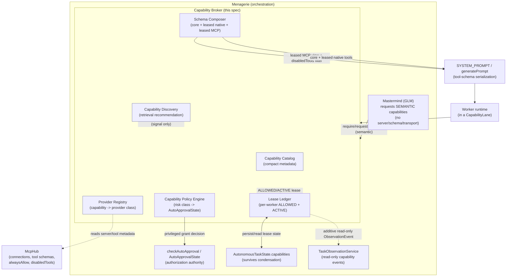
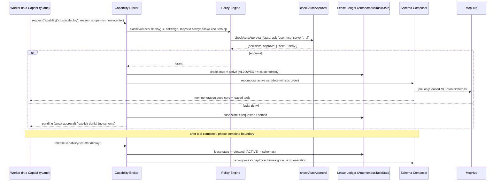

# Design Document

## Overview

This feature is **FEAT-013 — Dynamic Capability Broker and MCP Leasing**, the next lift in the Menagerie Autonomous Operations program. It changes a single wasteful default: today every worker on a task is handed **every configured MCP server's tool schema plus every native tool** for the task's entire lifetime, whether or not that worker will ever deploy to a cluster, drive a browser, or mutate cloud resources. Those schemas are serialized into every outbound model request, inflating the prompt, polluting the tool-choice space (more invalid/hallucinated tool calls), and defeating prefix caching whenever the configured set shifts.

The Dynamic Capability Broker replaces that with **least-privilege, phase-scoped tool access**: a worker starts with a tiny always-resident core surface and acquires additional **Tool Capabilities** only while they are relevant, via **leases** that a **policy engine** authorizes and that **expire** at a declared boundary (tool-complete, phase-complete, task-complete). A worker that reads a repository, then deploys a manifest, then audits the result in a browser holds `repo.read`/`repo.write`, *then* `cluster.deploy`, *then* `browser.inspect`/`browser.interact` — never all three at once, and never the dozens of unrelated MCP tools it will never call.

The governing layering mirrors the existing GLM/OmniRoute split:

> **GLM requests capabilities. Menagerie grants and scopes them. MCP providers implement them.**

The mastermind (and workers) reason only in terms of **semantic Tool Capabilities** (`cluster.deploy`, `browser.inspect`). They never see server names, MCP transports, tool-schema internals, tool IDs, or provider naming — unless they are explicitly choosing among *semantically distinct* capabilities. The **Capability Broker lives in Menagerie**, not OmniRoute: OmniRoute still schedules silicon, GLM still schedules cognition, and the broker schedules the **tool-capability surface**. It is the "gives the worker the relevant tools" layer that sits alongside Retrieval (relevant knowledge), Context Management (relevant history), the Reasoning Policy (cognitive depth), the Parallel Scheduler (concurrency), and OmniRoute (silicon).

### Desired end state

The per-generation worker context moves from:

```
TASK + ALL native tools + ALL MCP schemas + exploration + full history
```

to:

```
TASK + relevant evidence + small core toolset + currently-leased capabilities + structured task state
```

The broker owns the fourth term. Everything else is owned by sibling specs and is consumed unchanged.

### Vocabulary note — "Tool Capability" vs. the sibling `CapabilityLane`

The sibling spec **`capability-lanes-routing`** already uses *Capability* / `CapabilityLane` to mean a **cognitive role** (`reader.fast`, `reader.deep`, `coder.primary`, `reasoning.escalation`). This spec's **Tool Capability** is a completely different axis: it names a **unit of tool/MCP access** (`repo.read`, `cluster.deploy`, `browser.inspect`). To avoid any collision, this spec uses an explicit, distinct vocabulary throughout — **Tool Capability / `ToolCapabilityId`**, **Capability Broker**, **Capability Lease / `CapabilityLease`**, **Capability Catalog**, **Capability Policy Engine** — and never shortens "Tool Capability" to bare "Capability" in type names. The two axes are **orthogonal and coexist**: a worker runs **in** a cognitive `CapabilityLane` **and** holds a set of **Tool Capability leases**. For example, a `reader.fast` worker holds the minimal read lease set; a `coder.primary` worker in an implement phase additionally holds `repo.write`; a `coder.primary` worker in a deploy phase additionally holds `cluster.deploy`. The lane never changes which tool capabilities are *authorized* — the policy engine does — and the tool-capability set never changes the lane.

### Verified codebase grounding

| Element | Location / symbol | How this design uses it |
| --- | --- | --- |
| MCP connections, tool lists, per-server `alwaysAllow: string[]` (`"*"` + specific names), `disabledTools`, `toggleToolAlwaysAllow(server, source, tool, enabled)` | `src/services/mcp/McpHub.ts` | The sole source of concrete MCP tool schemas. Capability→provider registration reads server/tool metadata from the hub; schema composition pulls the *leased* subset from it; the compatibility path maps existing `alwaysAllow`/`disabledTools` into capability authorization. |
| Tool-schema serialization into the model request | `SYSTEM_PROMPT(... mcpHub, ... disabledTools, ...)` → `generatePrompt` in `src/core/prompts/system.ts` | The runtime enforcement hook. The broker supplies the *active leased* MCP tool set and native tool set as the effective `mcpHub` view + `disabledTools` filter so only leased schemas are serialized. |
| Approval / autonomy decision | `checkAutoApproval({state, ask, ...}) => {decision:"approve"|"deny"|"ask"}`, `AutoApprovalState`, `AutoApprovalStateOptions`, `isMcpToolAlwaysAllowed` in `src/core/auto-approval/` | The **only** authorization authority for privileged acquisition. Capability risk classes map onto existing `AutoApprovalState`; the policy engine routes high-risk grants through `checkAutoApproval` rather than inventing a second permission system. |
| Parallel worker spec | `ParallelTaskSpec {name, mode, message, todos, route}`, `.strip()`/`.max()` schema behavior, `mode: "project-reader"` | DAG-node capability requirements attach **additively** to the spec; `.strip()` keeps legacy specs valid. |
| Worker runtimes | `runParallelTasks` in `src/core/task/runParallelTasks.ts`; reader bound `compactParallelTasksResultForParent` / `MAX_READER_PARENT_RESULT_CHARS` | Each worker gets its own broker-scoped lease set; reader isolation reuses the `project-reader` role and bounded output unchanged. |
| Worker result + task state | `WorkerResult {status, summary, findings, evidence, changes, tests, blockers, artifacts, reasoning?}`, `AutonomousTaskState` (mastermind-execution-metadata) | Lease state lives in structured task state (survives condensation), not prose. Capability telemetry rides additively on the result. |
| Condensation | `Task.condenseContext` in `src/core/task/Task.ts` | Lease state is read back from structured state after condensation, never reconstructed from the transcript. |
| Retrieval | `RetrievalGatewayClient.retrieve` / `EvidencePacket` / `SemanticFinding` (semantic-first-retrieval); Retrieval Gateway (retrieval-fabric) | Capability **discovery/recommendation** only. Embeddings never authorize a capability. |
| Observatory | `TaskObservationService`, `ObservationEvent`, `observatoryUpdate` `ExtensionMessage`, `collectTaskBoard`-style read-only enumeration in `src/services/observatory/` | Capability state exposed as an additive read-only `ObservationEvent` under the zero-lifecycle-side-effect invariant. |
| Cognitive lanes (coexist, untouched) | `CapabilityLane`, `RoutingMetadata`, `WorkerResultWithRouting` (capability-lanes-routing) | Referenced only to show the two axes compose; never modified. |

### Cross-spec contracts consumed (not redefined)

- **capability-lanes-routing**: `CapabilityLane` (`reader.fast`/`reader.deep`/`coder.primary`/`reasoning.escalation`), `RoutingMetadata`, `WorkerResultWithRouting`. This spec adds an orthogonal tool-capability axis; it does not touch lane logic, `laneToRouteCapability`, or `RoutingMetadata`.
- **mastermind-execution-metadata**: `WorkerResult`, `AutonomousTaskState`, `ParallelTaskSpec.reasoning?`/`verification?`. This spec adds `AutonomousTaskState.capabilities` (lease state) and an additive optional `WorkerResult.capabilityTelemetry`; the base contracts are unchanged.
- **elastic-parallel-execution**: `BoundedElasticScheduler`, `RouteCapability`, `RouteCapacity`. The broker is a per-worker concern layered beside the scheduler; it adds no global lock and does not alter dispatch, leasing of inference, or the `RouteCapability` enum. (Note: `RouteCapability` is a *cognitive route*, unrelated to `ToolCapabilityId`.)
- **semantic-first-retrieval / retrieval-fabric**: `RetrievalGatewayClient.retrieve`, `EvidencePacket`, `SemanticFinding`. Consumed as a recommendation signal for capability discovery; never as an authorization authority.
- **task-observatory**: `TaskObservationService`, `ObservationEvent`, `observatoryUpdate`, and the Zero-Lifecycle-Side-Effect invariant. This spec adds a read-only capability `ObservationEvent` variant; it adds no mutation path.
- **Native MCP / approval**: `McpHub` and `src/core/auto-approval/*` are consumed and extended through their existing surfaces, not forked.

### Non-Goals

- Not a second permissions system. All privileged authorization routes through `checkAutoApproval` / `AutoApprovalState`.
- Not an OmniRoute change. The broker lives in Menagerie; OmniRoute still owns model/hardware.
- Not a redefinition of `CapabilityLane`, `WorkerResult`, `ParallelTaskSpec`, the scheduler mechanics, or the MCP wire protocol.
- v1 does **not** require physically stopping/restarting MCP processes to remove schemas from context; process idle/disconnect is a secondary, optional optimization.
- Not perfect fine-grained scoping for every provider; scoping is best-effort and provider-declared.

## Architecture

### Where the broker sits



The arrow from the broker to `checkAutoApproval` is the authorization boundary: **relevance** (from the mastermind or from retrieval) flows *into* the broker; **authorization** for anything privileged flows *out* to the existing approval mechanism and back. Embeddings and mastermind intent can make a capability *available to request*; they can never, by themselves, make a privileged capability *active*.

### Capability flow (request → grant → activate → release)



### Two-level per-worker state: ALLOWED vs. ACTIVE

Each worker's capability state has **two distinct levels**, and the distinction is load-bearing:

- **ALLOWED** — the set of Tool Capabilities this worker is *authorized* to use (policy has approved them, or they are always-resident core). Being allowed does **not** put a schema in context.
- **ACTIVE** — the subset of ALLOWED whose tool schemas are *currently serialized into the outbound model request*. Only ACTIVE capabilities cost context tokens.

A lease transitions `requested → active` (authorized + schema in context), can be `released` (authorized history, schema removed from context), or `denied` (never authorized). `ALLOWED = active ∪ released-but-reauthorizable ∪ core`; `ACTIVE = {leases with state active}`. The headline optimization (MCP-002, MCP-013) is precisely that **ACTIVE ⊊ ALLOWED ⊊ everything configured**, and that moving a lease out of ACTIVE removes its schema without deauthorizing or restarting anything.

### Always-resident core surface (no acquisition recursion)

Every worker — in any lane, with zero optional MCP — is born with a minimal **core capability** set that is always ACTIVE and never leased, scoped, or revocable by the broker:

- task-state read/update, todo/plan update (`AutonomousTaskState`),
- `semantic.retrieve` and targeted evidence read (bounded; via the Retrieval Gateway),
- **`capability.request`** (ask the broker for a capability) and **`capability.release`** (give one back),
- `attempt_completion`.

This set is deliberately chosen so a worker can always *function and always ask for more* without first needing an optional MCP tool. **Capability-acquisition recursion is structurally impossible**: `capability.request`/`capability.release` are native core tools, never themselves gated behind an optional MCP capability. A worker never needs tool B to acquire tool A.

### Runtime enforcement + deterministic schema composition

Enforcement is **runtime, not prompt**. The broker does not ask the model nicely to avoid unleashed tools; it never serializes their schemas. The **Schema Composer** produces the effective tool surface fed to `SYSTEM_PROMPT`/`generatePrompt`:

```
outbound tool schemas =
    [ stable CORE prefix ]                        (fixed, identical every turn)
  ++ [ leased NATIVE tools, sorted by ToolCapabilityId ]
  ++ [ leased MCP tools, sorted by (ToolCapabilityId, serverName, toolName) ]
```

Composition is **deterministic** (MCP-011): the core prefix is byte-stable; leased schemas are appended in a total, stable order keyed by capability id then provider identity. The same ACTIVE set therefore yields byte-identical serialization across turns, so **prefix/prompt caching is preserved** as long as the active set is unchanged, and a single lease activation appends at the end rather than reshuffling the prefix. The composer realizes this against the existing path by (a) presenting `McpHub` a *filtered view* that exposes only leased servers/tools and (b) extending the `disabledTools` argument already threaded into `SYSTEM_PROMPT` to suppress unleased native/MCP tools — reusing the exact serialization code, not forking it.

### Parallelism: per-worker, no global lock

Lease ledgers are **per worker** inside `AutonomousTaskState` and the broker's grant/compose path is per-worker and lock-free with respect to other workers (MCP-010). Two concurrent workers can activate and release radically different capability sets at the same time without serializing each other; the only shared, read-mostly structures are the Catalog and the Provider Registry. Policy evaluation that needs `checkAutoApproval` consults the shared autonomy state read-only. The broker therefore never becomes a scheduler bottleneck and does not interact with `BoundedElasticScheduler` dispatch.

### Fail-closed degradation

If the broker's internals fail (catalog load error, registry inconsistency, composer exception), the task is **not corrupted** and the system **does not fall back to exposing every configured MCP tool** (MCP-019). Safe behavior: retain the current ACTIVE set as-is, **refuse new privileged leases** (low-risk already-authorized reads may continue), and surface a broker-degradation indication to the Observatory and task state. New privileged acquisition fails closed.

## Components and Interfaces

### 1. Tool Capability taxonomy and `ToolCapabilityId`

An **extensible, namespaced string vocabulary** with a runtime registry — explicitly *not* a closed enum, so new providers can introduce capabilities without a code change to the broker core.

```ts
/**
 * Namespaced tool-capability id, e.g. "repo.read", "cluster.deploy".
 * Extensible by design: the string type documents the seed vocabulary while
 * permitting registry-registered extensions. NOT a closed enum (MCP req: extensible).
 */
export type ToolCapabilityId =
	| "semantic.retrieve"
	| "repo.read" | "repo.write"
	| "git.read" | "git.write"
	| "terminal.read" | "terminal.execute"
	| "cluster.read" | "cluster.deploy"
	| "browser.inspect" | "browser.interact"
	| "cloud.read" | "cloud.mutate"
	| "observability.read"
	| "issue.read" | "issue.write"
	| "artifact.read" | "artifact.write"
	| (string & {}) // extension point: registry may add namespaced capabilities

export type CapabilityAccessKind = "read" | "write" | "execute"

/** Risk classes map onto existing AutoApprovalState (see Policy Engine). */
export type CapabilityRiskClass = "low" | "elevated" | "high"

export type ProviderClass = "native" | "mcp"
```

### 2. Capability Catalog (compact, mastermind-visible)

Compact metadata — far smaller than serialized MCP schemas — sufficient to *choose* a capability without carrying any tool-schema internals.

```ts
export interface CapabilityCatalogEntry {
	id: ToolCapabilityId
	description: string // human-readable, mastermind-visible
	risk: CapabilityRiskClass
	access: CapabilityAccessKind
	providerClass: ProviderClass
	/** Light hints only — argument names/purpose, never full JSON Schema. */
	requiredArgHints?: string[]
	/** Whether scoping is meaningful for this capability (e.g. namespace, path). */
	scopeable?: boolean
	/** True for the always-resident core surface. */
	core?: boolean
}

export interface CapabilityCatalog {
	get(id: ToolCapabilityId): CapabilityCatalogEntry | undefined
	list(): readonly CapabilityCatalogEntry[]
	/** The compact view handed to the mastermind — never includes tool schemas. */
	mastermindView(): readonly Pick<
		CapabilityCatalogEntry,
		"id" | "description" | "risk" | "access" | "requiredArgHints" | "scopeable"
	>[]
}
```

### 3. Provider Registry (grounded in `McpHub`)

MCP servers and native tool providers register **which capabilities they satisfy**. Multiple implementations may satisfy the same capability class without changing any mastermind prompt (e.g. two Kubernetes MCP servers both satisfying `cluster.read`).

```ts
export interface CapabilityProvider {
	providerClass: ProviderClass
	/** For MCP: the McpHub server name. For native: a native provider id. */
	providerId: string
	satisfies: ToolCapabilityId[]
	/**
	 * The concrete tool identifiers this provider exposes for a capability,
	 * resolved against McpHub tool lists (MCP) or the native tool registry.
	 */
	toolsFor(capability: ToolCapabilityId): ResolvedTool[]
}

export interface ResolvedTool {
	providerClass: ProviderClass
	providerId: string // McpHub server name or native provider id
	toolName: string
	/** Opaque handle to the schema sourced from McpHub / native registry. */
	schemaRef: unknown
}

export interface ProviderRegistry {
	register(provider: CapabilityProvider): void
	/** All providers that can satisfy a capability (for remap/failover). */
	providersFor(capability: ToolCapabilityId): CapabilityProvider[]
	/** Resolve the concrete tools to serialize for an ACTIVE lease. */
	resolve(capability: ToolCapabilityId, preferredProviderId?: string): ResolvedTool[]
}
```

Registration reads server/tool metadata from `McpHub` (connections, tool lists); it does not duplicate schema storage. The hub remains the single source of concrete schemas.

### 4. CapabilityLease and the Lease Ledger

The lease is the explicit record of **who** holds **what**, **why**, at what **scope**, for how **long**, in which **state**.

```ts
export type LeaseRequester = "mastermind" | "worker" | "scheduler" | "policy"
export type LeaseState = "requested" | "active" | "released" | "denied"
export type LeaseLifetime = "tool-complete" | "phase-complete" | "task-complete"

export interface CapabilityLease {
	capability: ToolCapabilityId
	taskId: string
	workerId?: string // undefined => parent-held; leases are worker-specific by default
	requestedBy: LeaseRequester
	reason: string
	access: CapabilityAccessKind
	/** Best-effort scope tokens, e.g. ["/workspace"], ["namespace=nervecenter"]. */
	scope?: string[]
	state: LeaseState
	expiresWhen: LeaseLifetime
	/** Resolved provider for an active lease; enables provider-failure errors. */
	providerId?: string
	requestedAt: number
	activatedAt?: number
	releasedAt?: number
}

/** Per-worker two-level state (ALLOWED vs ACTIVE), lives in AutonomousTaskState. */
export interface WorkerCapabilityState {
	workerId: string
	allowed: ToolCapabilityId[] // authorized (incl. core)
	active: ToolCapabilityId[] // schema currently in context (⊆ allowed)
	leases: CapabilityLease[] // full lease history for this worker
}
```

### 5. Capability Broker (the orchestration surface)

```ts
export interface CapabilityRequest {
	capability: ToolCapabilityId
	taskId: string
	workerId?: string
	requestedBy: LeaseRequester
	reason: string
	access?: CapabilityAccessKind // defaults from catalog entry
	scope?: string[]
	expiresWhen?: LeaseLifetime // defaults to "phase-complete"
}

export type GrantOutcome =
	| { result: "activated"; lease: CapabilityLease }
	| { result: "pending-approval"; lease: CapabilityLease } // state = requested, awaiting checkAutoApproval
	| { result: "denied"; lease: CapabilityLease; reason: string }
	| { result: "broker-degraded"; reason: string } // fail-closed for privileged (MCP-019)

export interface CapabilityBroker {
	/** Core set every worker is born with; never leased, never recursive. */
	coreCapabilities(): readonly ToolCapabilityId[]

	/** Pre-activate a DAG node's declared requirements before first generation (MCP-016). */
	provision(workerId: string, required: ToolCapabilityId[], taskId: string): GrantOutcome[]

	/** Lazy, in-execution acquisition with a reason (MCP-003, MCP-017). */
	requestCapability(req: CapabilityRequest): Promise<GrantOutcome>

	/** Move a lease out of ACTIVE; schema disappears next generation (MCP-013). */
	releaseCapability(workerId: string, capability: ToolCapabilityId): void

	/** Read-only snapshot for state/Observatory; never mutates lifecycle. */
	snapshot(workerId: string): WorkerCapabilityState
}
```

### 6. Capability Policy Engine (routes privileged grants through `checkAutoApproval`)

The policy engine decides **auto-allow | mastermind-approval | user-approval | deny** for a request. It maps **risk class → existing `AutoApprovalState`** and calls `checkAutoApproval` for anything privileged. It must **not** trigger a GLM turn for a trivial low-risk read.

```ts
export type PolicyDecision =
	| { kind: "auto-allow"; reasons: string[] } // low-risk + relevant; no GLM turn, no prompt
	| { kind: "mastermind-approval"; reasons: string[] } // elevated: surface to mastermind
	| { kind: "user-approval"; reasons: string[] } // high: route to checkAutoApproval -> "ask"
	| { kind: "deny"; reasons: string[] }

export interface CapabilityPolicyEngine {
	/**
	 * Pure classification + decision. `autoApprovalState` and `relevance` are
	 * passed in (no I/O here) so the engine is unit/property-testable; the
	 * caller performs the actual checkAutoApproval call for user-approval.
	 */
	decide(input: {
		entry: CapabilityCatalogEntry
		request: CapabilityRequest
		relevance: number // 0..1 recommendation signal (NOT authorization)
		autoApprovalState: Pick<AutoApprovalState, AutoApprovalStateKeys> & AutoApprovalOptions
	}): PolicyDecision
}
```

**Risk-class → `AutoApprovalState` mapping (authorization authority is the existing mechanism):**

| Risk | Seed capabilities | Maps onto `AutoApprovalState` | Behavior |
| --- | --- | --- | --- |
| low | `semantic.retrieve`, `repo.read`, `git.read`, `cluster.read`, `browser.inspect`, `observability.read`, `issue.read`, `artifact.read` | `alwaysAllowReadOnly` (+ `allowedReadFiles` for scoped reads) | may **auto-grant when relevant** (MCP-004); no GLM turn |
| elevated | `terminal.read` | `alwaysAllowReadOnly` / mastermind view | mastermind-approval or auto under broad autonomy |
| high | `repo.write`, `git.write`, `terminal.execute`, `browser.interact`, `cluster.deploy`, `cloud.mutate`, `issue.write`, `artifact.write` | `alwaysAllowWrite` / `alwaysAllowExecute` / `alwaysAllowMcp` + DCG | obey existing approval/autonomy via `checkAutoApproval` → `approve`/`ask`/`deny` (MCP-005) |

`yoloModeEnabled` and `autoApprovalEnabled` continue to behave exactly as `checkAutoApproval` already defines; the broker adds no bypass. **Capability relevance ≠ authorization**: a high relevance score for `cluster.deploy` yields at most `user-approval`, never an auto-grant.

### 7. Capability Discovery (retrieval as recommendation only)

```ts
export interface CapabilityRecommendation {
	capability: ToolCapabilityId
	score: number // 0..1 relevance from retrieval
	why: string
}

export interface CapabilityDiscovery {
	/**
	 * Index compact catalog descriptions (capability id, description, provider
	 * purpose, required-arg hints, risk) and rank them for a task intent.
	 * Returns a RECOMMENDATION signal only (MCP-015); the policy engine, not
	 * this ranking, authorizes anything.
	 */
	recommend(intent: string, workspace: string): Promise<CapabilityRecommendation[]>
}
```

Worked example — intent "verify why the k8s cert is not renewing" → `cluster.read` 0.97, `observability.read` 0.90, `browser.inspect` 0.62, `repo.read` 0.40, … The broker may surface these as *requestable*; `cluster.deploy` (high risk) is never activated from this signal alone.

### 8. Schema Composer (the enforcement hook)

```ts
export interface ComposedToolSurface {
	/** Byte-stable core prefix (same every turn) → cache-friendly. */
	corePrefix: ResolvedTool[]
	/** Leased native tools, sorted by ToolCapabilityId. */
	leasedNative: ResolvedTool[]
	/** Leased MCP tools, sorted by (ToolCapabilityId, serverName, toolName). */
	leasedMcp: ResolvedTool[]
	/** disabledTools filter to pass into SYSTEM_PROMPT for everything unleased. */
	disabledTools: string[]
}

export interface SchemaComposer {
	/**
	 * Deterministic composition from a worker's ACTIVE set (MCP-001, MCP-011).
	 * Identical active sets yield byte-identical surfaces across turns.
	 */
	compose(active: WorkerCapabilityState, registry: ProviderRegistry): ComposedToolSurface
}
```

The composed surface is applied by presenting `SYSTEM_PROMPT`/`generatePrompt` a filtered `McpHub` view (only leased servers/tools visible) plus the computed `disabledTools`, reusing the existing serialization path so unleased schemas are simply never emitted (MCP-002, MCP-018 — no server restart needed).

### 9. DAG / `ParallelTaskSpec` integration (additive)

```ts
/** Additive capability requirement on a DAG node / ParallelTaskSpec. */
export interface NodeCapabilityRequirement {
	required: ToolCapabilityId[] // provisioned before first generation (MCP-016)
	optionalHints?: ToolCapabilityId[] // likely lazy acquisitions (MCP-017)
	scopeHints?: Record<string, string[]>
}

/** Rides additively on ParallelTaskSpec; `.strip()` keeps legacy specs valid. */
export interface ParallelTaskSpecCapabilities {
	capabilities?: NodeCapabilityRequirement
}
```

Worked DAG shapes (different concurrent workers → radically different tool surfaces):

| Node | Lane | Provisioned required set |
| --- | --- | --- |
| manifest-reader | reader.fast | `semantic.retrieve`, `repo.read`, (opt `git.read`) |
| implementer | coder.primary | `repo.read`, `repo.write`, `git.read` |
| deploy | coder.primary | `cluster.read`, `cluster.deploy` (scope `namespace=nervecenter`) |
| visual-audit | coder.primary | `browser.inspect`, `browser.interact` (scope `current session`) |
| deployment-verifier | coder.primary | `cluster.read`, `observability.read` |

### 10. Reader isolation (runtime-enforced)

The default `project-reader` capability set is `{ semantic.retrieve, repo.read, core }`, optionally `git.read`. Readers are **never granted** `repo.write`, `git.write`, `cluster.deploy`, `cloud.mutate`, or `browser.interact` — enforced by the policy engine denying those for the reader lane at the runtime layer, independent of any prompt text (MCP-006). This composes with — and does not replace — the sibling spec's reader isolation (private history, bounded output).

### 11. Lazy activation — the deploy-then-audit worked example

```
phase: implement   ACTIVE = {core, repo.read, repo.write, git.read}
  worker finishes edits, requests capability.release(repo.write)   (phase-complete)
phase: deploy      requestCapability(cluster.deploy, reason, scope=ns=nervecenter)
                   policy: high-risk -> checkAutoApproval -> approve/ask
                   ACTIVE = {core, repo.read, cluster.read, cluster.deploy}
  deploy done -> release(cluster.deploy)                           (tool-complete)
phase: audit       requestCapability(browser.inspect), requestCapability(browser.interact)
                   ACTIVE = {core, repo.read, browser.inspect, browser.interact}
  audit done -> release(browser.*)                                 (phase-complete)
```

At no point do deploy and browser schemas coexist; each exists only while relevant.

### 12. Parent/child isolation and inheritance

Leases are **worker-specific by default** (least privilege). A parent holding `cluster.deploy` does **not** imply children hold it; a worker acquiring `cloud.mutate` does **not** grant siblings (MCP-007). Explicit inheritance is opt-in via a `NodeCapabilityRequirement` on the child spec; absent that, a child is born with only the core set and must request the rest, re-passing policy.

### 13. Provider failure and remap

When an ACTIVE lease's provider becomes unavailable, the broker raises an **explicit capability-level error** `{ capability, providerId, state }` — never a silent success the model could hallucinate around (MCP-014). The broker **may** transparently remap to another registered provider that satisfies the same capability class *iff* the semantics are compatible (`providersFor(capability)` has an alternate); otherwise the lease transitions to a failed state surfaced to task state and Observatory.

### 14. Observatory integration (read-only)

```ts
/** Additive, read-only ObservationEvent variant. */
export interface CapabilityObservationEvent {
	taskId: string
	workerId: string
	kind: "capability"
	active: ToolCapabilityId[]
	available: ToolCapabilityId[] // allowed-but-not-active
	released: ToolCapabilityId[]
	denied: ToolCapabilityId[]
	history?: Pick<CapabilityLease, "capability" | "state" | "reason" | "requestedBy">[]
	committedAt: number
}
```

Delivered via the existing `observatoryUpdate` channel. Opening/inspecting these sections performs **zero** lifecycle-mutating operations and sends only read-only webview messages (MCP-009), honoring the task-observatory Zero-Lifecycle-Side-Effect invariant.

### 15. Context accounting / metrics

```ts
export interface CapabilityTelemetry {
	availableMcpToolCount: number
	activeMcpToolCount: number
	toolSchemaTokensTotalIfAllExposed: number // the counterfactual
	toolSchemaTokensActive: number
	coreToolTokens: number
	leasedToolTokens: number
	/** Headline metric: tokens avoided by not exposing unleased schemas. */
	toolSchemaTokensAvoided: number // = total-if-all-exposed − active
	capabilitiesActivated: number
	capabilitiesReleased: number
	capabilityRequests: number
	capabilityDenials: number
	/** Correlation signals (reported, not gated). */
	invalidToolCalls?: number
	malformedArgCount?: number
	retries?: number
	hallucinatedToolCount?: number
}

/** Additive optional extension of WorkerResult; base contract unchanged. */
export interface WorkerResultWithCapabilityTelemetry extends WorkerResult {
	capabilityTelemetry?: CapabilityTelemetry
}
```

### 16. Compatibility path

Existing MCP configuration keeps working through a **legacy "all configured capabilities allowed" mode** (MCP-020): the migration default registers every configured `McpHub` server/tool as an allowed capability for every worker, reproducing today's behavior, and respecting existing `alwaysAllow`/`disabledTools`. Operators then tighten toward least privilege per lane/node. No existing MCP config breaks; `.strip()` keeps capability-less specs valid.

## Data Models

```ts
// ── Taxonomy ────────────────────────────────────────────────────────────────
type ToolCapabilityId =
	| "semantic.retrieve"
	| "repo.read" | "repo.write" | "git.read" | "git.write"
	| "terminal.read" | "terminal.execute"
	| "cluster.read" | "cluster.deploy"
	| "browser.inspect" | "browser.interact"
	| "cloud.read" | "cloud.mutate"
	| "observability.read" | "issue.read" | "issue.write"
	| "artifact.read" | "artifact.write"
	| (string & {})
type CapabilityAccessKind = "read" | "write" | "execute"
type CapabilityRiskClass = "low" | "elevated" | "high"
type ProviderClass = "native" | "mcp"

// ── Catalog & registry ───────────────────────────────────────────────────────
interface CapabilityCatalogEntry {
	id: ToolCapabilityId
	description: string
	risk: CapabilityRiskClass
	access: CapabilityAccessKind
	providerClass: ProviderClass
	requiredArgHints?: string[]
	scopeable?: boolean
	core?: boolean
}
interface ResolvedTool { providerClass: ProviderClass; providerId: string; toolName: string; schemaRef: unknown }
interface CapabilityProvider {
	providerClass: ProviderClass
	providerId: string
	satisfies: ToolCapabilityId[]
	toolsFor(capability: ToolCapabilityId): ResolvedTool[]
}

// ── Leases & worker state (lives in AutonomousTaskState) ──────────────────────
type LeaseRequester = "mastermind" | "worker" | "scheduler" | "policy"
type LeaseState = "requested" | "active" | "released" | "denied"
type LeaseLifetime = "tool-complete" | "phase-complete" | "task-complete"
interface CapabilityLease {
	capability: ToolCapabilityId
	taskId: string
	workerId?: string
	requestedBy: LeaseRequester
	reason: string
	access: CapabilityAccessKind
	scope?: string[]
	state: LeaseState
	expiresWhen: LeaseLifetime
	providerId?: string
	requestedAt: number
	activatedAt?: number
	releasedAt?: number
}
interface WorkerCapabilityState {
	workerId: string
	allowed: ToolCapabilityId[]
	active: ToolCapabilityId[]
	leases: CapabilityLease[]
}

// ── AutonomousTaskState extension (additive; survives condensation) ───────────
interface AutonomousTaskStateCapabilities {
	/** Per-worker two-level state; absent ⇒ legacy "all allowed" compat mode. */
	capabilities?: {
		workers: WorkerCapabilityState[]
		brokerDegraded?: boolean
	}
}

// ── Policy / decision ─────────────────────────────────────────────────────────
type PolicyDecision =
	| { kind: "auto-allow"; reasons: string[] }
	| { kind: "mastermind-approval"; reasons: string[] }
	| { kind: "user-approval"; reasons: string[] }
	| { kind: "deny"; reasons: string[] }

// ── Composition & telemetry ───────────────────────────────────────────────────
interface ComposedToolSurface {
	corePrefix: ResolvedTool[]
	leasedNative: ResolvedTool[]
	leasedMcp: ResolvedTool[]
	disabledTools: string[]
}
interface CapabilityTelemetry {
	availableMcpToolCount: number
	activeMcpToolCount: number
	toolSchemaTokensTotalIfAllExposed: number
	toolSchemaTokensActive: number
	coreToolTokens: number
	leasedToolTokens: number
	toolSchemaTokensAvoided: number
	capabilitiesActivated: number
	capabilitiesReleased: number
	capabilityRequests: number
	capabilityDenials: number
	invalidToolCalls?: number
	malformedArgCount?: number
	retries?: number
	hallucinatedToolCount?: number
}
interface WorkerResultWithCapabilityTelemetry extends WorkerResult { capabilityTelemetry?: CapabilityTelemetry }
```

**Reconciliation with sibling types.** `WorkerResult`, `AutonomousTaskState`, and `ParallelTaskSpec` are consumed from mastermind-execution-metadata and extended additively (`AutonomousTaskStateCapabilities`, `WorkerResultWithCapabilityTelemetry`, `ParallelTaskSpecCapabilities`). `AutoApprovalState`/`checkAutoApproval` are consumed from `src/core/auto-approval` unchanged. `McpHub` is consumed as the schema source. `CapabilityLane`/`RoutingMetadata` (capability-lanes-routing), the `ObservationEvent`/`observatoryUpdate` channel (task-observatory), and the retrieval contracts are consumed, not redefined.

## Correctness Properties

*A property is a characteristic or behavior that should hold true across all valid executions of a system — a formal statement about what the system should do, serving as the bridge between human-readable specifications and machine-verifiable guarantees. Each entry is universally quantified and names the acceptance criteria it validates; these guide the generated-input tests in the Testing Strategy.*

### Property 1: A worker's serialized tool surface equals core plus active leases, and nothing else

*For any* `WorkerCapabilityState`, the composed outbound tool surface contains exactly the core capabilities' tools plus the tools of capabilities whose lease state is `active`, and contains no tool belonging to a capability that is merely configured, merely `allowed`, `released`, or `denied`.

**Validates: Requirements 1.1** (MCP-001, MCP-002, MCP-013)

### Property 2: ACTIVE is always a subset of ALLOWED, which excludes DENIED

*For any* sequence of request/grant/release operations, the resulting `active` set is a subset of `allowed`, and no capability with a `denied` lease ever appears in `allowed` or `active`.

**Validates: Requirements 2.1** (MCP-001, MCP-005, MCP-007)

### Property 3: Composition is deterministic and prefix-stable

*For any* ACTIVE set, `SchemaComposer.compose` produces a byte-identical surface across repeated calls, with an unchanged core prefix; and *for any* single activation added to an ACTIVE set, the core prefix and all previously-ordered leased entries retain their byte positions (the new schema is appended), so prefix caching is preserved.

**Validates: Requirements 3.1** (MCP-011)

### Property 4: Low-risk reads may auto-grant; privileged capabilities route through checkAutoApproval

*For any* request, the policy engine returns `auto-allow` only when the capability's risk class is `low` and it is relevant; and *for any* request whose risk class is `high`, the decision is never `auto-allow` — it is `user-approval` (routed to `checkAutoApproval`) or `deny`, regardless of relevance score.

**Validates: Requirements 4.1** (MCP-004, MCP-005, MCP-015, security property)

### Property 5: Relevance never authorizes a dangerous capability by itself

*For any* discovery recommendation (including score 1.0) for a `high`-risk capability with no corresponding `checkAutoApproval` approval, the capability does not become `active`.

**Validates: Requirements 5.1** (MCP-015)

### Property 6: Reader workers never hold write/execute/mutate capabilities

*For any* request made on behalf of a `project-reader`/`reader.*` worker for `repo.write`, `git.write`, `cluster.deploy`, `cloud.mutate`, or `browser.interact`, the policy decision is `deny` and the capability never becomes `active`.

**Validates: Requirements 6.1** (MCP-006)

### Property 7: Sibling leases are isolated

*For any* two concurrent workers, activating or releasing a capability for one worker leaves the other worker's `allowed` and `active` sets unchanged.

**Validates: Requirements 7.1** (MCP-007, MCP-010)

### Property 8: Capability state round-trips through condensation

*For any* `WorkerCapabilityState`, serializing it into `AutonomousTaskState` and reading it back after a `condenseContext` cycle yields equal `allowed`, `active`, and lease scope/lifetime fields (never reconstructed from prose).

**Validates: Requirements 8.1** (MCP-008)

### Property 9: Inspecting capability state causes zero lifecycle mutation

*For any* sequence of Observatory capability inspections, the number of lifecycle-mutating operations and non-allowlisted webview messages is zero, and every worker's capability and lifecycle state is identical before and after.

**Validates: Requirements 9.1** (MCP-009)

### Property 10: Release removes schemas on the next generation

*For any* active lease, after `releaseCapability` the next composed surface excludes that capability's tools while retaining the remaining ACTIVE set and the core prefix.

**Validates: Requirements 10.1** (MCP-013)

### Property 11: Unavailable provider yields an explicit error, never invented success

*For any* active lease whose provider is unavailable and for which no compatible alternate provider is registered, the broker surfaces an explicit `{capability, providerId, state}` error and never reports the tool as succeeded.

**Validates: Requirements 11.1** (MCP-014)

### Property 12: Provisioning activates declared requirements before first generation; lazy acquisition still works

*For any* DAG node with a `required` capability set that passes policy, those capabilities are `active` before the worker's first generation; and *for any* capability not declared, a later `requestCapability` can still move it to `active` during execution.

**Validates: Requirements 12.1** (MCP-016, MCP-003, MCP-017)

### Property 13: Fail-closed under broker degradation

*For any* broker-internal failure, the current ACTIVE set is retained, no **new** privileged (`high`-risk) lease becomes `active`, and the full configured MCP tool set is **not** exposed.

**Validates: Requirements 13.1** (MCP-019)

### Property 14: Legacy configurations keep working through the compatibility path

*For any* existing MCP configuration with no capability metadata, the compatibility mode exposes exactly the capabilities corresponding to the configured, non-disabled, always-allowed tools — i.e. behavior equivalent to today — and tightening to least privilege only ever removes, never adds, exposed tools.

**Validates: Requirements 14.1** (MCP-020)

### Property 15: Token-savings accounting is exact

*For any* ACTIVE set, `toolSchemaTokensAvoided` equals `toolSchemaTokensTotalIfAllExposed − toolSchemaTokensActive`, and both operands are non-negative with `toolSchemaTokensActive ≤ toolSchemaTokensTotalIfAllExposed`.

**Validates: Requirements 15.1** (MCP-012)

### Property 16: No acquisition recursion

*For any* worker, `capability.request` and `capability.release` are members of the core surface and are reachable without any optional MCP capability being `active`.

**Validates: Requirements 16.1** (MCP-003 core-surface requirement)

### Property 17: Scope is preserved on the lease and never silently widened

*For any* granted scoped request, the stored lease `scope` equals the requested scope, and no grant path widens a requested scope.

**Validates: Requirements 17.1** (scoping requirement, design element 13)

## Error Handling

- **Broker-internal failure (catalog/registry/composer).** Fail closed: retain ACTIVE, deny new privileged leases, mark `brokerDegraded` in task state, emit a degraded Observatory event. Never expose the full configured MCP set (MCP-019).
- **Provider unavailable for an ACTIVE lease.** Attempt transparent remap to a semantically compatible registered provider; if none, surface an explicit `{capability, providerId, state}` capability-level error to task state/Observatory and keep the model from assuming success (MCP-014).
- **Policy `ask` (high-risk needs user).** Lease stays `requested`; schema is **not** composed until `checkAutoApproval` returns `approve`. A `deny` records a `denied` lease and emits no schema (MCP-005).
- **Request for a reader-forbidden capability.** Immediate `deny` at the policy layer regardless of relevance; recorded as a `denied` lease (MCP-006).
- **Absent capability metadata (legacy config).** Not an error: compatibility mode treats the worker as holding the configured allowed set; `.strip()` keeps capability-less specs valid (MCP-020).
- **Discovery/retrieval failure.** Not an error for authorization: recommendations are a signal only; the broker proceeds with mastermind/worker-initiated requests and core capabilities, never auto-granting privileged capabilities (MCP-015).
- **Lease lifetime boundary reached.** On tool-/phase-/task-complete the matching leases transition to `released`; schemas drop from the next composition (MCP-013).
- **Concurrent requests from independent workers.** Served per-worker without a global lock; no serialization of unrelated workers (MCP-010).

## Testing Strategy

Per AGENTS.md, coverage sits at the **narrowest layer** that proves the behavior. The broker's catalog/registry/policy/composer/lease logic is pure or near-pure and belongs in **`src` package-local unit tests** plus **`fast-check` property tests**; the enforcement wiring (filtered `McpHub` view + `disabledTools` into `SYSTEM_PROMPT`), condensation survival, and Observatory read-only discipline are covered with small integration tests using faked collaborators; `apps/vscode-e2e` is reserved only for a real-extension-host smoke that lower layers cannot represent.

### `src` unit + generated-input tests (fast-check, ≥100 iterations per property)

Each property test is tagged `// Feature: dynamic-capability-broker, Property {N}: {property text}`.

- **SchemaComposer** — Property 1 (surface = core + active, nothing else), Property 3 (determinism + prefix stability), Property 10 (release drops schema), Property 15 (token-savings arithmetic).
- **Lease ledger / broker** — Property 2 (ACTIVE ⊆ ALLOWED, DENIED excluded), Property 7 (sibling isolation), Property 12 (provision-then-lazy), Property 16 (core includes request/release; no recursion), Property 17 (scope preserved, never widened).
- **CapabilityPolicyEngine** — Property 4 (low auto-grant / high → checkAutoApproval), Property 5 (relevance never authorizes high risk), Property 6 (reader forbidden set), Property 13 (fail-closed under degradation). Generate requests across risk classes, relevance scores, and `AutoApprovalState` combinations; assert decisions.
- **Compatibility mapping** — Property 14 (legacy config equivalence; tightening only removes exposure) over generated `McpHub` `alwaysAllow`/`disabledTools` fixtures.
- **State round-trip** — Property 8 (capability state survives a simulated `condenseContext` cycle).

### Integration tests (`src`, faked collaborators from `src/test-utils`)

- Enforcement wiring: compose an ACTIVE set, drive the filtered `McpHub` view + `disabledTools` into `SYSTEM_PROMPT`, and assert only leased MCP/native schemas appear and that no MCP process is restarted (MCP-002, MCP-018).
- Provider failure/remap (Property 11): fake a provider going unavailable with and without a registered alternate; assert transparent remap vs. explicit capability error.
- Condensation survival (MCP-008): drive `Task.condenseContext` against structured state and assert lease fields are read back, not reconstructed.
- Policy → `checkAutoApproval` seam: fake autonomy state and assert high-risk requests call `checkAutoApproval` and honor `approve`/`ask`/`deny` without a second permission system.

### webview-ui tests (`webview-ui/src/components/observatory/__tests__/`)

- Property 9 (zero-lifecycle-side-effect): generate inspection sequences over ACTIVE/AVAILABLE/RELEASED/DENIED sections and the lease-history view; assert no mutating webview message and no lifecycle change, reusing the task-observatory zero-mutation discipline.

### Example / edge-case tests

- The deploy-then-audit worked example: assert deploy and browser schemas never coexist in a composed surface across phases.
- Discovery recommendation ranking shape for the k8s-cert intent (recommendation only; no activation of `cluster.deploy`).
- Metrics object carries every field including the headline `toolSchemaTokensAvoided`.

### Extension-host E2E (`apps/vscode-e2e`) — boundary-only smoke

Reserved for the single behavior lower layers cannot represent: start a multi-worker batch where concurrent workers hold **different** ACTIVE capability sets, confirm each worker's real outbound request carries only its leased schemas (not the full configured MCP set) across the real messaging boundary, and that a release removes schemas on the next real generation — all with workers continuing independently (MCP-001, MCP-010, MCP-013 at the real boundary). Protocol/policy/composition detail stays at the unit/integration layers.

### Cross-references instead of duplication

Scheduler dispatch/leasing of inference is covered by elastic-parallel-execution; the `WorkerResult`/`AutonomousTaskState` base contracts and condensation survival by mastermind-execution-metadata; cognitive-lane routing by capability-lanes-routing; retrieval quality by semantic-first-retrieval / retrieval-fabric; Observatory zero-mutation by task-observatory. This spec's tests fake those contracts and assert only broker behavior.
