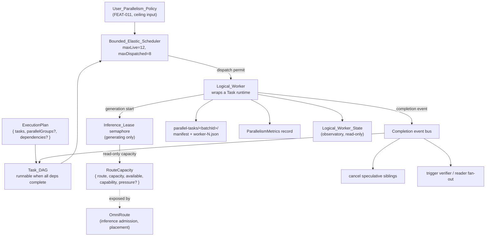
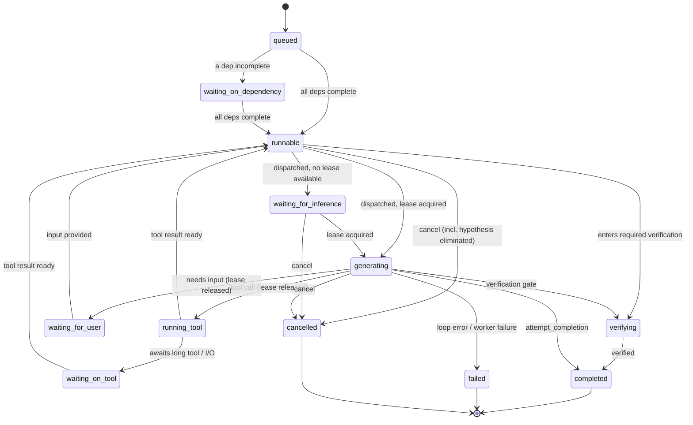

# Design Document

## Overview

This feature (FEAT-010 logical fabric and FEAT-012 parallelism metrics of the Menagerie Autonomous Operations Lift amendment) replaces the fixed process-wide worker pool with an elastic logical execution fabric. Today, `src/core/task/ParallelTaskPool.ts` exports `parallelTaskPool = new ParallelTaskPool(4)` and the `parallel_tasks` tool caps batches at four (`parallelTasksSchema` with `.max(4)`). That single number conflates two independent ideas: how many tasks may be **logically alive** and how many **model generations** may run **at once**. Separating them is the heart of this design.

The design introduces a `Bounded_Elastic_Scheduler` that admits logical work up to configurable live and dispatched bounds (default max live 12, default max dispatched 8), both constrained by the `User_Parallelism_Policy` supplied by FEAT-011 (`user-controlled-parallelism`) and by OmniRoute inference admission. Physical inference capacity becomes a **per-generation `Inference_Lease`** acquired when a worker enters `generating` and released the instant it runs a tool or waits on I/O — so the count of live `Logical_Worker`s can far exceed the count of physical inference slots. An **event-driven `Task_DAG`** replaces lockstep fan-out: a dependent node becomes `runnable` the moment all of its dependencies complete and never waits on unrelated siblings; worker completion publishes an event that may unlock dependents, satisfy evidence, cancel speculative siblings, trigger a verifier, trigger a reader fan-out, or update task state.

The governing ownership rule is **GLM schedules cognition; the user sets the aggressiveness ceiling; Menagerie manages the logical graph; OmniRoute schedules silicon.** Menagerie owns decomposition, dependencies, admission of logical work, priority, speculation, and backpressure of **new fan-out**. OmniRoute owns inference admission, model selection, residency, and physical placement. The scheduler branches only on route capability and capacity abstractions (`RouteCapacity`); it never reasons about GPU, VRAM, CUDA, or node identity and never decides model load or unload.

The design is **additive and safety-preserving**. The fixed four-worker pool is replaced, but every safety behavior `runParallelTasks` relies on today is retained: the `parallel-tasks/<batchId>/` persistence layout (manifest plus per-worker records), Git-worktree isolation, result ownership (children never mutate the parent's message buffers), and the rule that a cancelled or failed worker never abandons siblings holding permits. The new `Logical_Worker_State` values integrate with the existing lifecycle reducers in `src/core/task-persistence/taskLifecycle.ts` rather than replacing them.

Reasoning budgets, verification, and structured worker results are owned by the sibling `mastermind-execution-metadata` spec and are referenced, not redefined. The user-facing parallelism control and the numeric default-policy table are owned by `user-controlled-parallelism` (FEAT-011); this spec consumes the resulting `User_Parallelism_Policy` as a ceiling input. The Observatory UI is owned by `task-observatory`; this spec only exposes observable states.

### Verified codebase grounding

| Element | Location | Current behavior this design builds on or replaces |
| --- | --- | --- |
| `parallelTaskPool = new ParallelTaskPool(4)` | `src/core/task/ParallelTaskPool.ts` | Process-wide concurrency-4 pool: `active` count plus a `queue`; `run(signal, op)` admits up to 4 then queues, drains on release, rejects on abort. **Replaced** by the elastic scheduler; its abort-safe acquire/release/drain discipline is retained. |
| `TaskScheduler` | `src/core/task/TaskScheduler.ts` | `sem: TaskSemaphore`, `schedule(task, run)` gates concurrency, releases on throw, `cancelQueued()` rejects waiters without affecting the running one, skips `run` and releases the permit when the task aborted/abandoned before admission. **Reused** as the dispatch gate pattern for the lease and dispatch semaphores. |
| `TaskSemaphore` | `src/utils/TaskSemaphore.ts` | Tracks `available` permits **and** a `waiting` count so callers decide "don't enqueue more when the queue is deep"; `cancel()` rejects waiters and resets the waiting count via a generation guard. **Reused** as the mechanism for the dispatch semaphore and the inference-lease semaphore. |
| `runParallelTasks(parent, provider, specs)` | `src/core/task/runParallelTasks.ts` | Creates `batchId`, persists `parallel-tasks/<batchId>/` (manifest plus `worker-N.json`), snapshots the working tree, runs each worker via `parallelTaskPool.run(signal, op)`; cancellation and failed-record writes never abandon siblings holding permits. **Rehosted** onto the scheduler; persistence, worktree isolation, result ownership, and sibling safety are preserved. |
| `ParallelTaskReader` (`AUTO_READER_NAME`, `MAX_READER_DOCUMENT_BYTES`, `MAX_READER_EXCERPT_CHARS`) | `src/core/task/ParallelTaskReader.ts` | Appends a bounded reader to mixed-mode fan-outs with ≥2 workers, guarded by `specs.length < 4` so it never exceeds `max(4)`. **Generalized** into dynamic reader fan-out; the `< 4` guard is elasticized; the output bounds are retained. |
| `parallelTasksSchema` / `ParallelTaskSpec` / `compactParallelTasksResultForParent` | `src/core/tools/ParallelTasksTool.ts` | `parallel_tasks` accepts 1–4 tasks; `.strip()` drops unknown keys; parent-visible results are bounded. **The `.max(4)` cap is elasticized**; the compaction bound is preserved; `ExecutionPlan { tasks, parallelGroups?, dependencies? }` is added. |
| `Task.start()` / `Task.run()` | `src/core/task/Task.ts` | Returns the underlying promise so a scheduler can await completion and gate concurrency (as `waitForParallelTask` does). The `Logical_Worker` wraps this runtime; one logical worker maps to one `Task` runtime. |
| Lifecycle reducers | `src/core/task-persistence/taskLifecycle.ts`; model doc `docs/architecture/task-lifecycle-model.md` | `VALID_TASK_STATUS_TRANSITIONS` over `active \| delegated \| interrupted \| completed`; `delegate/interrupt/complete/abandon` reducers. New logical-worker states integrate here; reducer or model changes require `pnpm lifecycle:model-check`. |
| `User_Parallelism_Policy` | `user-controlled-parallelism` (FEAT-011) | Supplies per-request ceilings (max live, max runnable, reader swarm, speculation, work stealing) via the request envelope. Consumed read-only as an upper bound; not defined here. |
| `RouteCapacity`, reasoning/verification/structured results | OmniRoute boundary; `mastermind-execution-metadata` | OmniRoute exposes route capability/capacity; cognition metadata is owned by the sibling spec. Consumed, not redefined. |

## Architecture

### Two concurrency dimensions, two gates

The core architectural move is to split the single capacity-4 gate into **two independent gates** plus a logical-liveness bound:

- **Logical liveness** — how many `Logical_Worker`s exist (`queued` through `completed`). Bounded by `maxLive` (default 12), itself bounded by the `User_Parallelism_Policy`.
- **Dispatch** — how many logical workers are actively progressing (admitted to run their agent loop). Bounded by `maxDispatched` (default 8), bounded by the policy. Modeled by a dispatch `TaskSemaphore`.
- **Inference** — how many model generations run **at once**. Bounded by OmniRoute admission and surfaced locally as an `Inference_Lease` semaphore. A lease is held **only** while a worker is `generating`.

A tool-heavy worker holds a dispatch slot (it is alive and progressing) but holds **no** inference lease while running or waiting on a tool, so I/O work never reduces how many other workers may be `generating` (PAR-009). This is why the live-worker count can far exceed inference slots (PAR-001).



### Where the elastic fabric attaches

`runParallelTasks` keeps its outward contract (it receives a parent, provider, and specs, and returns a persisted manifest) but internally dispatches each worker through the scheduler instead of `parallelTaskPool.run`. `ParallelTasksTool` builds an `ExecutionPlan` from the (now un-capped) task list and hands it to the scheduler. The scheduler owns admission ordering; `runParallelTasks` continues to own the workspace snapshot, worktree creation, per-worker persistence, result export, and the abort wiring from `parent.lifetimeSignal`.

### Logical worker state machine

Each `Logical_Worker` is in exactly one `Logical_Worker_State` (PAR-001.6). The scheduler owns these states internally; it maps them onto the four persisted lifecycle statuses (`active`, `delegated`, `interrupted`, `completed`) only at the boundaries the lifecycle model must prove (see "Lifecycle integration").



- `queued` / `waiting-on-dependency`: the worker exists but is not yet eligible (dependencies incomplete). `queued` is the initial admitted-to-the-graph state; `waiting-on-dependency` is distinguished for observatory consumption (PAR-004, Req 20).
- `runnable`: all dependencies complete, eligible to be dispatched regardless of whether inference capacity is free (PAR-004.3). When a `runnable` worker is dispatched but no lease is available it becomes `waiting-for-inference`, surfaced to the observatory as **"Runnable — waiting for inference capacity"** (PAR-011.3).
- `generating`: holds exactly one `Inference_Lease` (PAR-008.2). This is the **only** state that holds a lease (PAR-001.4, PAR-008.4).
- `running-tool` / `waiting-on-tool`: tool execution and I/O waits, during which no lease is held (PAR-008.3). These are distinguished from inference-running for observatory consumption and for the I/O-independence guarantee (PAR-009).
- `waiting-for-user`: paused for user input; no lease.
- `verifying`: running the required verifier (role owned by `mastermind-execution-metadata`; scheduled here as an additional worker).
- `completed` / `failed` / `cancelled`: terminal. A speculative worker cancelled because its hypothesis was eliminated settles as `cancelled` with the recorded outcome **"cancelled — hypothesis eliminated"**, never `failed` (PAR-007.6).

### Inference leasing

The lease is a per-generation resource, modeled by an `Inference_Lease` semaphore built on `TaskSemaphore`. The flow:

1. A dispatched `runnable` worker that is about to generate calls `acquireLease(priority, capability, signal)`.
2. If a permit is available (and OmniRoute capacity for the capability is not exhausted), the worker transitions to `generating` and holds the lease.
3. If no permit is available, the worker transitions to `waiting-for-inference` and remains `runnable`/queued — it is **never rejected** (PAR-011.1). It is admitted when a lease frees (PAR-011.2).
4. When generation ends — a tool call, an I/O wait, a user wait, or completion — the worker releases the lease (`generating → running-tool | waiting-on-tool | waiting-for-user | completed`), making the permit available to another worker (PAR-008.3).

This is distinct from a worker-lifetime reservation: a worker may acquire and release the lease many times over its life, holding it only during the fraction of its lifetime spent generating. Lease release on throw is guaranteed by `try/finally`, mirroring `TaskScheduler.schedule`.

### Event-driven DAG

The mastermind supplies an `ExecutionPlan { tasks, parallelGroups?, dependencies? }`. The scheduler compiles `dependencies` into a `Task_DAG` whose edges point from dependency to dependent. A node is `runnable` **iff** all of its dependencies are `completed` (PAR-004.3, PAR-004.4); independent nodes (no path between them) run concurrently (PAR-004.2); a `runnable` node never waits on unrelated siblings (PAR-004.5).

On worker settle, the scheduler publishes a completion event. Handlers may: unlock dependents whose last dependency just completed, satisfy accumulated evidence, cancel speculative siblings whose hypothesis is eliminated, trigger a verifier, trigger a new reader fan-out, or update task state (PAR-004.6). The mastermind acts on each event as it arrives — it is **not** blocked until every child in the batch completes (PAR-004.7, partial batch completion). This replaces the current `Promise.all` lockstep in `runParallelTasks`, which resolves only when every worker settles.

### Reader swarms, work stealing, speculation

- **Reader swarms (PAR-005):** `addSharedDocumentReader` is generalized from a single appended reader into dynamic reader fan-out. The `specs.length < 4` guard is removed and replaced by the elastic bounds; reader output remains bounded by `MAX_READER_DOCUMENT_BYTES` and `MAX_READER_EXCERPT_CHARS`. The mastermind sizes the swarm to **saturate useful work**, not to match available worker count (PAR-005.5), and does not create readers beyond those doing useful work even when capacity is free (PAR-005.6, Dynamic_Fan_Out).
- **Work stealing (PAR-006):** when idle reader capacity appears while a reader has outstanding bounded investigation, the scheduler may split the remaining work into new bounded child tasks that run concurrently with the original (PAR-006.1, PAR-006.2), preserving provenance, evidence ownership, parent/child relationships, and bounded-output contracts (PAR-006.3).
- **Speculation (PAR-007):** the mastermind may run multiple hypotheses concurrently at `speculative` priority (below critical-path work). When evidence eliminates a hypothesis, the scheduler cancels that branch in isolation — it does not touch siblings, the parent, persisted evidence, or any other branch (PAR-007.4) — preserves useful partial evidence (PAR-007.5), and records **"cancelled — hypothesis eliminated"** (PAR-007.6). Isolated cancellation uses a per-branch `AbortController`, mirroring the per-batch controller already in `runParallelTasks`.

### Priority, dynamic admission, backpressure

- **Priority (PAR-010):** each worker carries a `Scheduling_Priority` of `critical | high | normal | background | speculative`. When inference capacity is constrained the lease semaphore admits higher-priority requests first via a priority-ordered wait queue layered over `TaskSemaphore`'s `waiting` count. Critical-path workers (identified by the mastermind over the DAG) get preference over non-critical ones (PAR-010.4), and `background`/`speculative` work can never delay admission of the architect or a required verifier (PAR-010.5).
- **Dynamic admission (PAR-011):** over-capacity workers stay `runnable`/`queued` (never rejected) and are admitted when capacity frees; the "Runnable — waiting for inference capacity" state is observable.
- **Backpressure (PAR-012):** the scheduler reduces **new logical fan-out** when OmniRoute reports sustained pressure (route saturation, high first-token latency, memory pressure, model swap in progress, queue length, context pressure, error rate, thermal/resource constraints). This throttles **new** admission only; it never models physical capacity itself — physical backpressure is deferred entirely to OmniRoute (PAR-012.4).

### No GPU-aware logic

Every scheduling decision reads only `RouteCapacity` fields (`capability`, `available`, `capacity`, optional `pressure`). The scheduler never branches on GPU, VRAM, CUDA, or node identity (PAR-013.1), never branches on a specific GPU model (PAR-013.2), never decides model load/unload (PAR-013.3), and delegates model selection, residency, and physical placement to OmniRoute (PAR-013.4). Parallelism learning tunes the Auto orchestration policy only and is forbidden from touching physical placement (Req 19).

### Lifecycle integration

The twelve logical-worker states are **scheduler-internal** and are not persisted individually. They map onto the four persisted statuses only at the boundaries the lifecycle model must prove: a worker's underlying `Task` is `active` while it is any non-terminal running state, `completed` on success, and the existing cancel/fail paths persist through the current reducers. New lifecycle transitions are avoided where possible; a transition is promoted into `taskLifecycle.ts` only when the lifecycle model must prove it (for example restart visibility of an interrupted DAG, or persistence/rehydration). Any reducer or model change runs `pnpm lifecycle:model-check`. This keeps scheduler interleavings at the reducer/unit layer and off the E2E layer, per the AGENTS.md Task Lifecycle Changes guidance.

## Components and Interfaces

### `BoundedElasticScheduler`

The replacement for `parallelTaskPool`. It owns the dispatch semaphore, the inference-lease semaphore, the DAG, the completion event bus, and the metrics record.

```ts
export interface SchedulerBounds {
	/** Max live Logical_Workers (queued..verifying). Default 12, bounded by policy. */
	maxLive: number
	/** Max concurrently dispatched (progressing) Logical_Workers. Default 8, bounded by policy. */
	maxDispatched: number
	/** Max concurrent Inference_Leases (generations). Supplied by OmniRoute capacity, not a fixed local number. */
	maxInferenceLeases: number
}

export type SchedulingPriority = "critical" | "high" | "normal" | "background" | "speculative"

export interface DispatchHandle {
	readonly workerId: string
	/** Acquire an Inference_Lease for one generation; release when generation ends. */
	acquireLease(capability: RouteCapability, signal: AbortSignal): Promise<() => void>
	/** Current observable state. */
	readonly state: LogicalWorkerState
}

export class BoundedElasticScheduler {
	constructor(bounds: SchedulerBounds, policy: UserParallelismPolicy, routes: RouteCapacityProvider)

	/** Compile an ExecutionPlan into the Task_DAG and admit its nodes as Logical_Workers. */
	admitPlan(plan: ExecutionPlan): void

	/**
	 * Dispatch one Logical_Worker's agent loop under a dispatch permit. Mirrors
	 * TaskScheduler.schedule: skip + release if cancelled/abandoned before admission;
	 * release on throw via try/finally. Over-capacity workers stay runnable, never rejected.
	 */
	dispatch(workerId: string, run: (handle: DispatchHandle) => Promise<void>): Promise<void>

	/** Publish a completion event; handlers may unlock dependents, cancel speculative siblings, etc. */
	onWorkerSettled(workerId: string, outcome: WorkerOutcome): void

	/** Split a reader's remaining bounded work into new child tasks (work stealing). */
	stealWork(parentWorkerId: string, split: WorkSplit): LogicalWorker[]

	/** Read-only observable states for the observatory. */
	snapshotStates(): ReadonlyMap<string, LogicalWorkerState>

	/** The accumulated metrics for this execution. */
	readonly metrics: ParallelismMetrics

	/** Cancel all queued/runnable waiters (never affects a running sibling). */
	cancelQueued(): void
}
```

Admission ordering and lease acquisition reuse the `TaskSemaphore` discipline: `waiting` count informs backpressure and dynamic fan-out decisions; `cancel()` rejects waiters without touching held permits (so a cancelled branch never abandons siblings that hold leases, PAR-021.5).

### `InferenceLeasePool`

A thin priority-aware wrapper over `TaskSemaphore`, parameterized by `RouteCapability`, modeling physical generation slots as leases.

```ts
export class InferenceLeasePool {
	constructor(capability: RouteCapability, routes: RouteCapacityProvider)
	/** Acquire a lease iff route capacity for the capability allows; otherwise queue by priority. */
	acquire(priority: SchedulingPriority, signal: AbortSignal): Promise<() => void>
	/** Observable: permits currently free, and waiters by priority. */
	readonly available: number
	readonly waiting: number
}
```

The pool consumes `RouteCapacity.available`/`capacity` read-only to decide whether a lease may be granted (PAR-002.3) and never derives placement (PAR-002.4, PAR-002.5).

### `RouteCapacityProvider`

Read-only adapter over the OmniRoute-exposed `RouteCapacity`. Menagerie reads it; it never writes it and never derives GPU placement from it.

```ts
export type RouteCapability = "reader" | "reasoner" | "long-context" | "vision" | "general"

export interface RouteCapacity {
	route: string
	capacity: number
	available: number
	capability: RouteCapability
	pressure?: number
}

export interface RouteCapacityProvider {
	/** Current capacity snapshot per capability. */
	capacitiesFor(capability: RouteCapability): readonly RouteCapacity[]
	/** Aggregate backpressure signal; sustained high pressure throttles new fan-out only. */
	sustainedPressure(): number
}
```

### `TaskDag`

Compiles `ExecutionPlan.dependencies` into a dependency graph and answers runnability.

```ts
export class TaskDag {
	constructor(plan: ExecutionPlan)
	/** True iff every dependency of nodeId is completed. */
	isRunnable(nodeId: string): boolean
	/** Nodes unlocked by nodeId completing (their last dependency just satisfied). */
	unlockedBy(nodeId: string): readonly string[]
	/** Critical-path node ids (longest dependency chain), used for scheduling preference. */
	criticalPath(): readonly string[]
	/** Reject cycles at construction (ExecutionPlan must be acyclic). */
}
```

### Generalized reader fan-out (`ParallelTaskReader`)

`addSharedDocumentReader` is generalized: the `specs.length >= 4` guard is removed; the appended reader count is bounded by the elastic reader-swarm ceiling from the policy rather than by `max(4)`. `AUTO_READER_NAME`, `MAX_READER_DOCUMENT_BYTES`, and `MAX_READER_EXCERPT_CHARS` are unchanged, so reader output stays bounded. Dynamic fan-out sizes the swarm to useful scopes, not to available capacity.

### `ParallelTasksTool` and `runParallelTasks`

- `parallelTasksSchema` replaces `.max(4)` with `.max(maxLive)` (bounded by the `User_Parallelism_Policy` at request time); `formatParallelTasksArgumentError` wording is updated to drop the "1–4" phrasing.
- `ParallelTasksTool.execute` builds an `ExecutionPlan` (tasks plus optional `parallelGroups`/`dependencies`) and calls `scheduler.admitPlan`.
- `runParallelTasks` dispatches each worker through `scheduler.dispatch(workerId, run)` instead of `parallelTaskPool.run(signal, op)`. The workspace snapshot, worktree creation, `worker-N.json` writes, patch export, result ownership, and `parent.lifetimeSignal` abort wiring are unchanged. The `Promise.all` lockstep is replaced by event-driven settling so partial batch completion is observable (PAR-004.7).
- `compactParallelTasksResultForParent` and the parent-result char bounds are unchanged.

## Data Models

### `LogicalWorkerState`

```ts
export type LogicalWorkerState =
	| "queued"
	| "runnable"
	| "waiting-for-inference"
	| "generating"
	| "running-tool"
	| "waiting-on-tool"
	| "waiting-on-dependency"
	| "waiting-for-user"
	| "verifying"
	| "completed"
	| "failed"
	| "cancelled"
```

### `LogicalWorker`

One logical worker maps to one existing `Task` runtime (the `child` created by `provider.createParallelTaskRuntime`). The scheduler holds the logical metadata; the `Task` holds the agent loop.

```ts
export interface LogicalWorker {
	id: string
	/** The underlying Task runtime id (child.taskId) once instantiated. */
	taskId?: string
	state: LogicalWorkerState
	priority: SchedulingPriority
	/** Ids of workers that must complete before this one is runnable. */
	deps: readonly string[]
	/** Held iff state === "generating". A release fn, absent otherwise. */
	lease?: () => void
	/** True for speculative branches; drives isolated cancellation + outcome labeling. */
	speculative: boolean
	/** For a speculative worker, the hypothesis under test (recorded in metrics). */
	hypothesis?: string
	/** Reader provenance preserved across work-stealing splits. */
	provenance?: WorkerProvenance
	outcome?: WorkerOutcome
}

export interface WorkerProvenance {
	parentWorkerId?: string
	batchId: string
	/** Evidence ownership: which worker owns results, preserved across splits. */
	evidenceOwnerId: string
}

export type WorkerOutcome =
	| { kind: "completed"; resultRef: string }
	| { kind: "failed"; error: string }
	| { kind: "cancelled"; reason: "parent-stopped" | "hypothesis-eliminated" | "superseded" }
```

### `ExecutionPlan`

```ts
export interface ExecutionPlan {
	tasks: ParallelTaskSpec[]
	/** Optional groups of task names that may run concurrently. */
	parallelGroups?: string[][]
	/** Edges: each entry names a dependent and the dependencies it waits on. */
	dependencies?: Array<{ dependent: string; dependsOn: string[] }>
}
```

### `SchedulerConfig` / bounds

```ts
export interface SchedulerConfig {
	bounds: SchedulerBounds // maxLive=12, maxDispatched=8 defaults, each bounded by policy
	policy: UserParallelismPolicy // from FEAT-011; an upper bound, not defined here
}
```

`maxLive` and `maxDispatched` are configurable (PAR-003.4) and are each clamped to the `User_Parallelism_Policy` ceiling for the exact submitted request (PAR-014.1). Under the Auto policy the effective worker count scales with useful decomposition and route capacity rather than a fixed number (PAR-014.3); the maximum (MAXIMUM CHAOS) setting raises the ceiling without manufacturing filler workers (PAR-014.2).

### `ParallelismMetrics` (FEAT-012)

```ts
export interface WorkerTimings {
	workerId: string
	queueWaitMs: number
	generationMs: number
	toolWaitMs: number
	taskDurationMs: number
}

export interface SpeculationRecord {
	workerId: string
	hypothesis: string
	durationMs: number
	tokenCount: number
	affectedFinalDecision: boolean
	cancelledEarly: boolean
}

export interface ParallelismMetrics {
	// Req 15
	logicalWorkersCreated: number
	peakLiveWorkers: number
	peakRunnableWorkers: number
	peakSimultaneousGenerations: number
	readerSwarmSizes: number[]
	perWorker: WorkerTimings[]
	speculativeCancellations: number
	workStealingOperations: number
	criticalPathIdleMs: number // Req 17
	routeCapacitySamples: Array<{ route: string; capacity: number; available: number; pressure?: number }>
	timeToFirstUsefulResultMs?: number
	timeToFinalResultMs?: number
	// Req 16
	usefulParallelismRatio: number // contributing workers / created workers
	// Req 18
	speculation: SpeculationRecord[]
}
```

`usefulParallelismRatio` is exposed as the efficiency objective; worker count is **not** the efficiency objective (Req 16.2). `criticalPathIdleMs` accumulates while a critical-path worker is `runnable` AND suitable inference capacity is unavailable, with minimization as its objective (Req 17). Route samples are capability/capacity only; no GPU identity is recorded (Req 19.3).

## Correctness Properties

A correctness characteristic is a behavior that should hold true across all valid executions of the system — a formal statement of what the scheduler must do. Each entry below is universally quantified ("for all" / "for any") and references the acceptance criteria it validates. These bridge the human-readable requirements and the machine-verifiable guarantees exercised in the Testing Strategy.

### Property 1: Many live workers preserve lifecycle integrity

For any set of at least 12 Logical_Workers and any interleaving of admit, dispatch, lease-acquire, lease-release, tool, wait, and settle events, every Logical_Worker is in exactly one `LogicalWorkerState`, no state transition is illegal, and the integration with the persisted lifecycle reducers never produces an illegal persisted status transition.

**Validates: Requirements 1.2, 1.3, 1.6, 4.1, 21.4**

### Property 2: A worker holds an inference lease only while generating

For any Logical_Worker and any point in any execution, the worker holds an Inference_Lease if and only if its state is `generating`; while it is `running-tool`, `waiting-on-tool`, `waiting-on-dependency`, `waiting-for-user`, `queued`, `runnable`, `waiting-for-inference`, or `verifying` it holds no lease, and therefore the count of workers in tool or wait states never reduces the number of other workers that may be `generating`.

**Validates: Requirements 1.4, 8.2, 8.3, 8.4, 9.1, 9.2**

### Property 3: A dependent node runs exactly when all dependencies complete

For any acyclic Task_DAG and any order in which its nodes complete, a dependent node becomes `runnable` if and only if all of its dependencies are complete, is never begun while any dependency is incomplete, and never waits on unrelated sibling nodes; independent nodes are concurrently runnable, and completing a subset of a batch makes dependents of the completed nodes runnable without a barrier that waits for every child.

**Validates: Requirements 4.2, 4.3, 4.4, 4.5, 4.6, 4.7**

### Property 4: Speculative cancellation is isolated

For any tree of Logical_Workers containing a speculative branch, cancelling that branch because its hypothesis was eliminated does not alter the state of its siblings, its parent, any other branch, or any persisted evidence; useful partial evidence produced by the cancelled branch is preserved; and the cancelled branch's outcome is recorded as `cancelled` with reason `hypothesis-eliminated`, never as `failed`.

**Validates: Requirements 7.2, 7.4, 7.5, 7.6**

### Property 5: Work-stealing splits preserve provenance and bounds

For any reader Logical_Worker with outstanding bounded investigation and any split of its remaining work into new child tasks, each child preserves task provenance, evidence ownership (the same `evidenceOwnerId`), the parent-and-child relationship, and the bounded-output contract (`MAX_READER_DOCUMENT_BYTES`, `MAX_READER_EXCERPT_CHARS`), and the children run concurrently with the remaining original work.

**Validates: Requirements 6.1, 6.2, 6.3**

### Property 6: Higher-priority and critical-path work is admitted first

For any set of Logical_Workers waiting for inference capacity under constraint, the scheduler admits a higher-`Scheduling_Priority` request before a lower-priority one, admits a critical-path worker before a non-critical-path worker of equal nominal priority, and never admits `background` or `speculative` work ahead of the architect or a required verifier.

**Validates: Requirements 7.3, 10.1, 10.2, 10.3, 10.4, 10.5**

### Property 7: No scheduling decision branches on physical identity

For any inputs to any scheduler decision, the decision is a pure function of `RouteCapacity` capability and capacity abstractions (`capability`, `available`, `capacity`, optional `pressure`), and injecting or varying any GPU, VRAM, CUDA, or node-identity value leaves every scheduling decision unchanged; the scheduler never decides model load or unload.

**Validates: Requirements 2.4, 2.5, 13.1, 13.2, 13.3, 13.4, 19.3**

### Property 8: Policy bounds the exact request without manufacturing filler

For any `User_Parallelism_Policy` ceiling and any ExecutionPlan, the effective maximum live and maximum dispatched Logical_Workers for the exact submitted request never exceed the policy ceiling, and the number of Logical_Workers created never exceeds the useful decomposition — selecting the maximum (MAXIMUM CHAOS) aggressiveness raises the ceiling but creates no Logical_Worker that performs no useful work.

**Validates: Requirements 3.5, 5.5, 5.6, 14.1, 14.2, 14.3**

### Property 9: Useful parallelism ratio is computed correctly

For any execution and any labeling of created Logical_Workers as contributing or non-contributing to the final outcome, the Useful_Parallelism_Ratio equals the number of contributing workers divided by the number created, lies in the closed interval from 0 to 1, is 0 only when no worker contributed, and is 1 only when every created worker contributed.

**Validates: Requirements 16.1, 16.2**

### Property 10: Over-capacity work is queued, never rejected

For any sequence of inference requests that exceeds currently available inference capacity, every affected Logical_Worker remains `runnable` or `queued` (exposed as "Runnable — waiting for inference capacity") rather than being rejected or marked failed, an OmniRoute queue or delay is never treated as a failure, and each waiting worker is admitted when suitable inference capacity frees.

**Validates: Requirements 3.6, 11.1, 11.2, 11.3**

## Error Handling

The elastic fabric retains every error-handling behavior the current `runParallelTasks` relies on and adds error semantics for the new concepts.

- **Lease acquisition failure or delay is not an error.** When no `Inference_Lease` is available or OmniRoute queues the generation, the worker stays `runnable`/`waiting-for-inference` and is admitted later (Property 10, PAR-011, PAR-003.6). A delay never transitions a worker to `failed` or `cancelled`.
- **Lease release is guaranteed.** The lease is released in a `try/finally` around each generation, mirroring `TaskScheduler.schedule` and `ParallelTaskPool.run`, so a throw during generation still frees the permit for other workers.
- **Dispatch of an already-cancelled worker is a no-op.** `dispatch` checks `task.abort || task.abandoned` after acquiring the dispatch permit and releases the permit without running, exactly as `TaskScheduler.schedule` does today.
- **Sibling isolation on cancel or failure.** Cancelling or failing one worker rejects only its own queued waiters via `cancelQueued`/`cancel()`, which never alters held permits or leases; siblings holding leases or dispatch permits continue to completion (Property 4, PAR-021.5). This preserves the existing invariant that a failed `worker-N.json` write or a cancelled batch never abandons siblings.
- **Speculative cancellation records an outcome, not a failure.** A branch cancelled by hypothesis elimination settles with `{ kind: "cancelled", reason: "hypothesis-eliminated" }` and preserves partial evidence (Property 4). A `superseded` reason is used when the mastermind cancels a redundant branch.
- **Invalid ExecutionPlan is recoverable.** A plan whose `dependencies` form a cycle, or whose task names are not unique, is rejected at `admitPlan`/schema time as a recoverable tool-argument error (the existing `ParallelTasksArgumentError` path in `ParallelTasksTool`), so the mastermind can fix and retry rather than hitting a fatal error.
- **Reader output overflow is clamped, not thrown.** Reader evidence that would exceed `MAX_READER_DOCUMENT_BYTES`/`MAX_READER_EXCERPT_CHARS` is truncated with the existing excerpt logic; work-stealing splits inherit the same bounds (Property 5).
- **Backpressure degrades gracefully.** Under sustained OmniRoute pressure the scheduler reduces new fan-out but keeps in-flight workers alive and never computes physical capacity itself (PAR-012.4, Property 7).
- **Persistence failures never abandon siblings.** A failed manifest or `worker-N.json` write is appended to that worker's `error` and downgrades only that worker's state, exactly as today; other workers are unaffected.
- **Parent stop aborts the batch cleanly.** The `parent.lifetimeSignal` abort wiring is unchanged: it aborts the batch controller, which cancels queued waiters while letting a running sibling settle, and the per-branch controllers isolate speculative cancellation from the batch.

## Testing Strategy

Testing follows the AGENTS.md test-placement guidance: most coverage is package-local `src` unit and property tests at the lowest layer that proves the behavior; extension-host E2E is reserved only for boundaries the reducer/unit models cannot prove.

### Unit tests (`src`)

Example-based unit tests cover specific scenarios, schema behavior, and edge cases:

- `parallelTasksSchema` accepts more than four tasks and still rejects duplicate names; `formatParallelTasksArgumentError` wording no longer claims a 1–4 cap (PAR-003.2).
- Default bounds are `maxLive = 12`, `maxDispatched = 8`, and overrides take effect (PAR-003.3, PAR-003.4).
- `RouteCapacity` schema requires `route`, `capacity`, `available`, `capability`, allows optional `pressure`, and restricts `capability` to the five values (PAR-002.1, PAR-002.2).
- `snapshotStates` exposes and distinguishes `queued`, `waiting-for-inference`, `generating`, `running-tool`, `waiting-on-tool`, and `waiting-on-dependency` as separate observable values (Req 20).
- Metrics fields populate: workers created, peak live/runnable/generations, reader-swarm sizes, per-worker timings, speculative-cancellation and work-stealing counts, route samples, time-to-first-useful and time-to-final result, and the speculation value records (Req 15, Req 18).
- `Critical_Path_Idle` accumulation returns the measure of intervals where a critical-path worker is `runnable` while suitable inference capacity is unavailable (Req 17).
- Speculation capability and reader-swarm concurrency/synthesis happy paths (PAR-005.1, PAR-005.2, PAR-005.4, PAR-007.1).

### Fast-check property tests

Each correctness characteristic above is implemented by a single property-based test using `fast-check`, run at a minimum of 100 iterations, and tagged in a comment with **Feature: elastic-parallel-execution, Property N: {property text}**. The scheduler state machine, lease acquire/release, DAG runnable logic, priority ordering, dynamic admission, backpressure, and metrics are pure enough to model directly; `fast-check`'s command/model-based testing and controlled Promise scheduling (as documented for race-condition testing) drive the interleavings. Shared async-stream setup reuses `src/test-utils/stream.ts`, and lease/dispatch gating tests follow the existing `TaskSemaphore`/`TaskScheduler` test patterns.

- Property 1 — generate ≥12 workers and random event interleavings; assert exactly-one-state and legal transitions.
- Property 2 — model worker transitions; assert lease-held ⇔ `generating` and that held leases never exceed `maxInferenceLeases`.
- Property 3 — generate random acyclic DAGs and completion orders; assert `isRunnable` ⇔ all deps complete and never earlier, with independent nodes concurrently runnable and no all-complete barrier.
- Property 4 — generate branch trees; cancel one speculative branch; assert sibling/parent/other-branch/evidence invariance and the `cancelled`/`hypothesis-eliminated` outcome.
- Property 5 — generate random splits; assert provenance, `evidenceOwnerId`, parent-child linkage, and output bounds are preserved and children run concurrently.
- Property 6 — generate waiter sets with priorities and critical-path flags; assert admission order honors priority, critical-path, and architect/required-verifier precedence.
- Property 7 — drive scheduler decisions with capability/capacity-only inputs; assert decisions are invariant under injected GPU/VRAM/CUDA/node values and that no load/unload decision is taken.
- Property 8 — generate policy ceilings and plans; assert effective live/dispatched never exceed the ceiling and worker count equals useful nodes (no filler at MAXIMUM CHAOS).
- Property 9 — generate worker sets with contribution flags; assert the ratio equals contributing/created and lies in [0, 1] with the stated endpoints.
- Property 10 — generate over-capacity lease demand; assert no worker is rejected or failed by the delay, each stays runnable/queued and exposes the waiting state, and each is admitted when a lease frees.

### Compatibility tests

- `runParallelTasks` still writes the `parallel-tasks/<batchId>/` manifest and `worker-N.json` records, still creates per-worker Git worktrees, and children still do not mutate the parent's message buffers (PAR-021.1, PAR-021.2, PAR-021.3).
- Cancelling or failing one worker leaves siblings holding leases or dispatch permits untouched (PAR-021.5), reusing the `TaskSemaphore.cancel` "does not alter held permits" guarantee.

### Lifecycle and E2E

Scheduler interleavings stay at the reducer/unit layer. Extension-host E2E (`apps/vscode-e2e`) is added only for boundaries the reducer model cannot prove, per AGENTS.md Task Lifecycle Changes:

- restart visibility of an interrupted DAG and persistence/rehydration of in-flight workers;
- real scheduler permit behavior across the extension host;
- delayed provider streams exercising lease acquire/release under real timing.

If any new transition must be promoted into `src/core/task-persistence/taskLifecycle.ts`, the model actions and invariants are updated and `pnpm lifecycle:model-check` is run. Reducer interleavings are not duplicated in E2E.
