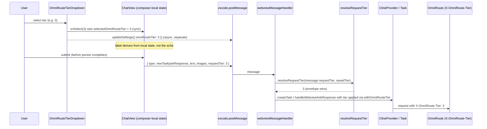

# Design Document

## Overview

This feature (FEAT-003) makes the user's selected OmniRoute cost tier apply **immediately and atomically** to the exact request submitted at that moment, and defines the **tier-ceiling** semantics for mastermind worker execution.

Today the tier selector (`OmniRouteTierDropdown`) persists the chosen tier **asynchronously** — on select it posts `updateSettings({ omniRouteTier })` and then reads the tier back from live extension state. Meanwhile `ChatView` submits requests **synchronously** (`newTask` / `askResponse`). A user who selects a tier and immediately presses submit can send the request with the *previous* tier, because the settings round trip (`updateSettings` → `ContextProxy` → `getState()` → `postStateToWebview`) has not yet completed. There is a classic read-after-write race between an async persist and a sync submit.

The fix moves the per-request tier into the **request envelope**, captured at submit time:

1. The composer holds a **synchronous local tier state** (`selectedOmniRouteTier`). Selecting a tier updates this state inside the same event handler; the displayed label derives from it, not from the live `omniRouteTier` echo. The dropdown *still* posts `updateSettings` asynchronously as a separate action (so the saved default stays in sync), but the UI no longer depends on that round trip.
2. At submit time, `ChatView` attaches `selectedOmniRouteTier` as `requestTier` on the `newTask` / `messageResponse` `askResponse` message.
3. On the host, a pure `resolveRequestTier(envelopeTier, savedTier)` function resolves the effective tier with precedence **envelope → saved → OmniRoute default**, feeding the `apiConfiguration` used for that one request through the existing `withOmniRouteTier` / `omniRouteRequestHeaders` path. The envelope tier wins for the request it rides on, without mutating the persisted `omniRouteTier`.
4. For a mastermind execution, the resolved `requestTier` is the **ceiling**: worker tiers at or below the ceiling pass through; a worker tier above the ceiling is clamped to it; no resolved tier means no ceiling (OmniRoute default).

The change is **additive and backward compatible**: `omniRouteTier` persistence, the OmniRoute-profile header discriminator, and `withOmniRouteTier`'s invalid-tier / non-OmniRoute behavior are unchanged. A request with no `requestTier` and a saved tier behaves exactly as before.

### Scope

In scope: composer-local tier state, the `requestTier` envelope field, host-side resolution, header emission wiring, and the mastermind worker tier ceiling. Out of scope (separate specs): observatory, loop detection, semantic retrieval, branding, reasoning budgets, parallelism scheduling, and the parallelism-mode envelope field.

### Verified codebase grounding

| Element | Location | Current behavior this design builds on |
| --- | --- | --- |
| `OmniRouteTierDropdown` | `webview-ui/src/components/chat/OmniRouteTierDropdown.tsx` | Reads `omniRouteTier` from `useExtensionState()`; on select posts `updateSettings({ omniRouteTier })`; renders only for an OmniRoute profile. |
| `ChatView` submit | `webview-ui/src/components/chat/ChatView.tsx` (~L692, L721, L711) | Posts `{ type: "newTask", text, images }` for the first message and `{ type: "askResponse", askResponse: "messageResponse", text, images }` for subsequent ones. |
| `omniRouteRequestHeaders` / `withOmniRouteTier` / `isOmniRoute` / `OMNIROUTE_TIER_HEADER` | `src/api/providers/omniroute.ts` | Emits `{ "X-OmniRoute-Tier": String(tier) }` only for OmniRoute profiles with a valid tier 1–5; `withOmniRouteTier` injects/removes the live tier, drops invalid tiers, never mutates input, never carries tier on non-OmniRoute profiles. |
| `WebviewMessage` / `ExtensionState` / `omniRouteTier` key | `packages/types/src/vscode-extension-host.ts`, `packages/types/src/global-settings.ts` (`omniRouteTierSchema = z.number().int().min(1).max(5)`), `packages/types/src/provider-settings/openai.ts` | Message envelope and state shapes; `omniRouteTier` is an existing optional global setting validated 1–5. |
| `newTask` / `askResponse` handlers | `src/core/webview/webviewMessageHandler.ts` (~L693, L723) | `newTask` → `provider.createTask(...)`; `askResponse` → `getCurrentTask()?.handleWebviewAskResponse(...)`. |
| Global-tier round trip | `src/core/webview/ClineProvider.ts` (`getState`, `getStateToPostToWebview`, `withLiveOmniRouteTier`) | Round-trips global `omniRouteTier` onto the active OmniRoute profile; parallel workers read the live global tier via `withLiveOmniRouteTier`. |

## Architecture

### End-to-end flow



### Where each responsibility lives

- **Submit-time capture (atomicity):** `ChatView` owns `selectedOmniRouteTier` as local React state and reads it synchronously at the moment it builds the `newTask` / `askResponse` payload. No host → webview echo is required (Req 4.4).
- **Resolution (precedence):** a new pure function `resolveRequestTier(envelopeTier, savedTier)` in `src/api/providers/omniroute.ts` (co-located with the existing tier helpers) returns the effective tier or `undefined`. It is called from `webviewMessageHandler` for `newTask` and `askResponse`, producing the tier that is applied to the `apiConfiguration` for that one request via the existing `withOmniRouteTier`.
- **Header emission (unchanged):** `omniRouteRequestHeaders` continues to be the single place the tier → header mapping lives. The resolved tier reaches it through `withOmniRouteTier`, so non-OmniRoute profiles and unset/invalid tiers emit no header exactly as before (Req 6.2, 6.3, 6.5).
- **Clamping (ceiling):** a new pure function `clampWorkerTier(requestedTier, ceilingTier)` constrains a mastermind worker's requested tier to the execution ceiling. It plugs into the existing parallel-worker tier plumbing (`ClineProvider.withLiveOmniRouteTier` / the handoff `apiConfiguration` path at `createTask`), replacing/augmenting the live-global-tier read with the clamped value for workers of a mastermind execution.

### Why resolution lives on the host, not the webview

The saved tier (`omniRouteTier`) authoritatively lives on the host (`ContextProxy`), and the header is emitted on the host (`openai.ts` request path). Placing resolution on the host means the webview only has to transmit the one value it owns synchronously (the envelope tier) and never has to read back merged state before submitting — which is exactly what removes the race. The envelope tier is a per-request override that never writes back to `ContextProxy`.

## Components and Interfaces

### 1. Message types (`packages/types/src/vscode-extension-host.ts`)

Add an optional `requestTier` field to `WebviewMessage`, carried on the `newTask` and `messageResponse` `askResponse` messages. Validation reuses the existing `omniRouteTierSchema` semantics (integer 1–5).

```ts
// WebviewMessage (additive field; present only on newTask / messageResponse askResponse)
/**
 * Per-request OmniRoute cost tier captured at submit time (FEAT-003).
 * Integer 1-5. Out-of-range or non-integer values are treated as absent by
 * resolveRequestTier on the host. Omitted when the composer has no local tier.
 */
requestTier?: number
```

The field is optional and additive, so older webview/host builds that omit it continue to work (a missing `requestTier` falls through to the saved tier).

### 2. `OmniRouteTierDropdown` (`webview-ui/src/components/chat/OmniRouteTierDropdown.tsx`)

The dropdown becomes a controlled component driven by composer-local state rather than the live echo:

```ts
interface OmniRouteTierDropdownProps {
  disabled?: boolean
  triggerClassName?: string
  /** Composer-local tier (source of truth for the label). FEAT-003. */
  selectedTier: number | undefined
  /** Synchronous local-state setter owned by ChatView. */
  onSelectTier: (tier: number | undefined) => void
}
```

- `handleSelect(tier)` calls `onSelectTier(tier)` **synchronously** (Req 1.1, 1.2) and *also* posts `updateSettings({ omniRouteTier: tier })` as a separate async action (Req 1.3).
- The displayed label derives from `selectedTier` (Req 1.4), not `omniRouteTier` from `useExtensionState()`.
- The OmniRoute-profile render guard (`isOmniRouteProfile`) is unchanged (Req 1.5).

This control lives in the chat toolbar, not `SettingsView`, so the `SettingsView` `cachedState` rule does not apply; the composer-local state is itself the buffer and the async `updateSettings` is the deliberate immediate-save flow.

### 3. `ChatView` (`webview-ui/src/components/chat/ChatView.tsx`)

Owns the composer-local tier state and attaches it at submit time:

```ts
const [selectedOmniRouteTier, setSelectedOmniRouteTier] =
  React.useState<number | undefined>(undefined)

// On first mount, seed from the saved tier so the control reflects the persisted
// default; after that, local state is authoritative (no echo dependence).
```

At each submit site, `requestTier` is attached only when the local tier is a valid 1–5 integer (undefined → field omitted, Req 2.3):

```ts
const requestTier = selectedOmniRouteTier // 1..5 | undefined, captured at submit (Req 2.4, 4.2)

if (messagesRef.current.length === 0) {
  vscode.postMessage({ type: "newTask", text, images, ...(requestTier ? { requestTier } : {}) })
} else {
  vscode.postMessage({
    type: "askResponse", askResponse: "messageResponse", text, images,
    ...(requestTier ? { requestTier } : {}),
  })
}
```

The `OmniRouteTierDropdown` is rendered with `selectedTier={selectedOmniRouteTier}` and `onSelectTier={setSelectedOmniRouteTier}`.

### 4. `resolveRequestTier` (`src/api/providers/omniroute.ts`)

Pure, total resolution function implementing the precedence envelope → saved → default:

```ts
/**
 * Resolve the effective OmniRoute cost tier for a single request (FEAT-003).
 * Precedence: a valid envelope tier wins; else a valid saved tier; else undefined
 * (OmniRoute default, no header). Any value that is not an integer in 1..5 is
 * treated as absent. Never mutates persisted state.
 */
export function resolveRequestTier(
  envelopeTier: number | undefined,
  savedTier: number | undefined,
): number | undefined {
  if (omniRouteTierSchema.safeParse(envelopeTier).success) return envelopeTier
  if (omniRouteTierSchema.safeParse(savedTier).success) return savedTier
  return undefined
}
```

Reusing `omniRouteTierSchema` keeps the accepted range aligned with the existing control, header reader, and `withOmniRouteTier`.

### 5. `clampWorkerTier` (`src/api/providers/omniroute.ts`)

Pure clamp enforcing the mastermind tier ceiling:

```ts
/**
 * Clamp a mastermind worker's requested tier to the execution ceiling (FEAT-003).
 * - ceiling undefined => no ceiling; pass the requested tier through (may be undefined).
 * - requested undefined => undefined (worker uses OmniRoute default under the ceiling's absence of override).
 * - otherwise => min(requested, ceiling), i.e. below/at ceiling preserved, above clamped down.
 */
export function clampWorkerTier(
  requestedTier: number | undefined,
  ceilingTier: number | undefined,
): number | undefined {
  if (ceilingTier === undefined) return requestedTier
  if (requestedTier === undefined) return ceilingTier
  return Math.min(requestedTier, ceilingTier)
}
```

### 6. Host wiring

- **`webviewMessageHandler` — `newTask`:** before `provider.createTask(...)`, read the saved tier (`provider.contextProxy.getValue("omniRouteTier")`), compute `resolveRequestTier(message.requestTier, savedTier)`, and apply the resolved tier to the request's `apiConfiguration` via `withOmniRouteTier`. The resolved tier is a per-request override and is **not** written back to `ContextProxy`.
- **`webviewMessageHandler` — `askResponse` (messageResponse):** same resolution, applied to the current task's active `apiConfiguration` for the follow-up request. Only the `messageResponse` askResponse carries `requestTier`; button-click askResponses are unaffected.
- **Resolution → header:** the resolved tier flows through the existing `withOmniRouteTier` → `omniRouteRequestHeaders` path in `openai.ts`, so the `X-OmniRoute-Tier` header carries the resolved integer for OmniRoute profiles only, and is omitted otherwise (Req 3.4, 3.5, 6.2, 6.3).
- **Mastermind workers:** at the parallel-worker/handoff `apiConfiguration` application point in `ClineProvider` (today `withLiveOmniRouteTier` reads the live global tier), the execution's resolved `requestTier` becomes the ceiling. For each worker, the tier applied is `clampWorkerTier(requestedWorkerTier, ceiling)` before `withOmniRouteTier`. When the ceiling is undefined, behavior is unchanged from today (no ceiling, OmniRoute default). OmniRoute still owns model/provider/GPU placement; only the tier header is constrained.

## Data Models

### Request_Envelope

```ts
type RequestEnvelope = {
  text: string
  images?: string[]
  requestTier?: number // integer 1-5 when present; out-of-range treated as absent on the host
}
```

Only `requestTier` is added by this feature; `text` / `images` are existing fields on the `newTask` / `askResponse` messages.

### Composer_Local_Tier_State

```ts
// ChatView local React state (source of truth for the label and submit capture)
selectedOmniRouteTier: number | undefined // 1-5 or undefined; updated synchronously on select
```

### Resolution function signature

```ts
resolveRequestTier(
  envelopeTier: number | undefined,
  savedTier: number | undefined,
): number | undefined // effective tier (1-5) or undefined (OmniRoute default)
```

### Worker clamp signature

```ts
clampWorkerTier(
  requestedTier: number | undefined,
  ceilingTier: number | undefined,
): number | undefined
```

### Saved_Tier (unchanged)

Global `omniRouteTier` (`omniRouteTierSchema = z.number().int().min(1).max(5)`, optional) persisted via `ContextProxy`, round-tripped onto the active OmniRoute profile by `ClineProvider.getState()`.

## Correctness Properties

*A property is a characteristic or behavior that should hold true across all valid executions of a system — essentially, a formal statement about what the system should do. Properties serve as the bridge between human-readable specifications and machine-verifiable correctness guarantees.*

This feature is a strong fit for property-based testing because the core is pure logic over a meaningful input space: the resolution function, the invalid-tier normalization, the header mapping across profile discriminators, and the worker clamp. UI wiring and submit-time capture are covered as example/edge-case tests in the Testing Strategy; the race regression is validated by a focused property-style test over the tier values.

### Property 1: Submit-time capture is atomic (no stale tier, no echo)

*For any* selected tier value in {1,2,3,4,5}, when the composer sets `selectedOmniRouteTier` to that value and then submits a request **before any host → webview state echo occurs**, the submitted `newTask` / `messageResponse` envelope SHALL carry `requestTier` equal to the selected value, and `resolveRequestTier(envelopeTier, savedTier)` SHALL equal the selected value regardless of the (stale) saved tier.

**Validates: Requirements 2.1, 2.2, 4.1, 4.2, 4.3, 4.4**

### Property 2: Resolution precedence is a total function (envelope → saved → default)

*For any* envelope tier value and *any* saved tier value (including out-of-range, non-integer, `NaN`, and `undefined`), `resolveRequestTier(envelopeTier, savedTier)` SHALL return a defined result where: if the envelope tier is a valid integer 1–5 the result equals the envelope tier; else if the saved tier is a valid integer 1–5 the result equals the saved tier; else the result is `undefined`. The function SHALL never throw and SHALL be defined for every input pair.

**Validates: Requirements 3.1, 3.2, 3.3, 4.3, 6.4**

### Property 3: Header emission respects the OmniRoute discriminator and the resolved tier

*For any* resolved tier value and *any* provider profile, applying the tier via `withOmniRouteTier` and reading `omniRouteRequestHeaders`: SHALL emit `{ "X-OmniRoute-Tier": String(tier) }` exactly when the profile is an OmniRoute profile and the resolved tier is an integer 1–5; and SHALL emit no header for every non-OmniRoute profile (regardless of `requestTier`) and for every unset/out-of-range resolved tier.

**Validates: Requirements 3.4, 3.5, 6.2, 6.3, 6.5**

### Property 4: Worker tier is clamped to the ceiling (min semantics)

*For any* ceiling value and *any* requested worker tier, `clampWorkerTier(requestedTier, ceilingTier)`: SHALL return the requested tier when the ceiling is `undefined` (no ceiling); SHALL return the ceiling when the requested tier is `undefined`; and otherwise SHALL return `min(requestedTier, ceilingTier)` so a requested tier at or below the ceiling is preserved and a requested tier above the ceiling is clamped down to the ceiling. When a ceiling is defined, the result SHALL never exceed the ceiling.

**Validates: Requirements 5.1, 5.2, 5.3, 5.4**

### Property 5: Invalid envelope tier is treated as absent

*For any* envelope tier value that is not an integer in 1–5 (including 0, 6, negatives, fractions, `NaN`, and `undefined`), `resolveRequestTier(envelopeTier, savedTier)` SHALL ignore the envelope tier and resolve from the saved tier (if valid) or to `undefined`, so an invalid envelope value never carries into the `X-OmniRoute-Tier` header.

**Validates: Requirements 2.4, 2.5**

## Error Handling

- **Out-of-range / malformed envelope tier:** normalized away by `resolveRequestTier` via `omniRouteTierSchema` (Property 5). No throw; the request falls back to the saved tier or the OmniRoute default. The composer only ever sets 1–5 or `undefined`, so this is defense-in-depth against hand-crafted or stale messages.
- **Missing `requestTier` (older webview or no selection):** treated as absent; resolution falls through to the saved tier exactly as before this feature (backward compatibility).
- **Non-OmniRoute active profile:** `omniRouteRequestHeaders` / `withOmniRouteTier` suppress the tier and header regardless of any `requestTier` (Property 3). No error surfaces to the user; the request routes normally without a tier header.
- **Clamp with undefined ceiling:** `clampWorkerTier` passes the requested tier through, preserving today's unbounded (OmniRoute-default) behavior for executions with no resolved tier.
- **Persistence failure of the async `updateSettings`:** does not affect the submitted request, because the request already carries the envelope tier captured at submit time; only the persisted default would be stale, surfaced on the next session via the normal settings path.

## Testing Strategy

Testing follows the test-pyramid guidance in `AGENTS.md` and `webview-ui/AGENTS.md`: webview-ui JSDOM tests for composer behavior; `src` unit/property tests for host pure logic; no new e2e unless a real-host boundary is required (it is not here — all logic is pure or component-level).

### Fast-check property tests (`src`, min. 100 iterations each)

Use the project's property-based testing library for the target language (e.g. `fast-check` for TypeScript). Do **not** implement property testing from scratch. Each property test runs a minimum of 100 iterations and is tagged with a comment referencing its design property.

Tag format: `// Feature: immediate-tier-semantics, Property {number}: {property_text}`

- **Property 2 — resolution precedence/totality** (`src/api/providers/__tests__/omniroute.spec.ts` or a new `resolveRequestTier.spec.ts`): generate arbitrary `(envelopeTier, savedTier)` pairs across valid tiers, out-of-range integers, floats, `NaN`, and `undefined`; assert the precedence rule and totality.
- **Property 3 — header emission** (extends `omniroute.spec.ts`): generate arbitrary tiers and profiles (OmniRoute vs non-OmniRoute via `apiProvider` / `openAiIsOmniRoute`); assert the header appears exactly for OmniRoute + valid tier and never otherwise.
- **Property 4 — worker clamp**: generate arbitrary `(requestedTier, ceilingTier)` including `undefined` on each side; assert `min` semantics and the never-exceeds-ceiling invariant.
- **Property 5 — invalid envelope treated as absent**: generate arbitrary non-1..5 values as the envelope tier; assert the envelope tier is ignored.

### Example / edge-case unit tests

- **`src` unit tests:** `resolveRequestTier` concrete cases (envelope 3 / saved 1 → 3; no envelope / saved 2 → 2; neither → undefined); `clampWorkerTier` ceiling assignment equals resolved tier (Req 5.1); `webviewMessageHandler` `newTask` / `askResponse` resolution applies the resolved tier to the request `apiConfiguration` without writing back to `ContextProxy`.
- **Preserve existing behavior:** `src/api/providers/__tests__/omniroute.spec.ts` (`withOmniRouteTier` do-not-mutate, drop-invalid, non-OmniRoute strip) and `ClineProvider` round-trip tests (`ClineProvider.spec.ts`, `ClineProvider.taskHistory.spec.ts`, `ClineProvider.apiHandlerRebuild.spec.ts`) must remain green (Req 6.1, 6.4, 6.5).

### webview-ui tests (`webview-ui/src/**/__tests__`, Vitest + JSDOM)

- **Composer-local state (Req 1.1, 1.2, 1.4):** render `OmniRouteTierDropdown` as a controlled component; select each tier and Default; assert the label follows the controlled `selectedTier` even when a conflicting live `omniRouteTier` is supplied via context.
- **Async persist is a separate action (Req 1.3):** with mocked `vscode.postMessage`, assert selecting a tier posts `updateSettings({ omniRouteTier })` and that the local-state label update does not depend on any host echo.
- **Render guard (Req 1.5):** visible for an OmniRoute profile, `null` for a non-OmniRoute profile.
- **Submit-time capture (Req 2.1, 2.2, 2.3, 4.2):** with mocked `postMessage`, select a tier then submit the first message → assert `newTask.requestTier`; with an ongoing task → assert `messageResponse` `askResponse.requestTier`; with no selection → assert `requestTier` is omitted.
- **Race regression (Req 4.1, 4.4) — the focused "race is gone" test:** select a tier and submit **immediately** with no intervening host → webview state message (no echo); assert the submitted payload carries the selected tier. Parametrized over tiers 1–5 to mirror Property 1.

### e2e (`apps/vscode-e2e`)

Not required. All behavior is covered at the webview-ui (component/state) and `src` (pure logic) layers. Reserve e2e only if a future change makes the resolution depend on a real extension-host boundary (e.g. real `ContextProxy` persistence timing), which this design deliberately avoids by capturing the tier in the envelope.

## Compatibility and Migration

- **Additive message field:** `requestTier` is optional on `WebviewMessage`; mixed old/new webview and host builds interoperate (missing field → saved tier fallback).
- **No change to `omniRouteTier` persistence:** the global setting, its schema, and the `getState()` / `getStateToPostToWebview()` round trip are unchanged. No migration of stored settings is needed.
- **`SettingsView` unaffected:** the tier control lives in the chat toolbar, not `SettingsView`; the `cachedState` pattern is not involved.
- **Header behavior unchanged for the no-`requestTier` path:** a request with no envelope tier and a saved tier on an OmniRoute profile emits the same `X-OmniRoute-Tier` header as before (Req 6.4).
