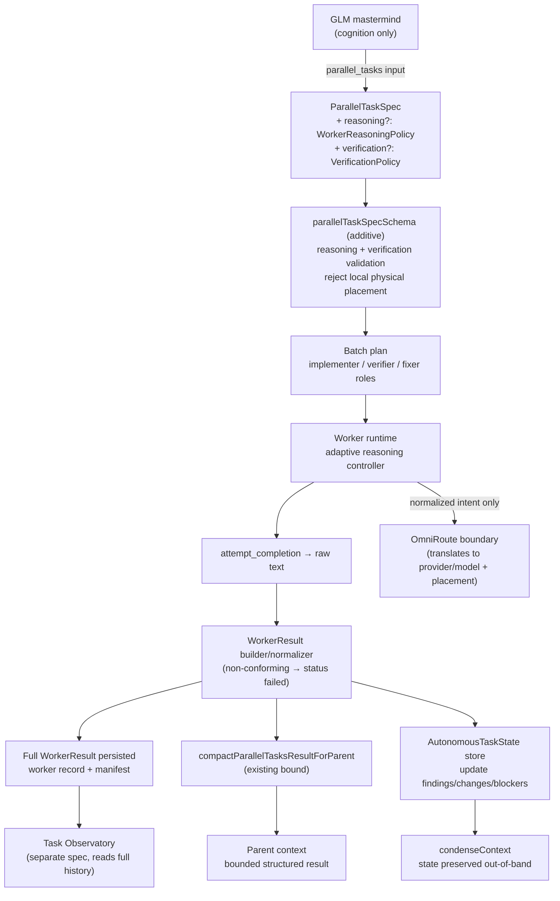
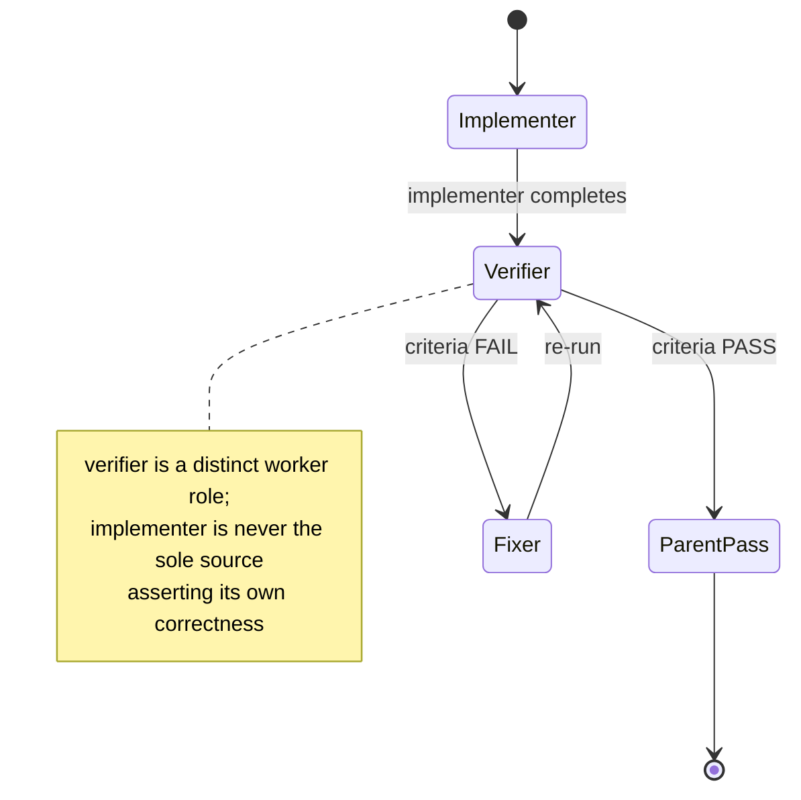

# Design Document

## Overview

This feature (FEAT-006 through FEAT-009) gives the Menagerie GLM mastermind **orchestrator intelligence**: it can attach normalized *cognition* metadata to delegated work — how hard to think, whether to adapt, what to verify, and the authoritative state of the task — without ever becoming a *silicon* scheduler. The governing invariant across all four sub-features is **GLM schedules cognition; OmniRoute schedules silicon.**

The design is deliberately **additive** to the existing native-parallel-tasks machinery. It extends `ParallelTaskSpec` with two optional fields (`reasoning`, `verification`), adds a normalized orchestration reasoning vocabulary that *maps onto* the existing `reasoningEffortsExtended` enum (rather than replacing it), introduces a typed `WorkerResult` that flows to the parent through the **existing** `compactParallelTasksResultForParent` bound while the full result persists unchanged, inserts an **implementer → verifier → fixer** delegation flow for consequential work, and makes `AutonomousTaskState` a first-class task-state object that survives `condenseContext`.

Four changes, one rule:

1. **FEAT-006 — Reasoning/execution budget.** A normalized `ReasoningEffort` enum (`"minimal" | "low" | "medium" | "high" | "max"`) is defined as a total mapping onto `reasoningEffortsExtended` in `packages/types/src/model.ts`. A `WorkerReasoningPolicy` (`effort`, optional `adaptive`, `maxEffort`, `priority`) rides on each `ParallelTaskSpec`. Workers may escalate adaptively up to `maxEffort` and report `reasoning: { requested, used, escalations }`. The normalized intent is carried to OmniRoute **as cognition metadata**, never translated into provider/model knobs locally.
2. **FEAT-007 — Structured worker results.** Workers return a typed `WorkerResult` with findings, evidence, changes, tests, blockers, artifacts, and optional reasoning telemetry. The full result persists in the worker record and manifest exactly as today; the parent receives the bounded structured representation through the existing `compactParallelTasksResultForParent` / `clipParentResult` path. Non-conforming worker output is normalized into a conforming `WorkerResult` with `status: "failed"`.
3. **FEAT-008 — Verification first-class.** A `verification` policy (`required`, optional `mode`, `criteria`) on a task schedules an independent **verifier** worker role. Required verification *gates* parent success: a task is not successfully verified until the verifier's criteria pass; a FAIL routes to a **fixer** then re-runs the verifier. The verifier is a cognition role, scheduled as an additional worker, never a GPU concern.
4. **FEAT-009 — Structured autonomous task state.** `AutonomousTaskState` becomes the authoritative task-state object. It is updated as workers report findings/changes/blockers and it **survives `condenseContext`** — after condensation, reads return the preserved structured state, not a reconstruction from the transcript.

### Scope

In scope: the normalized reasoning enum + mapping, `WorkerReasoningPolicy` validation, the additive `ParallelTaskSpec.reasoning` / `verification` fields, the adaptive-reasoning controller + telemetry, the `WorkerResult` builder/normalizer, the verifier role + criteria evaluation + required-verification gate, and the `AutonomousTaskState` store + condensation-survival hook.

Out of scope (owned elsewhere, referenced only): GPU/VRAM/CUDA/node/provider-thinking-token selection and provider-capability translation (OmniRoute); DAG scheduling, elastic/user-controlled parallelism, reader swarms, speculation (elastic-parallel-execution, FEAT-010/011/012); the Task Observatory UI (task-observatory); tier ceilings and tier semantics (immediate-tier-semantics). This design does not change the 1–4 task cap, does not modify the existing reasoning enums, and does not redefine tier ceilings.

### Verified codebase grounding

| Element | Location | Current behavior this design builds on |
| --- | --- | --- |
| `ParallelTasksTool` / `parallelTaskSpecSchema` / `ParallelTaskSpec` | `src/core/tools/ParallelTasksTool.ts` | Tool `parallel_tasks`; spec fields `name`, `mode`, `message`, `todos` (string\|null), `route` (string\|null); schema caps **1–4** tasks and requires unique names; `.strip()` drops unknown keys. |
| `compactParallelTasksResultForParent` / `clipParentResult` / `MAX_WORKER_PARENT_RESULT_CHARS` / `MAX_WORKER_PARENT_ERROR_CHARS` / `MAX_READER_PARENT_RESULT_CHARS` | `src/core/tools/ParallelTasksTool.ts` | Bounds what a worker injects into the parent context; reader workers use a smaller bound; appends a "Full result" manifest reference when clipped; full completion text stays in the worker record and manifest. |
| `reasoningEfforts` / `reasoningEffortsSchema` / `ReasoningEffort` / `reasoningEffortWithMinimalSchema` / `reasoningEffortsExtended` / `reasoningEffortExtendedSchema` | `packages/types/src/model.ts` | `ReasoningEffort = "low" \| "medium" \| "high"`; extended `["none","minimal","low","medium","high","xhigh","max"]`; setting values include `"disable"`. These are preserved unchanged. |
| `ProviderSettings.reasoningEffort` / `enableReasoningEffort` / `shouldUseReasoningEffort` | `packages/types`, `src/shared/api.ts` | Per-model gating of reasoning effort; the OmniRoute boundary — not the mastermind — resolves provider capability. |
| `AttemptCompletionTool` | `src/core/tools/AttemptCompletionTool.ts` | Workers deliver their result via `attempt_completion`; this is where raw completion text is captured for normalization into a `WorkerResult`. |
| `runParallelTasks` + manifest/worker records | `src/core/task/runParallelTasks.ts`, global storage `parallel-tasks/<batch-id>/` (manifest + `worker-N.json`) — see `docs/architecture/native-parallel-tasks.md` | Owns dispatch, result ownership, persistence of full worker result and manifest; the parent collects terminal results in one tool call. |
| `Task.condenseContext` | `src/core/task/Task.ts` (~L2060) | Summarizes conversational history to fit the window; the hook point where `AutonomousTaskState` must be preserved out-of-band so a read after condensation returns the stored state. |
| Lifecycle reducers | `src/core/task-persistence/taskLifecycle.ts`; model doc `docs/architecture/task-lifecycle-model.md` | Owns status/delegation transitions; any new transition (verifier/fixer re-run) must update the model and run `pnpm lifecycle:model-check`. |

## Architecture

### Where the new concepts attach



Three attachment points:

- **`ParallelTaskSpec`** gains two optional, additive fields: `reasoning?: WorkerReasoningPolicy` and `verification?: VerificationPolicy`. Existing fields and bounds are untouched; `.strip()` still drops unknown keys, so an old spec remains valid and a stray legacy key is dropped rather than rejected.
- **Worker runtime** gains an adaptive-reasoning controller that holds the applied effort, escalates up to `maxEffort` on defined triggers, and records telemetry; and a result normalizer that runs over the `attempt_completion` output.
- **`Task` state** gains an `AutonomousTaskState` store, written when worker results are applied and read as the authoritative task-state source, with a preservation hook across `condenseContext`.

### Normalized reasoning enum maps to the extended enum at the OmniRoute boundary

The normalized orchestration enum is **not** a new conflicting type. It is a subset of the existing `reasoningEffortsExtended` members, with a total mapping function that produces an extended value. The mapping is intentionally the identity on shared members (`minimal`, `low`, `medium`, `high`, `max` all already exist in `reasoningEffortsExtended`), which keeps reconciliation trivial and makes the mapping total and range-safe by construction. `reasoningEfforts` (`low/medium/high`), `ReasoningEffortWithMinimal`, and `reasoningEffortsExtended` are preserved unchanged.

The mastermind only ever emits the **normalized** value and the **priority** bias. These travel to the OmniRoute boundary as cognition metadata. Translation into provider/model-specific capabilities (`ProviderSettings.reasoningEffort`, `enableReasoningEffort`, thinking tokens, service tier, placement) happens **inside OmniRoute**, gated by `shouldUseReasoningEffort` per model. Menagerie performs the normalized→extended mapping only to hand OmniRoute a value drawn from the vocabulary it already understands; it does not pick the provider knob.

```mermaid
flowchart LR
    N["normalized ReasoningEffort<br/>minimal|low|medium|high|max"] -->|mapNormalizedToExtended<br/>(total, identity on shared members)| E["reasoningEffortsExtended<br/>none|minimal|low|medium|high|xhigh|max"]
    E -->|carried as cognition metadata| OR["OmniRoute boundary"]
    OR -->|shouldUseReasoningEffort + provider capability| Prov["provider/model knobs + placement"]
```

### Where implementer → verifier → fixer sits in the delegation lifecycle

Verification is a **role sequencing** concern layered on the existing boomerang/parallel delegation, not a new task database. For a task with required verification, the batch plan schedules an implementer worker and an independent verifier worker; a verifier FAIL schedules a fixer followed by a verifier re-run. These roles are ordinary workers (distinct runtimes), so result ownership, persistence, and the bounded-parent path are unchanged.

Because the pass/fail outcome influences how the parent observes task completion, any status transition expressed in the lifecycle model (for example a `verifier-pending → verified` / `verifier-failed → fixing` transition) **must** be added to the shared reducers in `src/core/task-persistence/taskLifecycle.ts`, with model actions/invariants updated, after reading `docs/architecture/task-lifecycle-model.md`, followed by `pnpm lifecycle:model-check`. Where the gate can be expressed purely as orchestration sequencing over existing worker-terminal states (implementer completes → schedule verifier → gate parent PASS on verifier pass), the design prefers that and avoids a new lifecycle status; a new transition is introduced only if the gate cannot be represented by existing terminal states.



### How WorkerResult flows through the bounded-parent path while persisting the full result

`WorkerResult` is serialized to JSON. The **full** serialized result is persisted in the worker record and the manifest, exactly as full completion text is today. The parent-visible representation is produced by the existing `compactParallelTasksResultForParent`, which runs `clipParentResult` with `MAX_WORKER_PARENT_RESULT_CHARS` (or `MAX_READER_PARENT_RESULT_CHARS` for reader workers) and appends the manifest reference when clipped. The structured result rides the existing `result` string channel: the normalizer produces the JSON string, which the bound then clips if oversized. No new parent-injection path is added; the bounds and the reader-specific behavior are preserved.

### AutonomousTaskState condensation survival

`AutonomousTaskState` is stored out-of-band from the conversational `apiConversationHistory` — the structure that `condenseContext` summarizes. `condenseContext` summarizes transcript messages but **does not** read, rewrite, or drop the `AutonomousTaskState` object. A `preserveAutonomousTaskState` hook captures the state object before summarization and the store returns the same object after, so a read after condensation yields the preserved state rather than a reconstruction. This makes `AutonomousTaskState` the authoritative source: the transcript is no longer the sole database for task state.

## Components and Interfaces

### 1. Normalized ReasoningEffort mapping (`packages/types/src/model.ts`, additive)

```ts
// Additive — existing reasoningEfforts / reasoningEffortsExtended are untouched.
export const orchestrationReasoningEfforts = ["minimal", "low", "medium", "high", "max"] as const
export const orchestrationReasoningEffortSchema = z.enum(orchestrationReasoningEfforts)
// Normalized orchestration ReasoningEffort used by the mastermind.
export type OrchestrationReasoningEffort = z.infer<typeof orchestrationReasoningEffortSchema>

/**
 * Total mapping from the normalized orchestration enum onto the existing
 * reasoningEffortsExtended members. Identity on shared members by construction;
 * every normalized value yields a valid ReasoningEffortExtended value.
 */
export function mapNormalizedToExtended(value: OrchestrationReasoningEffort): ReasoningEffortExtended {
	// All five normalized members are already members of reasoningEffortsExtended.
	return value
}

/** Rank used for ordering comparisons (maxEffort >= effort, used >= requested). */
export const orchestrationReasoningRank: Record<OrchestrationReasoningEffort, number> = {
	minimal: 0,
	low: 1,
	medium: 2,
	high: 3,
	max: 4,
}
```

The validator for mastermind-supplied values rejects anything outside `orchestrationReasoningEfforts` with a descriptive error naming the five permitted values (`minimal, low, medium, high, max`).

### 2. WorkerReasoningPolicy + validation (`packages/types`)

```ts
export const workerReasoningPriorities = ["latency", "balanced", "quality"] as const

export const workerReasoningPolicySchema = z
	.object({
		effort: orchestrationReasoningEffortSchema,
		adaptive: z.boolean().optional(),
		maxEffort: orchestrationReasoningEffortSchema.optional(),
		priority: z.enum(workerReasoningPriorities).optional(),
	})
	.superRefine((policy, ctx) => {
		if (
			policy.maxEffort !== undefined &&
			orchestrationReasoningRank[policy.maxEffort] < orchestrationReasoningRank[policy.effort]
		) {
			ctx.addIssue({
				code: z.ZodIssueCode.custom,
				message: `maxEffort (${policy.maxEffort}) must be >= effort (${policy.effort})`,
				path: ["maxEffort"],
			})
		}
	})

export type WorkerReasoningPolicy = z.infer<typeof workerReasoningPolicySchema>

/** Resolves the escalation ceiling: adaptive without maxEffort treats effort as the ceiling. */
export function resolveEffortCeiling(policy: WorkerReasoningPolicy): OrchestrationReasoningEffort {
	return policy.maxEffort ?? policy.effort
}
```

### 3. Adaptive reasoning controller (worker runtime)

A per-worker controller holds the applied effort and exposes escalation on defined triggers. It begins at `effort`, never exceeds `resolveEffortCeiling(policy)`, holds steady when `adaptive` is false/unset, and records escalation telemetry.

```ts
export type EscalationTrigger = "ambiguity" | "conflicting-evidence" | "repeated-failure" | "low-confidence"

export class AdaptiveReasoningController {
	constructor(private readonly policy: WorkerReasoningPolicy) {}
	// applied starts at policy.effort; escalations starts at 0
	escalate(trigger: EscalationTrigger): void // bumps applied by one rank toward the ceiling, counts the escalation
	readonly applied: OrchestrationReasoningEffort // current applied effort, never above the ceiling
	telemetry(): { requested: OrchestrationReasoningEffort; used: OrchestrationReasoningEffort; escalations: number }
	// requested = policy.effort; used = highest applied; escalations = count of escalate() calls that changed applied
}
```

### 4. WorkerResult builder / normalizer (`src/core/task` — worker result layer)

The normalizer runs over the `attempt_completion` output. Conforming structured output is parsed and defaulted (absent arrays become `[]`); non-conforming output (arbitrary prose, partial JSON, missing status) yields a conforming `WorkerResult` with `status: "failed"` and a descriptive, non-empty `summary` that references the raw output. The full `WorkerResult` is serialized for persistence; the serialized string is what the existing parent bound clips.

```ts
export const evidenceReferenceSchema = z.object({
	type: z.enum(["file", "test", "command", "url", "screenshot"]),
	reference: z.string(),
	lines: z.tuple([z.number(), z.number()]).optional(),
	result: z.string().optional(),
})
export const findingSchema = z.object({ claim: z.string(), confidence: z.number().optional() })

export const workerResultSchema = z.object({
	status: z.enum(["completed", "failed", "blocked"]),
	summary: z.string(),
	findings: z.array(findingSchema),
	evidence: z.array(evidenceReferenceSchema),
	changes: z.array(z.string()),
	tests: z.array(z.string()),
	blockers: z.array(z.string()),
	artifacts: z.array(z.string()),
	reasoning: z
		.object({
			requested: orchestrationReasoningEffortSchema,
			used: orchestrationReasoningEffortSchema,
			escalations: z.number().int().nonnegative(),
		})
		.optional(),
})
export type WorkerResult = z.infer<typeof workerResultSchema>

/** Always returns a schema-valid WorkerResult; non-conforming input becomes status "failed". */
export function normalizeWorkerResult(raw: unknown, context: { workerName: string }): WorkerResult
```

### 5. Verification policy, verifier role, and the required-verification gate

```ts
export const verificationPolicySchema = z.object({
	required: z.boolean(),
	mode: z.string().optional(),
	criteria: z.array(z.string()).optional(),
})
export type VerificationPolicy = z.infer<typeof verificationPolicySchema>

export type TaskKind = "read-only" | "code-modification" | "deployment" | "migration-destructive"

/** Recommended defaults by task kind (Requirement 10). */
export function defaultVerificationFor(kind: TaskKind): "optional" | "recommended" | "required"
// read-only -> optional; code-modification -> recommended; deployment -> required; migration-destructive -> required
```

The orchestration layer:

- Schedules an independent **verifier** worker role when `verification.required` is `true` (distinct runtime from the implementer).
- Gates parent success: a required-verification task is reported PASS to the parent **only** after the verifier's criteria pass; otherwise it is reported as **not successfully verified**.
- On verifier FAIL, schedules a **fixer** worker followed by a verifier re-run.
- Produces a compact pass/fail evidence list (not a transcript): the verifier returns a `WorkerResult` whose `evidence` array carries one pass/fail entry **per supplied criterion**, in criterion order.
- Treats verifier scheduling as a cognition role within the batch, never a GPU/placement concern.

### 6. AutonomousTaskState store + condensation-survival hook (`src/core/task`)

```ts
export const autonomousTaskStateSchema = z.object({
	objective: z.string(),
	constraints: z.array(z.string()),
	decisions: z.array(z.string()),
	assumptions: z.array(z.string()),
	activeWork: z.array(z.string()),
	completedWork: z.array(z.string()),
	filesTouched: z.array(z.string()),
	blockers: z.array(z.string()),
	openQuestions: z.array(z.string()),
	evidence: z.array(evidenceReferenceSchema), // same shape as WorkerResult evidence
	nextActions: z.array(z.string()),
})
export type AutonomousTaskState = z.infer<typeof autonomousTaskStateSchema>

/** Merge a worker's reported findings/changes/blockers/evidence into task state. */
export function applyWorkerResult(state: AutonomousTaskState, result: WorkerResult): AutonomousTaskState

/** Capture point before condenseContext summarization; the store returns this object afterward. */
export function preserveAutonomousTaskState(task: Task): AutonomousTaskState
```

The store lives on the `Task` out-of-band from `apiConversationHistory`. `condenseContext` does not read or rewrite it; a read after condensation returns the preserved object. `AutonomousTaskState` is the authoritative task-state source.

## Data Models

```ts
// ── FEAT-006: reasoning ────────────────────────────────────────────────────
type OrchestrationReasoningEffort = "minimal" | "low" | "medium" | "high" | "max"

interface WorkerReasoningPolicy {
	effort: OrchestrationReasoningEffort
	adaptive?: boolean
	maxEffort?: OrchestrationReasoningEffort
	priority?: "latency" | "balanced" | "quality"
}

interface ReasoningTelemetry {
	requested: OrchestrationReasoningEffort
	used: OrchestrationReasoningEffort
	escalations: number // non-negative integer
}

// ── FEAT-007: worker results ───────────────────────────────────────────────
interface Finding {
	claim: string
	confidence?: number
}

interface EvidenceReference {
	type: "file" | "test" | "command" | "url" | "screenshot"
	reference: string
	lines?: [number, number]
	result?: string
}

interface WorkerResult {
	status: "completed" | "failed" | "blocked"
	summary: string
	findings: Finding[]
	evidence: EvidenceReference[]
	changes: string[]
	tests: string[]
	blockers: string[]
	artifacts: string[]
	reasoning?: ReasoningTelemetry
}

// ── FEAT-008: verification ─────────────────────────────────────────────────
interface VerificationPolicy {
	required: boolean
	mode?: string
	criteria?: string[]
}

// ── FEAT-009: autonomous task state ────────────────────────────────────────
interface AutonomousTaskState {
	objective: string
	constraints: string[]
	decisions: string[]
	assumptions: string[]
	activeWork: string[]
	completedWork: string[]
	filesTouched: string[]
	blockers: string[]
	openQuestions: string[]
	evidence: EvidenceReference[] // same shape as WorkerResult.evidence
	nextActions: string[]
}

// ── ParallelTaskSpec extension (additive) ──────────────────────────────────
interface ParallelTaskSpec {
	name: string
	mode: string
	message: string
	todos?: string | null
	route?: string | null
	reasoning?: WorkerReasoningPolicy // NEW, optional
	verification?: VerificationPolicy // NEW, optional
}
```

Reconciliation with existing types: `OrchestrationReasoningEffort` is a strict subset of `reasoningEffortsExtended` (`"none" | "minimal" | "low" | "medium" | "high" | "xhigh" | "max"`); `mapNormalizedToExtended` is total and range-safe (identity on shared members). The existing `ReasoningEffort` (`"low" | "medium" | "high"`), `ReasoningEffortWithMinimal`, and `reasoningEffortsExtended` definitions and members are unchanged. The `ParallelTaskSpec` additions keep the schema `.strip()` behavior and the 1–4 task cap.

## Correctness Properties

*A property is a characteristic or behavior that should hold true across all valid executions of a system — essentially, a formal statement about what the system should do. Properties serve as the bridge between human-readable specifications and machine-verifiable correctness guarantees.*

### Property 1: Normalized reasoning mapping is total, range-safe, and preserves existing enums

*For all* normalized `OrchestrationReasoningEffort` values, `mapNormalizedToExtended` returns a member of `reasoningEffortsExtended`, and for any string outside the normalized enum the validator rejects it with an error naming the five permitted values; the existing `reasoningEfforts`, `ReasoningEffortWithMinimal`, and `reasoningEffortsExtended` members remain unchanged.

**Validates: Requirements 1.1, 1.2, 1.3, 1.4**

### Property 2: WorkerReasoningPolicy validation enforces the effort ceiling

*For all* `WorkerReasoningPolicy` inputs, the policy is accepted exactly when `maxEffort` is absent or ranks greater than or equal to `effort`, and rejected with a descriptive error otherwise; when `adaptive` is true and `maxEffort` is absent, the resolved escalation ceiling equals `effort`.

**Validates: Requirements 2.3, 2.4**

### Property 3: Adaptive reasoning stays within the ceiling and telemetry is faithful

*For all* escalation-trigger sequences, the applied reasoning effort starts at the requested `effort`, is non-decreasing, never exceeds the resolved ceiling (equal to the requested `effort` when adaptive is off/unset), and the reported telemetry satisfies `requested == effort`, `used == highest applied effort`, and `escalations == a non-negative count of effort-changing escalations`.

**Validates: Requirements 5.1, 5.2, 5.3, 5.4, 5.5, 16.1, 16.2, 16.3**

### Property 4: Parent always receives a bounded conforming result while the full result persists

*For all* worker results, the full serialized `WorkerResult` is persisted in the worker record and manifest, the parent-visible representation is produced by `compactParallelTasksResultForParent` within `MAX_WORKER_PARENT_RESULT_CHARS` (or `MAX_READER_PARENT_RESULT_CHARS` for reader workers) and `MAX_WORKER_PARENT_ERROR_CHARS`, and whenever the representation is clipped it includes a reference to the full persisted result.

**Validates: Requirements 6.1, 6.2, 6.3, 6.4, 8.1, 8.2**

### Property 5: Non-conforming worker output normalizes to a conforming failed result

*For all* raw worker outputs, `normalizeWorkerResult` returns a schema-valid `WorkerResult`, and whenever the raw output does not conform to the contract the returned result has `status == "failed"` with a non-empty descriptive `summary`.

**Validates: Requirements 7.2, 7.6**

### Property 6: Required verification gates success through an independent verifier

*For all* implementer/verifier outcome combinations on a task with required verification, an independent verifier role distinct from the implementer is scheduled, the parent is reported PASS only when the verifier's criteria pass (and reported not-successfully-verified otherwise), a verifier FAIL routes to a fixer followed by a verifier re-run, and when `criteria` are supplied the verifier result contains exactly one pass/fail evidence entry per criterion in criterion order.

**Validates: Requirements 9.3, 11.1, 11.2, 11.3, 11.4, 12.1, 12.2, 12.3, 12.4**

### Property 7: AutonomousTaskState survives condensation

*For all* task states, reading the state after `condenseContext` runs returns a value equal to the pre-condensation state regardless of any transcript summarization, confirming the structured state — not the transcript — is the authoritative source.

**Validates: Requirements 14.1, 14.2, 14.3**

### Property 8: The mastermind cannot select physical placement without a user route override

*For all* mastermind-originated specs, the intent carried to the OmniRoute boundary contains normalized cognition fields and no provider/model-capability keys, and absent a user-supplied `route` override any mastermind-originated selection of GPU, VRAM, CUDA device, provider-specific thinking tokens, or physical node is rejected; a supplied `route` override is passed through verbatim.

**Validates: Requirements 4.1, 4.3, 4.4, 15.1, 15.3**

## Error Handling

- **Out-of-enum reasoning value (Req 1.3).** Rejected by `orchestrationReasoningEffortSchema` with a descriptive error listing `minimal, low, medium, high, max`. Surfaced through the existing `formatParallelTasksArgumentError` recoverable-tool-error path so the model can retry.
- **`maxEffort` below `effort` (Req 2.4).** Rejected by `workerReasoningPolicySchema.superRefine` with a message identifying both values. Recoverable argument error.
- **Mastermind-originated physical placement without route override (Req 4.3, 15.3).** Rejected with a cognition-vs-silicon error explaining that GPU/VRAM/CUDA/node/thinking-token selection belongs to OmniRoute and that only a user `route` override pins placement. Recoverable argument error.
- **Non-conforming worker output (Req 7.6).** Never throws; `normalizeWorkerResult` records a conforming `WorkerResult` with `status: "failed"` and a descriptive summary that references the raw output. The full raw output is still persisted for the Observatory.
- **Oversized structured result (Req 6.3).** Not an error; `clipParentResult` clips the parent view and appends the manifest reference. Full result persists unchanged.
- **Verifier FAIL (Req 11.2, 12.3).** Not an error; routes to the fixer then re-runs the verifier. If the task has required verification and criteria still do not pass, the parent is reported not-successfully-verified rather than PASS.
- **Legacy specs / stray keys (Req 3.3).** `.strip()` drops unknown keys; specs without `reasoning`/`verification` validate and apply default behavior.
- **Backward-compat guard.** `parallelTasksSchema` keeps the 1–4 cap and unique-name refinement; the additive fields never relax existing bounds.

## Testing Strategy

Per AGENTS.md, coverage sits at the **narrowest layer** that proves the behavior. The reasoning mapping, policy validation, adaptive controller, result normalization, verification gate/criteria evaluation, ownership rejection, and condensation survival are pure/near-pure logic and belong in **src package-local unit tests** with **fast-check generated-input tests**. Reuse the shared helpers in `src/test-utils` (`stream.ts`, `api.ts`, `fs.ts`, `reset.ts`, `vscode.ts`) for mechanical setup; keep worker payloads and failure cases inline where they explain the scenario.

**Unit tests (example / edge).** Enum membership and preservation of existing enums (Req 1.1, 1.4); `WorkerReasoningPolicy` optional-field shapes and invalid `priority` (Req 2.1, 2.2); `ParallelTaskSpec` accepts/omits `reasoning` and `verification` and still enforces existing bounds and the 1–4 cap (Req 3.1–3.4, 9.1, 9.2); `WorkerResult` field shapes including `findings`/`evidence` entry shapes and the `reasoning` field (Req 7.1, 7.3, 7.4, 7.5); `AutonomousTaskState` field presence and shared evidence shape (Req 13.1, 13.2); `applyWorkerResult` merge accumulation (Req 13.3); preservation of `MAX_WORKER_PARENT_RESULT_CHARS` / `MAX_WORKER_PARENT_ERROR_CHARS` / reader bound (Req 6.4); route override pass-through (Req 4.4); `defaultVerificationFor` kind→policy table (Req 10.1–10.4).

**Generated-input tests (fast-check).** Each correctness property above is implemented as a single generated-input test running a minimum of **100 iterations**, tagged with a comment of the form `Feature: mastermind-execution-metadata, Property N: <property text>`:

- P1 — `mapNormalizedToExtended` totality/range + out-of-enum rejection naming permitted values + existing-enum preservation.
- P2 — policy acceptance iff `maxEffort >= effort`; adaptive-without-maxEffort ceiling equals `effort`.
- P3 — over random trigger sequences: applied effort non-decreasing, bounded by the ceiling, initial equals requested, held when adaptive off; telemetry `requested`/`used`/`escalations` faithful.
- P4 — over random results (including oversized): full persisted length equals original; parent length within bound; manifest reference present when clipped; reader bound applied for reader workers.
- P5 — over arbitrary raw outputs: normalizer always returns a schema-valid result; non-conforming inputs yield `status: "failed"` with non-empty summary.
- P6 — over random implementer/verifier/fixer outcome combinations and criteria lists: PASS to parent iff verifier passed; FAIL routes fixer→verifier; one pass/fail evidence entry per criterion in order; verifier distinct from implementer.
- P7 — over random `AutonomousTaskState` values and transcript mutations: read-after-condense equals pre-condense state.
- P8 — over random specs with/without placement keys and route overrides: placement keys without a route override are rejected; carried envelope has no provider/model-capability keys; route override forwarded verbatim.

**Integration (boundary) tests.** OmniRoute translation of normalized intent into provider/model capabilities (Req 4.2, 15.2) is OmniRoute's responsibility, verified with 1–3 representative examples at the boundary stub, not with generated inputs.

**Lifecycle E2E (only if a reducer-unprovable boundary exists).** If the verifier/fixer flow introduces a new status transition in `taskLifecycle.ts`, update the lifecycle model, run `pnpm lifecycle:model-check`, and add extension-host E2E coverage **only** for a boundary the reducer model cannot prove — for example verifier-transition restart visibility (an interrupted implementer→verifier batch is not auto-resumed after an extension-host restart). Protocol/validation, normalization, the gate decision, and condensation survival stay at the unit layer. Run `pnpm test` and the focused lifecycle tests before completing any lifecycle change.

**Compatibility checks.** Regression tests assert the additive `ParallelTaskSpec` fields do not alter existing field bounds, the 1–4 task cap, the unique-name refinement, the `compactParallelTasksResultForParent` bounds, or the existing reasoning enums; and that tier ceilings are neither defined nor redefined in this feature's modules.
