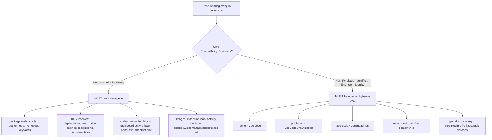
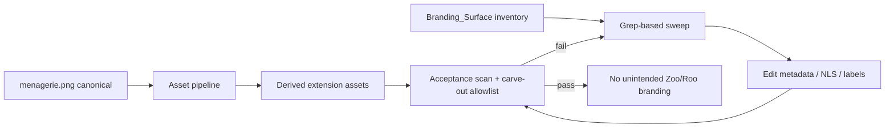

# Design Document

## Overview

This feature (FEAT-005) completes the user-visible Menagerie rebrand and establishes
`menagerie.png` as the canonical visual identity for the extension, while guaranteeing that no
persisted user state is disturbed. The display name already resolves to "Menagerie", but the
codebase still carries Zoo/Roo terminology in package metadata (`author.name`, `repository.url`,
`homepage`, `keywords`), in NLS-resolved settings descriptions, in task-surface labels
(`src/activate/taskBoard.ts`), and in the activity bar icon (which still points at the unrelated
`assets/icons/icon.svg` rather than a menagerie-derived image).

The central design idea is a strict **taxonomy** that partitions every brand-bearing string in the
extension into exactly one of two classes:

- **User_Visible_String surfaces** — text or images rendered to a user (command titles, settings
  descriptions, activity bar / sidebar / welcome / task-surface labels and images, and published
  package metadata such as `displayName`, `description`, `author`, `repository`, `homepage`,
  `keywords`, and marketplace images). These MUST read "Menagerie" and MUST NOT show the
  Prohibited_Branding "Zoo Code" / "Roo Code".
- **Compatibility_Boundary identifiers** — Persisted_Identifier and Extension_Identity fields whose
  change would break settings, global storage, command compatibility, persisted profiles, task
  histories, or VS Code install/upgrade continuity. These include the extension `name`
  (`"zoo-code"`), `publisher` (`"ZooCodeOrganization"`), every `zoo-code.*` command ID, the
  `zoo-code-ActivityBar` views-container id, global storage keys, and persisted profile keys. These
  MUST be retained byte-for-byte.

Every requirement is mapped onto this taxonomy. The rebrand changes the first class and never the
second. A grep-based sweep plus an automated acceptance scan with an explicit carve-out allowlist
proves that no stray Zoo/Roo branding remains while permitting the retained identifiers.

### Scope and Non-Goals

- **In scope:** package metadata text, NLS-resolved user-visible strings, task-surface labels, and
  the asset pipeline that derives extension images from `menagerie.png`.
- **Out of scope (explicitly):** introducing `menagerie.*` command-ID aliases. The future migration
  that adds `menagerie.*` (or `glm.*`) aliases while retaining `zoo-code.*` as compatibility aliases
  is noted only as future work (see Compatibility and Migration). This lift renames **no** persisted
  identifier.
- Not addressed here: observatory, loop detection, tiers, semantic retrieval, reasoning budgets,
  parallelism, GPU scheduling (separate specs).

## Architecture

### Branding Taxonomy



### Requirement-to-Taxonomy Map

| Requirement | Taxonomy class | How it is satisfied |
|---|---|---|
| 1 (Canonical asset) | User_Visible_String (images) | Asset pipeline derives all extension images from `menagerie.png`. |
| 2 (Naming policy) | User_Visible_String (text) | All new/updated user-facing text reads "Menagerie". |
| 3 (Compatibility boundary) | Compatibility_Boundary | `name`, `publisher`, `zoo-code.*`, container id, storage/profile keys retained. |
| 4 (Package metadata) | User_Visible_String (metadata) + boundary carve-out | Edit `author`/`repository`/`homepage`/`keywords`; resolve `displayName`/`description`; retain `name`/`publisher`. |
| 5 (String + asset sweep) | User_Visible_String (text + images) | Grep-based sweep across all surfaces; asset pipeline for images. |
| 6 (No unintended branding) | Cross-cutting guard | Acceptance scan over rendered strings + metadata with a carve-out allowlist of retained `zoo-code` tokens. |

### Processing Flow



The sweep is a repeatable, idempotent operation: the inventory drives the edits, and the acceptance
scan is the gate. If the scan reports an unintended occurrence, the surface is added to the
inventory and re-swept; if it reports a retained identifier, the carve-out allowlist is confirmed.

## Components and Interfaces

### 1. Asset Pipeline (`scripts/branding/derive-assets`)

A build/helper script (invoked manually or from a package script, not from extension runtime) that
reads the Canonical_Brand_Asset and emits the derived extension assets.

- **Input:** `menagerie.png` at the repository root (canonical). `src/assets/icons/menagerie.png`
  is the mirrored copy consumed by the packaged extension; the pipeline keeps the two in sync.
- **Outputs (derived assets):**
  - Extension icon — `src/assets/icons/menagerie.png` (already referenced by `package.json.icon`).
  - Activity bar icon — a menagerie-derived image that the `zoo-code-ActivityBar` views container
    points at. See "Activity bar icon format" below.
  - Sidebar header, welcome screen, task-surface, and marketplace/package images as those surfaces
    adopt branded art.
- **Interface (conceptual):** `deriveAssets(canonicalPath, manifest) -> writes each manifest.target
  from canonicalPath`. The manifest is the derived-asset portion of the Branding_Surface inventory
  (see Data Models), so provenance is declarative and testable.

**Activity bar icon format.** `menagerie.png` is a raster PNG; the previous activity bar icon was an
SVG (`icon.svg`). VS Code accepts either a single icon path (PNG or SVG) or a `{ light, dark }` pair
for a views container icon. Two viable approaches:

1. **PNG reference (simplest):** point the container `icon` at a menagerie-derived PNG sized for the
   activity bar (VS Code renders the activity-bar glyph at 24×24; supply a crisp power-of-two source
   such as 48×48 or 128×128 and let VS Code downscale). This changes only the `icon` *value*, never
   the container `id`.
2. **SVG wrapper (sharpest):** generate a small SVG that embeds or traces the menagerie mark so the
   glyph stays vector-crisp at every DPI. The wrapper is still a derived asset produced by the
   pipeline from `menagerie.png`.

Either way, **the container id `zoo-code-ActivityBar` is unchanged** — only the `icon` field it
carries is repointed at a menagerie-derived asset.

### 2. Metadata Editor (manual edits to `src/package.json` + `src/package.nls.json`)

Concrete edits:

**`src/package.json`**
- `author.name`: `"Zoo Code"` → `"Menagerie"`.
- `repository.url`: `"https://github.com/Zoo-Code-Org/Zoo-Code"` → the current Menagerie repository
  URL (`https://github.com/celesrenata/menagerie`, matching the workspace origin).
- `homepage`: `"https://zoocode.dev"` → the current Menagerie site/repository URL.
- `keywords`: remove `"zoo code"` and `"zoocode"`; add a Menagerie keyword (e.g. `"menagerie"`).
- **Retained unchanged:** `name` (`"zoo-code"`), `publisher` (`"ZooCodeOrganization"`), the
  `zoo-code-ActivityBar` container id, and all `zoo-code.*` command IDs. The `icon` field already
  references a menagerie-derived asset.

**`src/package.nls.json`** (resolves `%key%` references)
- `extension.displayName`: already `"Menagerie"` (confirm).
- `extension.description`: ensure it describes Menagerie and contains no Prohibited_Branding.
- `settings.enableCodeActions.description`: `"Enable Zoo Code quick fixes"` → Menagerie wording.
- `settings.customStoragePath.description`: example `'D:\ZooCodeStorage'` → neutral/Menagerie
  example path.
- `settings.autoImportSettingsPath.description`: `"ZooCode configuration file"` /
  `'~/Documents/zoo-code-settings.json'` → Menagerie wording and example.
- `settings.workspace.rootResolution.description`: `"How Zoo resolves…"` → `"How Menagerie
  resolves…"`.

Note: `.roomodes`, `.roo/mcp.json`, `.roo/rules/` referenced in the root-resolution description are
on-disk configuration path tokens (a filesystem/config compatibility boundary), not product brand
words, and are left unchanged here. They are tracked in the inventory as `isCompatibilityBoundary:
true` so the scan does not flag them.

### 3. Task-Surface Label Editor (`src/activate/taskBoard.ts`)

- `getActivityLabel()`: the `ask` branch and the `say` branch build `` `Zoo · ${…}` `` → `` `Menagerie
  · ${…}` ``.
- Task details panel title: `` `Zoo Task · ${row.title.slice(0, 60)}` `` → `` `Menagerie Task ·
  ${…}` ``.
- Checklist empty-state hint: `"No checklist yet — ask Zoo to use update_todo_list."` → `"No
  checklist yet — ask Menagerie to use update_todo_list."` (the tool name `update_todo_list` is an
  internal identifier, not branding, and is retained).
- **Retained unchanged:** the webview panel view type `"zoo-code.taskBoardTaskDetails"` and the view
  ids `"zoo-code.SidebarProvider"` / `"zoo-code.taskBoard"` (Persisted_Identifiers).

### 4. User-Visible String Sweep (grep-based, scripted)

A systematic sweep that enumerates candidate occurrences and separates branding from identifiers.

- **Find candidates:** case-insensitive search for `zoo`, `roo`, `zoocode`, `zoo code`, `roo code`
  across `src/package.json`, `src/package.nls.json`, `src/**/*.ts` user-facing strings, and other
  rendered-text sources.
- **Exclude boundary tokens:** any match whose surrounding token is a Compatibility_Boundary
  identifier — `zoo-code` as part of a command ID, the container id, the view type/ids, `name`,
  `publisher` — is excluded (these are the carve-out allowlist entries).
- **Rewrite remainder:** every remaining match is a User_Visible_String and is rewritten to
  Menagerie wording.

The sweep is backed by the Branding_Surface inventory so it is reproducible rather than ad hoc.

### 5. Acceptance Scan + Carve-Out Allowlist (`src/__tests__` / `scripts/branding`)

A script/test that scans rendered user-facing strings and published package metadata for the
Prohibited_Branding tokens and asserts there are **no** occurrences except those explicitly permitted
by the carve-out allowlist. The allowlist contains only Compatibility_Boundary tokens (the retained
`zoo-code` / `ZooCodeOrganization` identifiers). The scan is the executable guarantee behind
Requirement 6.

## Data Models

### Branding_Surface descriptor

The inventory record that drives both the sweep and the acceptance check.

```typescript
type BrandingSurfaceKind =
  | "metadata"       // package.json fields (author, repository, homepage, keywords)
  | "nls"            // package.nls.json resolved strings (displayName, description, settings desc)
  | "command-title"  // user-visible command palette label
  | "settings-desc"  // settings description shown to the user
  | "label"          // code-constructed UI label (e.g. task board activity label)
  | "asset"          // image/icon surface

interface BrandingSurface {
  location: string          // file path + field/line, e.g. "src/package.json#author.name"
  kind: BrandingSurfaceKind
  currentValue: string      // value before this feature
  targetValue: string       // value after this feature (Menagerie-branded, or retained)
  isCompatibilityBoundary: boolean // true => retained byte-for-byte, carve-out permitted
}
```

### Carve-out allowlist

The set of tokens the acceptance scan is permitted to find because they are retained
Compatibility_Boundary identifiers. Encoded alongside the scan.

```typescript
interface CarveOutEntry {
  token: string             // e.g. "zoo-code", "ZooCodeOrganization", "zoo-code-ActivityBar"
  reason: "extension-identity" | "persisted-identifier"
  location: string          // where the retained token legitimately appears
}
```

Representative allowlist entries:

| token | reason | location |
|---|---|---|
| `zoo-code` | extension-identity | `src/package.json#name` |
| `ZooCodeOrganization` | extension-identity | `src/package.json#publisher` |
| `zoo-code-ActivityBar` | persisted-identifier | `viewsContainers`/`views` container id |
| `zoo-code.*` | persisted-identifier | command IDs, `zoo-code.SidebarProvider`, `zoo-code.taskBoard`, `zoo-code.taskBoardTaskDetails` |
| `.roomodes` / `.roo/` | persisted-identifier (config path) | root-resolution setting description |

### Derived-asset manifest

The `asset`-kind subset of the inventory, consumed by the asset pipeline and the provenance check.

```typescript
interface DerivedAsset {
  source: string   // always the canonical "menagerie.png"
  target: string   // output path, e.g. "src/assets/icons/menagerie.png" or activity bar icon
  surface: "extension-icon" | "activity-bar" | "sidebar-header" | "welcome" | "task-surface" | "marketplace"
}
```

## Correctness Properties

A characteristic or behavior that should hold true across all valid executions of a system is a
formal statement about what the system should do. Such statements serve as the bridge between
human-readable specifications and machine-verifiable correctness guarantees. The following
universally quantified statements are derived from the acceptance criteria via the prework analysis,
with redundant criteria consolidated.

### Property 1: Every user-visible surface renders Menagerie branding

*For all* Branding_Surface entries where `isCompatibilityBoundary` is false, the resolved/rendered
value equals the Menagerie-branded `targetValue` and contains none of the Prohibited_Branding tokens
("Zoo Code", "Roo Code", or the standalone product words "Zoo"/"Roo").

**Validates: Requirements 2.1, 2.2, 2.4, 4.4, 5.1, 5.2, 5.3, 5.4**

### Property 2: Every compatibility-boundary identifier is retained byte-for-byte

*For all* Compatibility_Boundary entries (Extension_Identity fields `name` and `publisher`, every
`zoo-code.*` command ID, the `zoo-code-ActivityBar` container id, global storage keys, and persisted
profile keys), the value after this feature is byte-for-byte identical to the pre-feature baseline,
which also preserves existing settings, global storage, persisted profiles, and task histories
without data loss.

**Validates: Requirements 3.1, 3.2, 3.4, 4.5**

### Property 3: The acceptance scan finds no unintended Zoo/Roo branding outside the carve-out

*For all* occurrences of a Prohibited_Branding token found by scanning rendered user-facing UI
strings and published package metadata, the occurrence is a member of the carve-out allowlist (a
retained Persisted_Identifier or Extension_Identity on a Compatibility_Boundary); equivalently, no
occurrence exists outside the allowlist.

**Validates: Requirements 6.1, 6.2, 6.3**

### Property 4: Every derived asset traces to the canonical brand asset

*For all* entries in the derived-asset manifest (including the extension icon and the activity bar
icon referenced by the `zoo-code-ActivityBar` container), the asset `source` is the Canonical_Brand_
Asset `menagerie.png` and the `target` is a declared derived output path.

**Validates: Requirements 1.2, 1.3, 1.4, 5.1**

### Property 5: Persisted state keys, profiles, and histories are unchanged

*For all* persisted-state identifiers (storage keys, profile keys, task-history keys), the identifier
present after this feature equals the identifier present before it; no identifier is renamed, so no
state-migration data loss can occur. (This restates the preceding retention guarantee from a
state-preservation angle, foregrounded here for user-state clarity.)

**Validates: Requirements 3.2, 3.4**

## Error Handling

- **Asset pipeline cannot read the canonical asset:** if `menagerie.png` is missing or unreadable,
  the pipeline fails fast with a clear error naming the expected path, and derived assets are not
  overwritten (fail closed; keep the last-good assets).
- **Asset pipeline write failure:** on a per-target write error, the pipeline reports the failing
  target and exits non-zero without leaving a partially written file (write to a temp file, then
  atomic rename).
- **Acceptance scan finds an unintended occurrence:** the scan exits non-zero and prints the
  offending `location`, matched token, and the surrounding text so the maintainer can either add the
  surface to the inventory (if it is a User_Visible_String to rewrite) or add it to the carve-out
  allowlist (only if it is a genuine Compatibility_Boundary token).
- **Carve-out allowlist contains a non-boundary token:** the allowlist is itself validated — any
  entry whose `reason` cannot be substantiated as a boundary identifier is rejected, preventing the
  allowlist from silently hiding real branding leaks.
- **Attempted identifier rename:** any edit that would change `name`, `publisher`, a `zoo-code.*`
  command ID, or the container id is rejected by the retention test (Property 2), which fails the
  build before packaging.

## Testing Strategy

Property-based testing applies only partially here. The feature is largely metadata editing, string
rewriting, and asset wiring (configuration-shaped work), so most verification is example-based,
inventory-driven assertions and a scan. The genuinely universal checks — surface branding, boundary
retention, the acceptance scan, and asset provenance — are expressed as property-style assertions
over the inventory/manifest. Per `AGENTS.md`, tests are placed at the narrowest layer that proves the
behavior; no heavy e2e is used.

### Unit and example tests (package-local, Vitest from `src/`)

- **Task-surface labels (`src/activate/taskBoard.ts`):** unit-test `getActivityLabel()` returns
  `"Menagerie · …"` for `ask` and `say` messages (and `"You"` for user feedback), the task details
  panel title uses `"Menagerie Task · …"`, and the checklist empty-state hint reads
  `"ask Menagerie to use update_todo_list"`. Covers Requirement 2.3.
- **Metadata field edits (`src/package.json`):** assert `author.name` is `"Menagerie"` (not
  `"Zoo Code"`), `repository.url` and `homepage` are the Menagerie URLs (not the Zoo-Code URLs), and
  `keywords` contains neither `"zoo code"` nor `"zoocode"` and includes a Menagerie keyword. Covers
  Requirements 4.1, 4.2, 4.3.
- **Identity/identifier retention (`src/package.json`):** assert `name === "zoo-code"`,
  `publisher === "ZooCodeOrganization"`, the container id is `"zoo-code-ActivityBar"`, and every
  command id begins with `"zoo-code."`; additionally assert **no** command id begins with
  `"menagerie."` (Requirement 3.5). Covers Requirements 3.1, 3.2, 4.5, 3.5.
- **Extension icon field:** assert `package.json.icon` references a menagerie-derived asset
  (`assets/icons/menagerie.png`). Covers Requirement 1.4.
- **Canonical asset presence (smoke):** assert `menagerie.png` exists at the repository root and is
  the declared pipeline input. Covers Requirement 1.1.

### Inventory/manifest assertion tests (property-style)

- **Property 1 — user-visible surfaces:** iterate the Branding_Surface inventory and, for every
  entry with `isCompatibilityBoundary === false`, assert the resolved value equals `targetValue` and
  matches no Prohibited_Branding pattern.
- **Property 2 — boundary retention:** iterate the Compatibility_Boundary entries and assert each
  current value equals the recorded baseline byte-for-byte.
- **Property 4 — asset provenance:** iterate the derived-asset manifest and assert every `source` is
  `menagerie.png` and every `target` is a declared derived path, including the activity bar icon the
  container points at. Icon *pixel* rendering cannot be fully auto-verified; the test verifies
  provenance and path wiring, and a short manual check confirms the rendered glyph.
- **Property 5 — persisted-state keys:** assert the set of persisted-state identifiers equals the
  baseline set (no rename).

### Acceptance scan test (property-style, with carve-out)

- **Property 3 — no unintended branding:** a `src/`-level test/script scans rendered user-facing
  strings (NLS entries, command titles, settings descriptions, code-constructed labels) and published
  package metadata for `"Zoo Code"`/`"Roo Code"` (and standalone `Zoo`/`Roo` product usage) and
  asserts every match is a member of the carve-out allowlist. The test also validates the allowlist:
  every allowlist entry must be a substantiated Compatibility_Boundary token, so the carve-out cannot
  mask a real leak. Covers Requirements 6.1, 6.2, 6.3.

### Property-based test configuration

Where a property is implemented with generated inputs (e.g. generating surface records or token
strings to exercise the scan's classifier), use `fast-check` and configure a minimum of 100
iterations. Each such test is tagged with a comment referencing its design property, in the form:
`// Feature: menagerie-branding-migration, Property N: <property text>`. Each correctness property is
implemented by a single fast-check property test; concrete examples and edge cases are covered by the
unit tests above.

### Test placement

- Package-local unit tests in `src/` for label logic, metadata assertions, identifier retention, and
  the acceptance scan (pure file/string inspection — no VS Code host needed).
- No `apps/vscode-e2e` coverage is added: nothing here depends on the real extension host, and icon
  rendering fidelity is confirmed by a brief manual check rather than e2e.

## Compatibility and Migration

- **No persisted identifier is renamed in this lift.** The extension `name`, `publisher`, every
  `zoo-code.*` command ID, the `zoo-code-ActivityBar` container id, global storage keys, and persisted
  profile keys are retained exactly, so existing installs upgrade without resetting settings,
  profiles, or task histories.
- **Future work (out of scope):** a later migration MAY introduce `menagerie.*` (or `glm.*`)
  command-ID aliases with the existing `zoo-code.*` IDs retained as compatibility aliases. That alias
  migration is explicitly **not** part of this feature and is noted here only for context.
