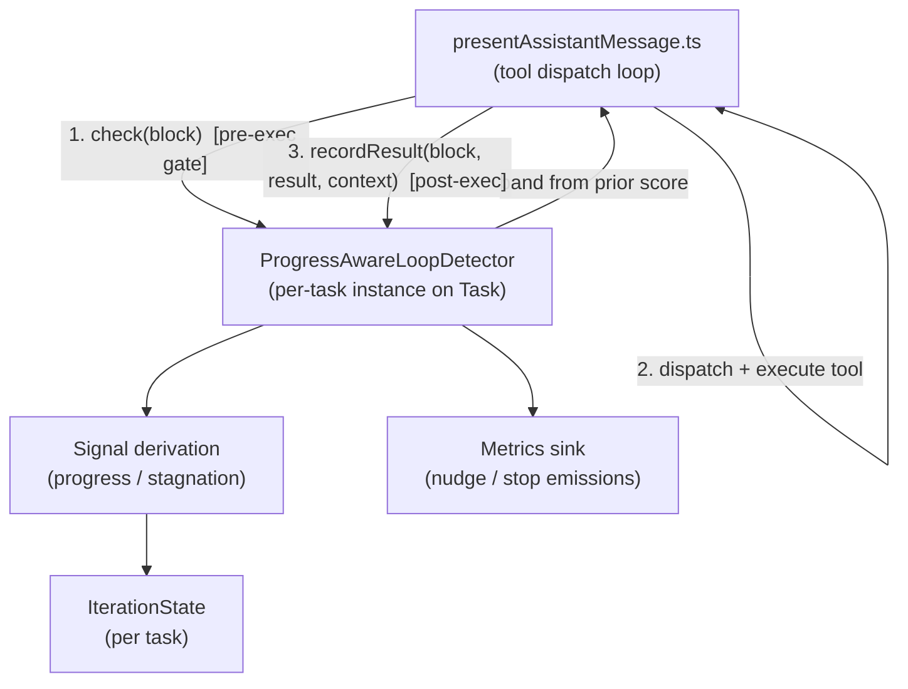

# Design Document

## Overview

This feature replaces the exact-repetition `ToolRepetitionDetector` with a progress-aware `ProgressAwareLoopDetector`. The current detector (`src/core/tools/ToolRepetitionDetector.ts`) serializes each `ToolUse` to canonical JSON, counts consecutive identical serializations, nudges at a fixed limit (default 3), and escalates to a user ask at twice the limit. That approach cannot distinguish legitimate iterative work (paging through a file, polling a Kubernetes resource, re-running a shrinking test suite) from genuine stagnation, because repetition of a tool name or argument object is not, by itself, evidence of a stuck loop.

The new detector evaluates each tool execution across four phases (`beforeTool`, `executeTool`, `afterTool`, `evaluateProgress`), maintains a per-task `IterationState`, derives `ProgressSignal`s and `StagnationSignal`s from **observable** tool arguments, results, and workspace state, accumulates a bounded `noProgressScore` (0–100), and escalates through graduated bands: continue (0–5), nudge (6–9), replanning (10–13), hard stop (14+). Repetition alone never blocks an iterative-capable tool; it can only raise the score through observed stagnation. A genuine infinite loop (identical args, identical result, no workspace change, across multiple completed executions) still drives the score to a hard stop.

The detector preserves the existing `ToolRepetitionCheckResult` discriminated union so the sole runtime call site, `src/core/assistant-message/presentAssistantMessage.ts`, needs no change to its branching on `allowExecution`, `nudge`, and `askUser`.

### Scope

- In scope: the detector class, its per-task state model, the signal taxonomy and derivation, scoring and band evaluation with hysteresis, the preserved result contract, and nudge/stop metric emission.
- Out of scope: task observatory, tier semantics, semantic retrieval, branding, parallelism. Metrics are described only as outputs of this detector (Requirement 9), not as a separate feature.

### Key Design Decisions

- **Two-call protocol over a single `check()`.** The existing `check(block)` is a pre-execution gate: it runs *before* the tool executes and only sees the `ToolUse`. Progress and stagnation, however, are only observable *after* a result exists. The detector therefore keeps `check()` as the pre-execution gate (returning the band computed from state accumulated by prior completed executions) and adds a post-execution `recordResult()` call that supplies the result and workspace signals, runs `afterTool`/`evaluateProgress`, and updates the score for the next gate. This keeps `presentAssistantMessage.ts` branching unchanged, needs one small added call after the tool runs, and preserves the "gate before execution" contract. See [Architecture](#architecture) for the integration seam.
- **Observable-only signals.** Every signal derives from `ToolUse` args, the tool result, workspace/git state, todo state, extracted cursor/target, or `errorClass`. No model self-report is consulted (Requirement 7.3). Where a signal cannot be observed, the detector is conservative and credits no progress.
- **Score, not count.** Interventions are a pure function of `noProgressScore`, never of a raw repetition count (Requirements 1.5, 5.4, 6.9).
- **Rename with a compatibility export.** The class is renamed `ToolRepetitionDetector → ProgressAwareLoopDetector`. A compatibility `export { ProgressAwareLoopDetector as ToolRepetitionDetector }` and a re-exported `ToolRepetitionCheckResult` keep `Task.ts` and the i18n key (`tools:toolRepetitionLimitReached`, `messageKey: "mistake_limit_reached"`) working with a minimal rename at the import site.

## Architecture

### Component Context



### Four-Phase Evaluation and the Integration Seam

The requirements name four phases. They map onto the two-call protocol as follows:

| Phase | When it runs | Where it hooks in `presentAssistantMessage.ts` | What it does |
| --- | --- | --- | --- |
| `beforeTool` | Pre-execution | Inside `check(block)` | Normalizes args, computes `normalizedArgsHash`, extracts `cursor`/`target`, and returns the **gate decision** for the band currently derived from accumulated score. Captures pending pre-execution inputs for the result step. |
| `executeTool` | Execution | The existing `switch (block.name)` dispatch (the detector does not run the tool; this phase is the host's existing execution) | The host executes the tool and produces a result string plus observable context. |
| `afterTool` | Post-execution | New `recordResult(...)` call after dispatch returns | Computes `resultHash`, reads workspace/git, todo, cursor-advance, test-failure, k8s, and browser/DOM signals from the supplied `ToolResultContext`. |
| `evaluateProgress` | Post-execution | Tail of `recordResult(...)` | Converts captured signals into score deltas, clamps the score, updates `IterationState`, re-derives the band for the next gate, and emits metrics on nudge/stop. |

`beforeTool`, `afterTool`, and `evaluateProgress` are **public methods** on the detector so the four-phase API is directly exposed (Requirement 1.1). `check()` is a thin public wrapper that calls `beforeTool` and returns the gate result; `recordResult()` is a thin public wrapper that calls `afterTool` then `evaluateProgress`. `executeTool` is exposed as a no-op/pass-through marker method documenting the boundary (the host owns actual execution), so all four named phase operations exist on the class per Requirement 1.1–1.4.

### Gate Timing Rationale

A pre-execution gate cannot see the *current* execution's result, so the band returned by `check()` reflects the score accumulated by **prior completed executions**. This matches Requirement 6.2 ("WHEN a tool execution completes ... re-evaluate the current escalation band ... before the next tool execution begins") exactly: the score updates on completion (`recordResult`), and the next `check()` reads that updated band. The hard-stop precondition (Requirement 6.7/6.8) — at least two completed executions — is naturally satisfied because the score can only have risen to the hard-stop band through completed executions recorded via `recordResult`.

### Call-Site Changes (minimal)

1. `Task.ts`: change the import to `ProgressAwareLoopDetector` (or keep the compatibility alias) and the field type; construction stays `new ProgressAwareLoopDetector(this.consecutiveMistakeLimit)`.
2. `presentAssistantMessage.ts`: the existing `const repetitionCheck = cline.toolRepetitionDetector.check(block)` branching on `nudge`/`askUser` stays identical. One addition: after a tool executes and its result is pushed, call `cline.toolRepetitionDetector.recordResult(block, result, context)` so post-execution signals are captured. The gate branches (`nudge`, `askUser`) are unchanged.

For a **replanning** band, the contract has only `nudge` and `askUser`. Replanning is surfaced as a `nudge`-variant result (`allowExecution: false`, `nudge` payload) whose nudge message carries replanning guidance ("a different approach is required before continuing"). The call site already turns a `nudge` into a tool-result error that returns control to the model without a user ask, which is precisely the replanning semantics (model must adjust before the next tool). An optional `band` discriminator field is added to the nudge payload (`nudge.band: "nudge" | "replanning"`) so callers *may* tailor messaging, but existing callers that only read `toolName`/`repeatCount` keep working.

## Components and Interfaces

### `ProgressAwareLoopDetector`

```typescript
import stringify from "safe-stable-stringify"
import { ToolUse } from "../../shared/tools"
import { t } from "../../i18n"

/**
 * Preserved result contract. Callers branch on allowExecution / nudge / askUser.
 * `nudge.band` is additive and optional for callers; "replanning" reuses the nudge
 * channel because the contract exposes only nudge and askUser.
 */
export type ToolRepetitionCheckResult =
	| { allowExecution: true; nudge?: undefined; askUser?: undefined }
	| {
			allowExecution: false
			nudge: { toolName: string; repeatCount: number; band?: "nudge" | "replanning" }
			askUser?: undefined
	  }
	| {
			allowExecution: false
			nudge?: undefined
			askUser: { messageKey: "mistake_limit_reached"; messageDetail: string }
	  }

export class ProgressAwareLoopDetector {
	constructor(limit?: number, deps?: ProgressAwareLoopDetectorDeps)

	/** Pre-execution gate. Thin wrapper over beforeTool. Preserves the existing signature. */
	check(block: ToolUse, taskId?: string): ToolRepetitionCheckResult

	/** Post-execution signal capture + scoring. New call. */
	recordResult(block: ToolUse, result: ToolExecutionResult, context: ToolResultContext, taskId?: string): void

	// ---- Four named phase operations (Requirement 1.1) ----
	beforeTool(block: ToolUse, taskId: string): ToolRepetitionCheckResult
	executeTool(): void // boundary marker; host owns execution
	afterTool(block: ToolUse, result: ToolExecutionResult, context: ToolResultContext, taskId: string): CapturedSignals
	evaluateProgress(taskId: string, captured: CapturedSignals): BandDecision
}
```

`taskId` defaults to a single implicit task when omitted, preserving the current single-task construction in `Task.ts`. When present it selects the per-task `IterationState` (Requirement 2.1).

### Collaborators

```typescript
/** Observable inputs available after a tool executes. Supplied by the host (presentAssistantMessage). */
export interface ToolResultContext {
	/** Serialized result text/body the tool produced. */
	resultText?: string
	/** Error classification when the tool failed (e.g. "auth", "malformed_diff", "not_found"). */
	errorClass?: string
	/** True when git/worktree state changed as a result of this execution. */
	workspaceChanged?: boolean
	/** True when the checklist (todo) state changed as a result of this execution. */
	todoChanged?: boolean
	/** Count of failing tests parsed from a test-runner result, when derivable. */
	failingTestCount?: number
	/** Stable identity set of failing tests, when derivable (for set-change detection). */
	failingTestIds?: string[]
	/** Observable external/command/k8s/browser state fingerprint, when derivable. */
	externalStateHash?: string
	/** When true, an explicit wait/poll workflow is in effect for this execution. */
	isPollingWorkflow?: boolean
	/** Verification signal: observed success/failure that may contradict a claimed success. */
	verifiedSucceeded?: boolean
}

export interface ToolExecutionResult {
	ok: boolean
	body?: string
}

export interface MetricsSink {
	emitNudge(event: { toolName: string; noProgressScore: number }): void
	emitStop(event: { toolName: string; noProgressScore: number }): void
}

export interface ProgressAwareLoopDetectorDeps {
	metrics?: MetricsSink
	now?: () => number
}
```

The host (`presentAssistantMessage.ts`) is responsible for populating `ToolResultContext` from signals it already has access to (git status, todo state, result text, error from the dispatch `catch`). Any field the host cannot derive is left `undefined`, and the detector treats absence conservatively (no progress credit).

### Iterative-Capable Tool Classification

```typescript
/** Requirement 5.1: explicit iterative-capable set. */
const ITERATIVE_CAPABLE_TOOLS: ReadonlySet<string> = new Set([
	"read_file",
	"read_command_output",
	"codebase_search",
	"search_files",
	"browser_action",
])

/** Command-shape matchers for execute_command bodies (kubectl/watch, test runners, polling). */
const ITERATIVE_COMMAND_PATTERNS: readonly RegExp[] = [
	/\bkubectl\b.*\b(get|describe|logs|rollout status)\b/,
	/\bwatch\b/,
	/\b(jest|vitest|pytest|go test|cargo test|mocha)\b/,
	/\b(sleep|poll|until|while)\b/, // explicit wait/poll shells
]

function isIterativeCapable(block: ToolUse, context?: ToolResultContext): boolean {
	if (ITERATIVE_CAPABLE_TOOLS.has(String(block.name))) return true
	if (context?.isPollingWorkflow) return true
	const command = block.params.command ?? block.nativeArgs?.["command"]
	return typeof command === "string" && ITERATIVE_COMMAND_PATTERNS.some((re) => re.test(command))
}
```

Classification only changes *how repetition affects the score*: for iterative-capable tools, repetition with any progress signal never raises the score (Requirement 5.2), and repetition with no progress raises the score only through stagnation signals, never a raw count (Requirements 5.3, 5.4).

## Data Models

### `IterationState` (per task — Requirement 2)

```typescript
export interface IterationState {
	/** Most recently evaluated tool name. */
	tool: string
	/** Order-insensitive hash of normalized args (Requirement 2.5, 3.x comparisons). */
	normalizedArgsHash: string
	/** Hash of the last result body; optional (Requirement 2.3). */
	resultHash?: string
	/** Extracted iteration position: read offset, pagination token, or line range. */
	cursor?: string | number
	/** Extracted target: file path and/or line range. */
	target?: string
	/** Error classification of the last execution, if it failed. */
	errorClass?: string

	// Progress flags derived at evaluateProgress for the most recent execution:
	workspaceChanged: boolean
	todoChanged: boolean
	resultChanged: boolean
	cursorAdvanced: boolean

	/** Accumulated no-progress evidence, bounded 0..100 (Requirement 6.1). */
	noProgressScore: number

	// Internal bookkeeping (not part of the public field list but required for bands):
	/** Count of completed executions recorded for this task (Requirement 6.7/6.8 precondition). */
	completedExecutions: number
	/** The band last surfaced, to enforce once-per-entry nudge and hysteresis cancellation. */
	lastBand: Band
	/** Set true when a replanning/hard-stop intervention is pending but not yet issued. */
	pendingIntervention?: Band
	/** The previous failing-test count, to detect decrease (Requirement 3.9). */
	prevFailingTestCount?: number
	/** The previous failing-test id set hash, to detect set change (Requirement 3.8). */
	prevFailingTestSetHash?: string
	/** The previous external state hash (command/k8s/browser) (Requirement 3.7, 3.10, 3.11). */
	prevExternalStateHash?: string
}
```

The per-task map is `private states: Map<string, IterationState>`. `check()`/`recordResult()` resolve the task's state, creating a fresh default when first seen (Requirement 2.1 — one state per task, independent across tasks).

### Signal Taxonomy

```typescript
export type ProgressSignal =
	| "cursor_advanced"        // Req 3.1, 3.12
	| "target_changed"        // Req 3.2
	| "query_changed"         // Req 3.3
	| "result_changed"        // Req 3.4
	| "workspace_changed"     // Req 3.5
	| "todo_changed"          // Req 3.6
	| "external_state_changed" // Req 3.7, 3.10, 3.11
	| "failing_tests_changed" // Req 3.8
	| "failing_tests_decreased" // Req 3.9
	| "poll_progress"         // Req 3.13

export type StagnationSignal =
	| "identical_args_and_result" // Req 4.1, 4.4, 4.7
	| "repeated_error_class"      // Req 4.2, 4.5
	| "empty_mutation_diff"       // Req 4.3, 4.6
	| "unverified_success"        // Req 4.8

export type Band = "continue" | "nudge" | "replanning" | "hard_stop"

export interface CapturedSignals {
	tool: string
	normalizedArgsHash: string
	resultHash?: string
	cursor?: string | number
	target?: string
	errorClass?: string
	progress: ProgressSignal[]
	stagnation: StagnationSignal[]
	workspaceChanged: boolean
	todoChanged: boolean
	resultChanged: boolean
	cursorAdvanced: boolean
}

export interface BandDecision {
	band: Band
	noProgressScore: number
	result: ToolRepetitionCheckResult
}
```

### Normalized Args Hash

`normalizedArgsHash` is computed by merging `params` and `nativeArgs` into a single plain object, dropping `undefined`/empty values, and serializing with `safe-stable-stringify` (which sorts keys), then hashing the string. Because the serializer is order-stable, two arg objects differing only in key order produce the same hash (Requirement 2.5, 5.x). This mirrors the existing `serializeToolUse` behavior that already sorts keys, so prior "same params in different order are identical" behavior is preserved.

```typescript
function normalizeArgs(block: ToolUse): Record<string, unknown> {
	const merged: Record<string, unknown> = { ...block.params }
	if (block.nativeArgs && Object.keys(block.nativeArgs).length > 0) {
		Object.assign(merged, block.nativeArgs)
	}
	for (const key of Object.keys(merged)) {
		const value = merged[key]
		if (value === undefined || value === "" || value === null) delete merged[key]
	}
	return merged
}

function hashArgs(block: ToolUse): string {
	return fnv1a(stringify({ name: block.name, args: normalizeArgs(block) }))
}
```

A small, dependency-free FNV-1a hash is used for `normalizedArgsHash`, `resultHash`, `prevFailingTestSetHash`, and `externalStateHash`, so no new runtime dependency is introduced.

### Cursor and Target Extraction

```typescript
/** Pulls an iteration position from args/result. Order of preference: explicit offset/token, then line range. */
function extractCursor(block: ToolUse, context?: ToolResultContext): string | number | undefined {
	const args = normalizeArgs(block)
	if (typeof args["offset"] === "number" || typeof args["offset"] === "string") return args["offset"] as string | number
	if (typeof args["start_line"] === "string") return `${args["start_line"]}:${args["end_line"] ?? ""}`
	// pagination token surfaced by the tool result, when present
	const token = /next[_-]?(page|token|cursor)[^A-Za-z0-9]+([A-Za-z0-9=_-]+)/i.exec(context?.resultText ?? "")
	return token ? token[2] : undefined
}

/** File + line-range identity, independent of cursor advancement. */
function extractTarget(block: ToolUse): string | undefined {
	const args = normalizeArgs(block)
	const path = (args["path"] ?? args["file"]) as string | undefined
	if (!path) return undefined
	const range = args["start_line"] ? `#${args["start_line"]}-${args["end_line"] ?? ""}` : ""
	return `${path}${range}`
}
```

`cursorAdvanced` is true when the new cursor is comparable to and strictly greater/different-forward than the previous cursor for the same `target` (numeric comparison for offsets; token inequality for pagination tokens).

## Correctness Properties

*A property is a characteristic or behavior that should hold true across all valid executions of a system — essentially, a formal statement about what the system should do. Properties serve as the bridge between human-readable specifications and machine-verifiable correctness guarantees.*

The prework analysis showed that most of Requirement 3's twelve progress criteria and Requirement 4's eight stagnation criteria share one universal scoring rule (any progress signal decreases the score; any stagnation signal increases it), so they are consolidated into comprehensive properties rather than one property per criterion. Band mapping, clamping, hysteresis, and the result contract are each total-function properties. Non-trivial per-signal derivations (empty-diff mutation, auth retry, verification mismatch, test-count parsing) are covered as edge-case example tests in the Testing Strategy rather than as universally quantified properties.

### Property 1: Observable progress never escalates an iterative-capable tool

*For any* iteration state and *any* sequence of executions of an iterative-capable tool where each execution yields at least one progress signal, the `noProgressScore` never enters the nudge band (stays ≤ 5) and the gate result is always `allowExecution: true`.

**Validates: Requirements 1.5, 3.1, 3.2, 3.3, 3.4, 3.12, 5.2, 6.9**

### Property 2: Identical args and identical result monotonically escalate to a hard stop

*For any* tool, repeatedly executing it with the same `normalizedArgsHash` and the same `resultHash` (no progress signal) causes `noProgressScore` to increase on each completed execution (until clamped at 100), and once the score is ≥ 14 with at least two completed executions the gate returns an `askUser` hard stop whose `messageDetail` identifies the repeated tool.

**Validates: Requirements 4.1, 4.4, 4.7, 6.7, 7.1, 7.2**

### Property 3: Band and result are a total function of score with the exact boundaries and hysteresis

*For any* integer `noProgressScore` in 0–100, `deriveBand` returns exactly: `continue` for 0–5, `nudge` for 6–9, `replanning` for 10–13, and `hard_stop` for 14–100; the mapping is total and monotonic in band severity, and whenever the score decreases below the lower boundary of the current band the detector demotes to the band of the decreased score and cancels any pending higher-band intervention not yet issued.

**Validates: Requirements 6.2, 6.3, 6.4, 6.5, 6.6**

### Property 4: Interventions depend on score, never on raw repetition count

*For any* iterative-capable tool and *any* repetition count N, if every execution carries a progress signal (so the score stays ≤ 5) then no intervention is ever raised regardless of how large N is; repetition without progress raises the score only through stagnation signals.

**Validates: Requirements 5.3, 5.4, 3.13**

### Property 5: `normalizedArgsHash` is order-insensitive

*For any* tool argument object and *any* permutation of its keys (across both `params` and `nativeArgs`), the computed `normalizedArgsHash` is identical.

**Validates: Requirements 2.5**

### Property 6: The returned result is always a valid `ToolRepetitionCheckResult`

*For any* input `ToolUse` and *any* accumulated state, `check()` returns a value matching the discriminated union: either `{allowExecution: true}`, or `{allowExecution: false, nudge}` with a well-formed `nudge` payload, or `{allowExecution: false, askUser}` with `messageKey === "mistake_limit_reached"` and a non-empty `messageDetail`; the three variants are mutually exclusive.

**Validates: Requirements 8.1, 8.2, 8.3, 8.4**

### Property 7: Scoring depends only on observable inputs (determinism / no self-report)

*For any* two executions with identical observable inputs (`normalizedArgsHash`, `resultHash`, `errorClass`, workspace/todo/cursor/external-state signals), the scoring delta applied is identical, independent of any field that would represent model self-report.

**Validates: Requirements 7.3**

### Property 8: Score stays bounded 0–100

*For any* finite sequence of progress and stagnation signals, `noProgressScore` always satisfies 0 ≤ score ≤ 100.

**Validates: Requirements 6.1**

### Property 9: Hard stop is withheld below two completed executions

*For any* state where `noProgressScore` ≥ 14 but fewer than two completed executions have been recorded, the gate does not return `askUser`; it continues evaluating subsequent completed executions.

**Validates: Requirements 6.8**

### Property 10: Per-task state isolation

*For any* two distinct task ids with interleaved executions, each task's `noProgressScore` evolves independently of the other's signals.

**Validates: Requirements 2.1**

## Error Handling

- **Missing or unobservable signals.** When a `ToolResultContext` field is `undefined` (the host could not derive it — e.g. no git status available, result text unparsable), the detector credits no progress for that dimension and does not fabricate a stagnation signal from it either. Conservatism means absence of evidence is treated as "no change observed," which cannot grant false progress (Requirement 7.3) but also will not, on its own, force an escalation.
- **Malformed or empty args.** `normalizeArgs` tolerates empty `params`/`nativeArgs`; the hash of an empty arg set is stable, so empty-arg tools behave like the current detector (preserved by the existing "empty tool call" test).
- **Result parsing failures.** Test-failure count/set and external-state fingerprints are best-effort regex/structured extractions. A parse failure yields `undefined`, which disables that signal for the execution rather than throwing.
- **Unknown tool names.** Tools not in the iterative-capable set and not matching command patterns are treated as non-iterative; they still participate in observable progress/stagnation scoring (a non-iterative tool with a workspace change still earns a progress signal).
- **Score clamping.** All score mutations pass through a `clamp(0, 100)` so no signal sequence can drive the score negative or past 100 (Property 8).
- **Recovery after hard stop.** As in the current detector, after a hard stop is surfaced the detector resets the task's accumulated score and intervention state so the user can guide the model past the condition without being immediately re-blocked.
- **Metrics sink failures.** Metric emission is wrapped so a throwing sink cannot break tool dispatch; a failed emission is swallowed (the detector's job is gating, not guaranteed delivery).

## Testing Strategy

Property-based testing applies here: the detector is pure state-machine logic over observable inputs with large input spaces (arbitrary arg objects, signal sequences, scores), and the scoring/band/hash behavior has clear universal invariants. Tests live at the package-local unit layer under `src/core/tools/__tests__/`, per AGENTS.md test-placement guidance. No e2e is needed — the logic requires neither the VS Code extension host nor the webview.

### Property Tests (fast-check)

Use `fast-check` (the project's property library for TypeScript) with a minimum of 100 iterations per property. Each test is tagged with a comment referencing its design property.

Format for each tag: `// Feature: progress-aware-loop-detection, Property N: <property text>`

- Property 1 — iterative tool + progress signal each run ⇒ score ≤ 5 and `allowExecution: true`, over arbitrary run counts and progress-signal choices.
- Property 2 — identical args+result repeated ⇒ monotonic score increase to a hard stop with tool identification, over arbitrary tools and run counts.
- Property 3 — `deriveBand` total function over 0–100 with exact boundaries; plus a rise-then-fall score path demonstrating demotion and pending-intervention cancellation.
- Property 4 — arbitrary N identical iterative calls with progress ⇒ no intervention, independent of N.
- Property 5 — arbitrary arg object + arbitrary key permutation ⇒ equal `normalizedArgsHash`.
- Property 6 — arbitrary `ToolUse` + arbitrary accumulated state ⇒ result matches the discriminated union; variants mutually exclusive; hard-stop `messageKey === "mistake_limit_reached"`.
- Property 7 — identical observable inputs ⇒ identical score delta.
- Property 8 — arbitrary signal sequence ⇒ 0 ≤ score ≤ 100.
- Property 9 — score ≥ 14 with `completedExecutions < 2` ⇒ no `askUser`.
- Property 10 — interleaved executions across two task ids ⇒ independent scores.

### Unit / Example / Edge Tests

- Phase API presence and ordering (Requirement 1.1–1.4): `beforeTool`/`executeTool`/`afterTool`/`evaluateProgress` exist; `beforeTool` captures before result, `afterTool` captures result/workspace, `evaluateProgress` updates band.
- `IterationState` shape and optional fields (Requirement 2.2, 2.3); post-evaluation state reflects the latest execution (Requirement 2.4).
- Iterative-capable classification membership for each named tool and command pattern (Requirement 5.1).
- Signal-derivation edge cases: empty mutation diff (4.3), repeated malformed edit (4.6), auth retry without new credentials (4.5), unverified-success mismatch (4.8), failing-test count decrease and set change (3.8, 3.9), k8s/browser/external state change (3.7, 3.10, 3.11), poll workflow no-increase (3.13).
- Once-per-entry nudge behavior and hysteresis cancellation (Requirement 6.4, 6.6) as stateful example tests.
- Metrics emission (Requirement 9.1, 9.2): mock `MetricsSink`; assert `emitNudge`/`emitStop` carry `toolName` and `noProgressScore`.
- Contract/signature compatibility (Requirement 8.5): `check(block)` type-checks and behaves at the existing call site.

### Preserving Existing Behavior

`ToolRepetitionDetector.spec.ts` encodes behavior that must still hold where applicable: order-insensitive argument comparison, differentiation by `nativeArgs` (different files/offsets/cwd), and the hard-stop `messageKey`/tool-name interpolation. These assertions are migrated into the new spec (renamed to `ProgressAwareLoopDetector.spec.ts`, or retained via the compatibility export). The exact fixed-count nudge/escalate schedule (e.g. "4th call nudges") is intentionally replaced by score-driven behavior; the migrated tests are rewritten to feed stagnation signals (identical args + identical result) so the equivalent genuine-loop cases still reach a nudge and then a hard stop, satisfying Requirement 7 while honoring the new count-independent semantics.

### Commands

Run the narrowest Vitest suite from the package directory:

```bash
# from the src/ package directory
npx vitest run src/core/tools/__tests__/ProgressAwareLoopDetector.spec.ts
```

After editing files, confirm lint suppressions did not increase per AGENTS.md:

```bash
pnpm --dir src exec eslint --prune-suppressions --max-warnings=0 src/core/tools/ProgressAwareLoopDetector.ts
```

New code fixes lint violations directly (no `as any`); private-member access in tests uses bracket notation as the existing spec already does.
