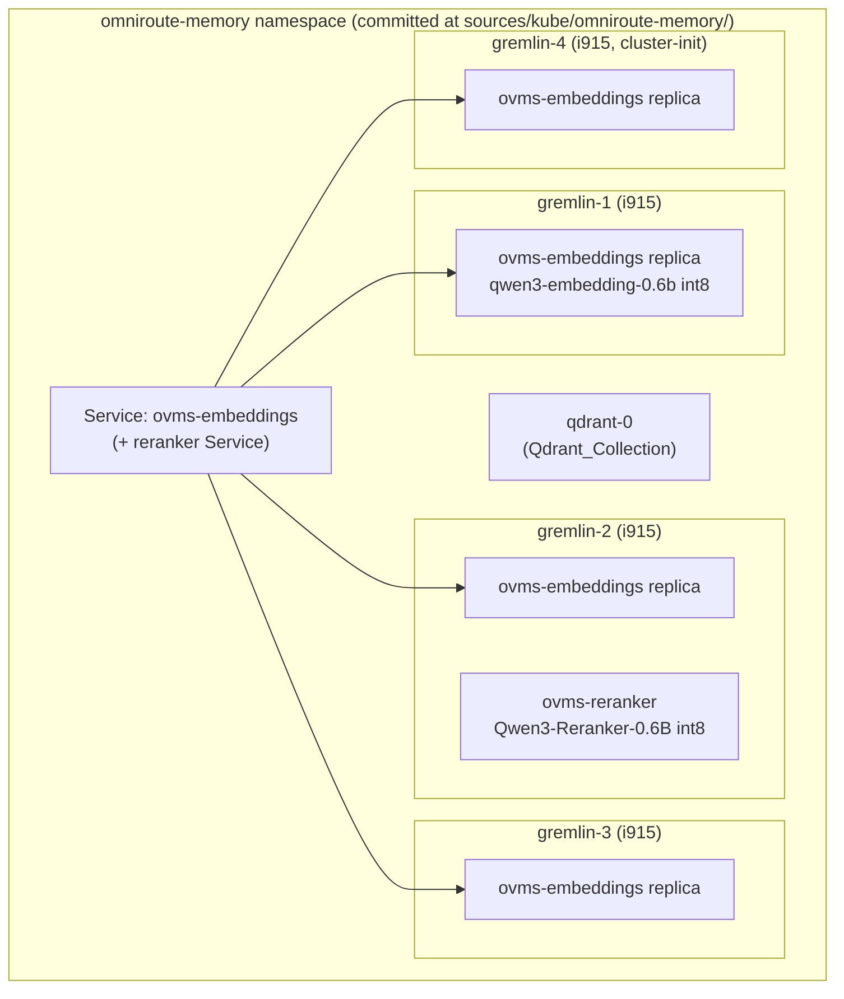

# Design Document

## Overview

The Retrieval Fabric is the Intel-side retrieval infrastructure that Menagerie consumes for repository code retrieval. This design **extends** the production k3s OpenVINO Model Server (OVMS) deployment in the `omniroute-memory` namespace rather than redesigning it. It is grounded in the **verified live cluster state** inspected over SSH, not the idealized handoff: several "already done" handoff claims are, in reality, gaps this design implements (real-inference readiness, the Qwen3 reranker, the digest-pinned committed image, and the serving-ceiling/pod-memory sizing).

The design has two halves:

1. **The physical fabric** — four Intel SR-IOV GPU nodes (`gremlin-1`..`gremlin-4`, `10.1.1.12`-`10.1.1.15`; `gremlin-4` cluster-init) running one embedding OVMS replica per node plus a Qwen3 reranker, all declared in the committed config at `sources/kube/omniroute-memory/`. The committed manifests are reconciled to live reality so nothing retrieval-critical remains as drift.
2. **The logical Retrieval Gateway** — a single `retrieve(query, workspace, intent, limit)` entry point above the Kubernetes Service that fronts the replicas. The gateway runs a hybrid retrieval pipeline (query decomposition → dense + lexical/symbol → deterministic RRF fusion → Qwen3 reranking) and returns a bounded 5-8 item evidence packet. Menagerie never selects a physical node or replica.

The Menagerie-side consumption behaviors (exploration policy, known-target bypass, per-task cache, change-awareness consumption preference, Menagerie-side metrics) are owned by the existing `semantic-first-retrieval` spec, which will be extended to consume this gateway. This spec provides the gateway/fabric those behaviors consume.

### Verified live state (design baseline)

- **Committed:** only `ovms-embeddings-statefulset.yaml` exists at `sources/kube/omniroute-memory/`. It declares the embedding StatefulSet with image tag `openvino/model_server:latest-gpu`.
- **Live embedding image is digest-pinned:** `docker.io/openvino/model_server@sha256:e7a448ec4eb885cab232a5f5ff8b9f41fb3b6f69401633c2af83cac260c40e8e`. The committed `latest-gpu` tag is drift.
- **Live reranker is `bge-reranker-base`**, served by an *uncommitted* `ovms-reranker` Deployment (1 replica, currently on `gremlin-2`, `--task=rerank`, PVC `reranker-models`, generic `/v2/health/ready`). This is drift and must be replaced by Qwen3-Reranker-0.6B INT8 and committed.
- **Readiness is generic OVMS HTTP today** (`/v2/health/ready`) on both the StatefulSet and the reranker Deployment. Real-inference readiness is a gap to implement.
- **Node memory ≈ 98.5GB capacity / ≈ 94GB allocatable per node**; Arc iGPUs draw from **shared system RAM**. The binding near-term OOM boundary is the **8Gi pod memory limit**, not node RAM.

_Content was rephrased from live cluster inspection for this design._

## Architecture

### Physical fabric topology



- The `ovms-embeddings` StatefulSet keeps `replicas: 4`, `podManagementPolicy: Parallel`, **required** `podAntiAffinity` on `app=ovms-embeddings` over `topologyKey kubernetes.io/hostname` (one replica per node), `gpu.intel.com/i915: 1`, and `nodeSelector intel.feature.node.kubernetes.io/gpu=true`. Model volume is a Longhorn RWO `volumeClaimTemplate` (`models`, `10Gi`); pods run `fsGroup 5000`. These constraints are preserved verbatim (Requirement 1).
- **Initial desired reranker topology:** run the reranker-0.6b model on all four nodes alongside the embedding replica where measured memory and performance permit (Requirement 4.1). The **fallback topology** (3 embedding nodes + 1 dedicated reranker node) is adopted **only after** benchmarking demonstrates meaningful iGPU contention or instability — a benchmark-before-fallback gate (Requirement 4.2, 4.3).

### Logical retrieval pipeline

```mermaid
flowchart LR
  M["Menagerie\n(semantic-first-retrieval consumer)"] -->|retrieve(query, workspace, intent, limit)| GW["Retrieval Gateway"]
  subgraph GW["Retrieval Gateway (logical)"]
    QD["Query decomposition\n1 question -> N queries"]
    DEN["Dense retrieval\nOVMS embeddings + Qdrant"]
    LEX["Lexical / exact-token search"]
    SYM["Symbol / file / path search"]
    RRF["Deterministic RRF fusion\n(30-50 candidates)"]
    RR["Qwen3-Reranker-0.6B"]
    FRESH["Change-awareness / freshness"]
  end
  QD --> DEN & LEX & SYM
  DEN & LEX & SYM --> RRF
  RRF --> RR
  RR --> FRESH
  FRESH -->|bounded 5-8 EvidencePacket| M
  DEN -. via Service/OmniRoute .-> SVC2["ovms-embeddings replicas"]
  RR -. via Service .-> RRK["ovms-reranker"]
```

Request distribution across replicas is owned by **OmniRoute / the Kubernetes Service** — the gateway sits logically above the Service and never asks the caller to pick a node (Requirements 8, 22.2). Menagerie receives only the bounded logical evidence packet, never the 30-50 candidate set (Requirements 10, 22.3, 22.4).

### Pipeline stages

1. **Query decomposition (Requirement 13).** One engineering question is expanded into a small set of independent retrieval queries only where it adds distinct coverage (e.g. a "wrong Kubernetes certificate" question → ingress TLS, cert-manager `Certificate`, `ClusterIssuer`, hostname config, manifests). Independent queries are dispatched concurrently across embedding capacity. Pointless multiplication is avoided.
2. **Hybrid candidate generation (Requirements 9, 11).** For each query the gateway runs, in parallel:
   - **Dense** — embed the query via OVMS (through the Service), search the `Qdrant_Collection`.
   - **Lexical / exact-token** — exact identifier and string search (matters for `AUTO_READER_NAME`, `HTTP 502`, `celestium-le-production`, UUIDs, paths).
   - **Symbol / file / path** — symbol, file-name, and path relevance.
   Candidate generation never relies on vector similarity alone (Requirement 11.2).
3. **Deterministic RRF fusion (Requirement 12).** The ranked lists are merged with Reciprocal Rank Fusion into one ~30-50 candidate list **before** reranking. Fusion is a pure function of the input ranked lists: identical inputs produce identical merged order.
4. **Reranking (Requirement 14).** Qwen3-Reranker-0.6B scores the merged candidates and reduces them to ~5-8 items. Qwen3-Reranker-4B is a **benchmark-only** path (Requirement 15).
5. **Change-awareness / freshness (Requirement 18).** Before returning, the gateway applies freshness so a stale index result cannot silently outrank a current changed file; a file changed after indexing triggers incremental reindex or freshness weighting.
6. **Bounded evidence packet (Requirement 10).** The gateway returns ~5-8 `EvidenceItem`s shaped `{ file, startLine, endLine, score, reason }`, with compact snippets only where they materially help.

### Request-batching guards (preserved, Menagerie side)

The gateway's dense path reuses the existing Menagerie embedding guards unchanged (Requirement 7):
- `MAX_EMBEDDING_REQUEST_ITEMS` (32) and `MAX_EMBEDDING_REQUEST_PADDED_TOKENS` (16384) in `src/services/code-index/constants/index.ts`, consumed via `DEFAULT_EMBEDDING_REQUEST_LIMITS` and `planEmbeddingRequests` in `shared/embedding-batches.ts`.
- The 5xx-driven splitter bounded by `MAX_EMBEDDING_SPLIT_DEPTH` (5) in `embedders/openai-compatible.ts`.
The serving-ceiling/pod-memory sizing (below) tunes values but never weakens these guards.

### Graceful degradation

When the fabric or gateway is unavailable, Menagerie keeps working through the existing `CodeIndexManager` availability states (`not configured` / `disabled` / `not initialized` / `Indexing` / `Indexed`) and direct reads (Requirements 22.7, 22.8). Known-target exact reads bypass semantic retrieval (Requirement 22.5); retrieval reduces filesystem walking rather than adding a mandatory round trip to every tool call (Requirement 22.6).

## Components and Interfaces

### 1. `ovms-embeddings` StatefulSet (committed config delta)

Reconcile the committed manifest to live and add real-inference readiness + sized memory. Config deltas applied to `sources/kube/omniroute-memory/ovms-embeddings-statefulset.yaml`:

- **Digest pin (Requirement 2):** replace `image: openvino/model_server:latest-gpu` with the live digest `docker.io/openvino/model_server@sha256:e7a448ec4eb885cab232a5f5ff8b9f41fb3b6f69401633c2af83cac260c40e8e` on both the `ovms` container and the `model-pull` init container.
- **Real-inference readiness (Requirement 5):** replace/augment `readinessProbe httpGet /v2/health/ready` with an `exec` probe that issues a tiny real embedding request against the local OVMS (see "Dual-path readiness" below). The liveness probe stays HTTP.
- **Pod memory limit (Requirement 6):** set `resources.limits.memory` to the sized value (replacing the legacy `8Gi`) in tandem with the serving ceiling.
- Everything else (replicas, anti-affinity, i915, nodeSelector, init containers, Longhorn PVC, fsGroup) is unchanged.

### 2. `ovms-reranker` Deployment (new committed config)

Replace the uncommitted `bge-reranker-base` Deployment with a committed Qwen3 reranker (Requirements 3, 21):
- `--model_name=qwen3-reranker-0.6b`, `--model_path=/models/OpenVINO/Qwen3-Reranker-0.6B-int8-ov`; `model-pull` init container `--source_model=OpenVINO/Qwen3-Reranker-0.6B-int8-ov --task=rerank --target_device=GPU`.
- Image digest-pinned to match the embedding image.
- Dual-path readiness also validates the **real rerank path** (tiny real rerank request) while reranking is in production (Requirement 5.3).
- Keeps the i915 request, nodeSelector, fsGroup 5000, chown init container, and `reranker-models` PVC. Pod memory limit sized with the ceiling.
- For the initial desired topology the reranker runs on all four nodes; the committed form expresses the chosen topology (per-node vs. dedicated) after the benchmark gate.

### 3. Dual-path real-inference readiness

A small readiness mechanism (committed declaratively as an `exec` probe script baked/mounted into the pod, Requirement 5.5) that:
- Issues a **tiny real embedding request** to the local OVMS embedding endpoint and asserts a well-formed embedding of the expected dimension comes back (Requirement 5.2).
- For the reranker pod, issues a **tiny real rerank request** and asserts a well-formed score comes back (Requirement 5.3).
- Reports **not ready** when the real request fails or times out, even if `/v2/health/ready` is green — catching a wedged GPU serving path (Requirement 5.4), the stated root cause of historical replica load imbalance.
- Is introduced without destabilizing existing Arc/OVMS readiness and load-spreading (Requirement 22.9): same probe cadence envelope, longer timeout than the HTTP probe, and the HTTP liveness probe retained.

### 4. Retrieval Gateway (`retrieve()`)

The logical entry point (Requirements 8, 9). TypeScript shape of the gateway surface the Menagerie consumer sees:

```typescript
export type RetrievalIntent = "implement" | "debug" | "explain" | "locate" | "review"

export interface RetrieveParams {
	query: string
	workspace: string
	intent: RetrievalIntent
	limit: number // caller hint; gateway still bounds output to ~5-8
}

export interface EvidenceItem {
	file: string
	startLine: number
	endLine: number
	score: number
	reason: string
	snippet?: string // included only where it materially aids the caller
}

export interface EvidencePacket {
	items: EvidenceItem[] // bounded to ~5-8, never the 30-50 candidate set
	degraded: boolean // true when served via fallback (fabric/gateway unavailable)
}

export interface RetrievalGateway {
	retrieve(params: RetrieveParams): Promise<EvidencePacket>
}
```

Internal pure-logic surfaces (unit/property tested):

```typescript
// Deterministic RRF fusion over multiple ranked candidate lists (Requirement 12).
export function fuseRRF(rankedLists: RankedCandidate[][], k?: number): RankedCandidate[]

// Decide which retrieval modes a query needs; always includes lexical/symbol
// when the query carries an exact token (Requirement 11.3).
export function planHybridQuery(query: string): HybridQueryPlan

// Decompose one question into independent queries without pointless multiplication (Requirement 13).
export function decomposeQuery(query: string, intent: RetrievalIntent): string[]

// Bound a reranked candidate list to a 5-8 item packet (Requirement 10).
export function toEvidencePacket(reranked: RankedCandidate[], degraded: boolean): EvidencePacket
```

### 5. Serving-ceiling / pod-memory sizing

The dense path's per-item serving ceiling and the pod memory limit are tuned together (Requirement 6). A single sizing source expresses the coupling and validates it against the dual-path readiness probe before adoption. Pure sizing logic lives in Menagerie TS so it can be unit/property tested; the chosen pod memory value is emitted into the committed manifest.

### 6. Qdrant collection coupling

The gateway's dense path depends on the `Qdrant_Collection` (`qdrant-0`) vector dimension matching the stored embedding dimension from `getModelDimension` (`src/shared/embeddingModels.ts`), enforced by `vector-store-factory.ts` which throws on mismatch. A Matryoshka dimension change must update both and reindex `qdrant-0` (Requirement 16).

### 7. Evaluation harness

A runnable benchmark (not a unit-test gate) built from real Menagerie/NerveCenter tasks that measures Recall@30/@10, MRR@5, NDCG@5, and Top-5 expected-file hit rate across vector-only / lexical-only / hybrid / hybrid+reranker-0.6B / hybrid+reranker-4B, and sweeps Matryoshka dimensions 256/512/768/1024 by retrieval quality (Requirements 16, 20).

## Data Models

### Committed manifest deltas (declarative config, not TS)

Embedding StatefulSet container/init image and probe/memory delta (applied to the committed YAML):

```yaml
# ovms-embeddings-statefulset.yaml (deltas)
containers:
  - name: ovms
    image: docker.io/openvino/model_server@sha256:e7a448ec4eb885cab232a5f5ff8b9f41fb3b6f69401633c2af83cac260c40e8e
    readinessProbe:            # real-inference, replaces httpGet /v2/health/ready
      exec:
        command: ["/opt/readiness/embed-probe.sh"]
      initialDelaySeconds: 15
      periodSeconds: 15
      timeoutSeconds: 5
      failureThreshold: 4
    resources:
      limits:
        cpu: "4"
        gpu.intel.com/i915: "1"
        memory: <SIZED>Gi      # sized with the serving ceiling (was 8Gi)
      requests:
        cpu: "1"
        gpu.intel.com/i915: "1"
        memory: 2Gi
initContainers:
  - name: model-pull
    image: docker.io/openvino/model_server@sha256:e7a448ec4eb885cab232a5f5ff8b9f41fb3b6f69401633c2af83cac260c40e8e
```

Reranker Deployment (new committed file, replacing the drift):

```yaml
# ovms-reranker-deployment.yaml (shape)
containers:
  - name: ovms
    image: docker.io/openvino/model_server@sha256:e7a448...   # digest-pinned to match embeddings
    args:
      - --rest_port=8000
      - --model_name=qwen3-reranker-0.6b
      - --model_path=/models/OpenVINO/Qwen3-Reranker-0.6B-int8-ov
    readinessProbe:
      exec: { command: ["/opt/readiness/rerank-probe.sh"] }   # real rerank request
    resources:
      limits: { cpu: "4", gpu.intel.com/i915: "1", memory: <SIZED>Gi }
      requests: { cpu: "1", gpu.intel.com/i915: "1", memory: 2Gi }
initContainers:
  - name: model-pull
    args:
      - --pull
      - --model_repository_path=/models
      - --source_model=OpenVINO/Qwen3-Reranker-0.6B-int8-ov
      - --model_name=qwen3-reranker-0.6b
      - --task=rerank
      - --target_device=GPU
nodeSelector: { intel.feature.node.kubernetes.io/gpu: "true" }
# fsGroup 5000, chown init container, reranker-models PVC preserved
```

### Serving-ceiling / pod-memory sizing parameters (TS)

```typescript
export interface ServingSizing {
	/** Per-item serving ceiling (OOM guard); documented, configurable, measured-safe default (not fixed 4096). */
	perItemServingCeilingTokens: number
	/** Mirrors MAX_EMBEDDING_REQUEST_PADDED_TOKENS; sized with the ceiling, never weakened. */
	maxPaddedTokens: number
	/** Mirrors MAX_EMBEDDING_REQUEST_ITEMS; sized with the ceiling, never weakened. */
	maxItems: number
	/** Pod memory limit in GiB; raised in tandem whenever the ceiling is raised. */
	podMemoryLimitGi: number
}
```

Invariant encoded by the sizing: raising `perItemServingCeilingTokens` must raise `podMemoryLimitGi` monotonically, and `maxPaddedTokens`/`maxItems` must never drop below the guard defaults (16384 / 32).

### Matryoshka ↔ Qdrant coupling (TS)

```typescript
export interface DimensionConfig {
	/** Stored embedding dimension (256 | 512 | 768 | 1024), from getModelDimension. */
	storedDimension: number
	/** Qdrant_Collection configured vector dimension; MUST equal storedDimension. */
	qdrantCollectionDimension: number
}
// A mismatch is rejected exactly as vector-store-factory.ts enforces; a change requires reindexing qdrant-0.
```

### Evaluation harness case (TS)

```typescript
export interface EvalCase {
	id: string
	query: string // real Menagerie / NerveCenter task
	expectedFiles: string[]
	expectedSymbolsOrRanges: Array<{ file: string; symbol?: string; startLine?: number; endLine?: number }>
}

export type EvalConfig =
	| "vector-only"
	| "lexical-only"
	| "hybrid"
	| "hybrid+reranker-0.6b"
	| "hybrid+reranker-4b"

export interface EvalResult {
	config: EvalConfig
	dimension: 256 | 512 | 768 | 1024
	recallAt30: number
	recallAt10: number
	mrrAt5: number
	ndcgAt5: number
	top5ExpectedFileHitRate: number
}
```

### Metrics (TS)

```typescript
export interface RetrievalMetrics {
	semanticQueriesIssued: number
	queryDecompositionsProduced: number
	embeddingLatencyMs: number
	rerankingLatencyMs: number
	candidatesBeforeRerank: number
	resultsAfterRerank: number
	semanticHitRate: number
	subsequentFileReads: number
	rawFileReadTokens: number
	cacheHits: number
	indexFreshnessMisses: number
	rerankerTopNQuality: number
	/** Key product metric: % of raw file reads preceded by a relevant retrieval hit. */
	rawReadsPrecededByRelevantHitPct: number
	/** Time from task creation to first useful source-code evidence. */
	timeToFirstUsefulEvidenceMs: number
}
```

## Correctness Properties

A correctness property is a characteristic or behavior that should hold true across all valid executions of a system — essentially, a formal statement about what the system should do. These statements serve as the bridge between human-readable specifications and machine-verifiable correctness guarantees, and each is written to be checked with property-based tests over generated inputs.

The following statements are the universally quantified invariants of the gateway's pure logic. Manifest-shaped facts (topology, digest pin, reranker model, committed drift) are verified by a config-assertion test described in the Testing Strategy, not by generated-input tests.

### Property 1: Dual-path readiness fails on a wedged serving path

*For any* readiness evaluation where the real embedding request OR (for the reranker) the real rerank request fails or times out, the readiness check reports the replica as **not ready**, even when the OVMS HTTP `/v2/health/ready` endpoint reports healthy.

**Validates: Requirements 5.1, 5.2, 5.3, 5.4**

### Property 2: retrieve() returns a bounded evidence packet

*For any* reranked candidate list of any size, `toEvidencePacket` (and therefore `retrieve()`) returns at most approximately 8 `EvidenceItem`s, each shaped `{ file, startLine, endLine, score, reason }`, and never returns the full 30-50 candidate set.

**Validates: Requirements 10.1, 10.2, 10.3, 10.5, 14.1, 22.4**

### Property 3: RRF fusion is deterministic and runs before reranking

*For any* collection of ranked candidate lists, `fuseRRF` produces the identical merged ranking when fused twice with the same inputs, and in the pipeline fusion always completes before the reranker is invoked.

**Validates: Requirements 9.4, 9.5, 12.1, 12.2, 12.3**

### Property 4: exact-token queries include lexical and symbol retrieval

*For any* query containing an exact token — an identifier (e.g. `AUTO_READER_NAME`, `FooFactory`), an error string (e.g. `HTTP 502`), a named resource (e.g. `celestium-le-production`), a file path, or a UUID — `planHybridQuery` includes exact identifier/lexical retrieval and symbol/file/path retrieval and does not rely on dense similarity alone.

**Validates: Requirements 11.1, 11.2, 11.3**

### Property 5: a Matryoshka dimension change keeps stored and collection dimensions equal

*For any* dimension configuration, the configuration is accepted if and only if the stored embedding dimension (from `getModelDimension`) equals the `Qdrant_Collection` vector dimension; otherwise it is rejected as a dimension mismatch, exactly as `vector-store-factory.ts` enforces.

**Validates: Requirements 16.4, 16.6**

### Property 6: raising the serving ceiling raises pod memory and never weakens the guards

*For any* increase to the per-item serving ceiling, the resulting pod memory limit is greater than or equal to the prior pod memory limit, and `maxPaddedTokens` and `maxItems` are never set below the guard defaults (`MAX_EMBEDDING_REQUEST_PADDED_TOKENS` 16384, `MAX_EMBEDDING_REQUEST_ITEMS` 32).

**Validates: Requirements 6.2, 6.3, 6.5, 7.3**

### Property 7: a current changed file is not silently outranked by a stale index result

*For any* ranking that contains both a current (changed-after-indexing) version of a file and a stale index entry for that same file, the stale entry does not outrank the current changed file in the returned evidence.

**Validates: Requirements 18.1, 18.2, 18.3, 18.4**

### Property 8: graceful degradation preserves Menagerie function when the fabric is unavailable

*For any* `CodeIndexManager` availability state (not configured / disabled / not initialized / Indexing / Indexed), when the Retrieval Fabric or Retrieval Gateway is unavailable, retrieval still returns a result (marked `degraded`) via existing code indexing and direct reads rather than throwing.

**Validates: Requirements 22.7, 22.8**

### Property 9: the 4B reranker and the fallback topology are never the default without a benchmark gate

*For any* production deployment selection, the default reranker is Qwen3-Reranker-0.6B and never Qwen3-Reranker-4B, and the fallback (3 embedding + 1 dedicated reranker) topology is not selected unless a benchmark-contention signal is present.

**Validates: Requirements 4.2, 4.3, 15.1, 15.2, 15.3**

## Error Handling

- **Wedged GPU serving path (HTTP green, inference failing).** Dual-path readiness marks the replica not ready; the Kubernetes Service removes it from rotation while the HTTP liveness probe keeps the pod alive for recovery. This is the primary defense against historical replica load imbalance (Requirement 5.4).
- **OVMS 5xx on an embedding request.** The existing splitter in `openai-compatible.ts` halves the request and retries, bounded by `MAX_EMBEDDING_SPLIT_DEPTH` (5); 4xx (including 429) are not split. The serving-ceiling sizing never weakens this (Requirements 7.2, 7.4).
- **Padded-batch OOM pressure.** `planEmbeddingRequests` bounds each wire request by item count and padded tokens before it reaches OVMS; the per-item serving ceiling and pod memory limit are sized together so a request at the ceiling cannot exceed measured safe memory (Requirement 6.5).
- **Dimension mismatch.** `vector-store-factory.ts` throws when the stored embedding dimension and the `Qdrant_Collection` dimension disagree; a Matryoshka change is rejected until `qdrant-0` is reindexed to the new dimension (Requirements 16.4, 16.6).
- **Fabric / gateway unavailable.** The gateway degrades to existing code indexing and direct reads, returning `degraded: true` rather than failing; known-target reads bypass semantic retrieval (Requirements 22.5, 22.7).
- **Reranker unavailable.** The pipeline returns the fused top candidates bounded to the evidence-packet size (still never the full candidate set), degraded, rather than failing the whole retrieval.
- **Readiness-probe transient timeout.** The readiness `failureThreshold` tolerates brief blips so a single slow real-inference request does not flap a healthy replica, preserving existing load-spreading (Requirement 22.9).

## Testing Strategy

Generated-input (property-based) testing applies to the gateway's **pure logic** (fusion, bounding, query planning/decomposition, sizing coupling, dimension coupling, freshness ranking, degradation, deployment selection). It does **not** apply to the Kubernetes manifests (declarative config → config-assertion tests) or to live GPU-wedge behavior (needs a brief live check). This split follows the test-pyramid guidance in `AGENTS.md`: most coverage at the fast `src` unit/property layer, config assertions for the committed deltas, and a runnable benchmark for quality measurement.

### `src` unit and generated-input tests (fast-check)

Per `AGENTS.md`, the gateway's pure logic is tested with package-local Vitest plus `fast-check` property tests. Each generated-input test runs a minimum of 100 iterations and is tagged with its design property.

- **Fast-check property tests** (one property-based test per property, tag format `Feature: retrieval-fabric, Property {n}: {property text}`):
  - Property 1 — generate (http-health, real-embedding-outcome, real-rerank-outcome) tuples; assert not-ready whenever a real request fails even with HTTP green.
  - Property 2 — generate candidate lists of arbitrary size; assert the packet is ≤ ~8 items, correctly shaped, and never the full set.
  - Property 3 — generate ranked lists; assert `fuseRRF` is deterministic across repeats and that the pipeline orders fusion before rerank.
  - Property 4 — generate queries embedding exact tokens (identifiers, error strings, resource names, paths, UUIDs); assert the plan includes lexical and symbol modes.
  - Property 5 — generate dimension pairs; assert accept iff stored == collection dim, else reject.
  - Property 6 — generate ceiling increases; assert pod memory is monotonically non-decreasing and guards never drop below 16384 / 32.
  - Property 7 — generate rankings with stale+current pairs for a changed file; assert the stale entry never outranks the current file.
  - Property 8 — generate `CodeIndexManager` states with the fabric unavailable; assert a degraded result is returned, never a throw.
  - Property 9 — generate deployment-selection inputs; assert default reranker is 0.6B and fallback/4B appear only with a benchmark signal.
- **Example and edge-case unit tests:** the `retrieve()` signature exposes no node/replica parameter (Requirements 8.2, 8.4); the multi-concern certificate question decomposes into distinct ingress/cert-manager/ClusterIssuer/hostname queries with no exact-duplicate queries (Requirement 13); a 5xx triggers split-and-retry up to depth (Requirement 7.4); the metrics object carries every required field including the headline raw-reads-preceded-by-hit percentage and time-to-first-useful-evidence (Requirement 19); the chunker produces chunks below the serving ceiling with the token targets and 10-15% overlap (Requirement 17).

### Manifest / config-assertion test

A single config-assertion test parses the committed declarative config at `sources/kube/omniroute-memory/` and asserts the reconciled deltas (Requirements 1, 2, 3, 5.5, 6.6, 21):
- embedding image is the live digest pin and never `latest-gpu`; `model-pull` image matches;
- embedding topology preserved (replicas 4, required hostname anti-affinity, i915, nodeSelector, Longhorn 10Gi PVC, fsGroup 5000, model args, pull args);
- reranker model is `qwen3-reranker-0.6b` and not `bge-reranker-base`, OVMS-native, committed as a file (no longer drift);
- readiness probes are the dual-path real-inference `exec` probes, not `httpGet /v2/health/ready` alone;
- pod memory limit and the serving ceiling are present and sized together;
- no retrieval-critical configuration remains as live-only drift.

### Evaluation harness (runnable benchmark, not a gate)

The harness runs over real Menagerie/NerveCenter `EvalCase`s and reports Recall@30/@10, MRR@5, NDCG@5, and Top-5 expected-file hit rate across `vector-only`, `lexical-only`, `hybrid`, `hybrid+reranker-0.6b`, and `hybrid+reranker-4b`, sweeping Matryoshka dimensions 256/512/768/1024 (Requirements 16.1-16.3, 20). It is a decision tool, run on demand, not a unit-test gate. A smoke test confirms the harness executes each config and emits the full `EvalResult` metric set.

### Live checks (cannot be fully auto-verified)

The real GPU-wedge detection (dual-path readiness removing a replica while HTTP stays green), the per-node vs. dedicated reranker topology under real iGPU contention, and the sized ceiling/pod-memory validated against the live probes require a brief live-cluster check on `gremlin-1`..`gremlin-4` (Requirements 4.2, 6.4, 22.9). These are confirmed on the cluster after the committed config is applied, not in CI.
