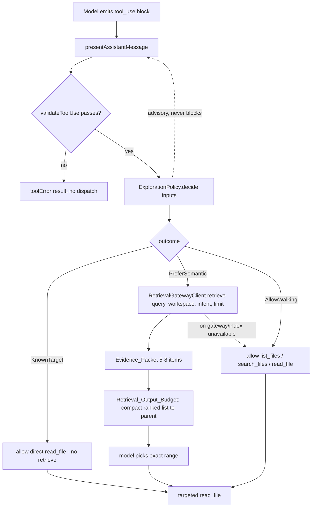

# Design Document

## Overview

This feature (FEAT-004) makes semantic retrieval the default runtime exploration mechanism for repository code whenever a code index and the retrieval-fabric gateway are available. Prompt guidance alone has proven insufficient: models still walk directories and read many files before converging on the relevant code. The design introduces a runtime **ExplorationPolicy** in the extension host that biases tool selection toward semantic retrieval before broad filesystem walking, without ever blocking the model's chosen tool call.

The ExplorationPolicy is a **pure decision component** fed by three signals — an index-availability snapshot, a known-target detection result, and an exploring-unseen-area signal — plus gateway availability. It consumes semantic evidence from the sibling **retrieval-fabric** gateway's `retrieve(query, workspace, intent, limit)`, which runs the full retrieval pipeline (decomposition, dense/lexical/symbol retrieval, deterministic fusion, reranking) and returns a bounded reranked **Evidence_Packet** of roughly 5–8 items. This spec covers only the Menagerie-side consumption of that gateway; the pipeline, reranker, hybrid fusion, and freshness mechanism remain owned by retrieval-fabric.

Three supporting mechanisms back the policy:

- A **per-task semantic exploration cache** so repeated exploration of the same concept reuses prior findings instead of re-querying.
- A **cross-worker Shared_Retrieval_Memory** so sibling readers, reasoners, verifiers, and the GLM mastermind can reuse findings within one task without inheriting another worker's chat history.
- A **retrieval output budget** so the parent context receives a compact ranked list (file, line range, score, one-line reason) rather than large code chunks.

The design is strictly additive. The existing `CodebaseSearchTool` contract (`name: "codebase_search"`, `execute({query, path?})`, emitting `codebase_search_result` via `task.say` and `pushToolResult`) is preserved; compact output is an additive preference, not a change to that contract. When the gateway or index is unavailable, the policy falls back to allowing broad filesystem walking and records the appropriate metric, never blocking exploration.

### Grounding in the existing codebase

- `src/core/tools/CodebaseSearchTool.ts` — `CodebaseSearchTool.execute` resolves the workspace, obtains the manager via `CodeIndexManagerRegistry.getOrCreate(context, workspacePath)`, checks `isConfigurationLoaded / isFeatureEnabled / isFeatureConfigured / isInitialized`, calls `manager.searchIndex(query, directoryPrefix)`, emits `task.say("codebase_search_result", …)` and `pushToolResult(...)`.
- `src/services/code-index/manager.ts` — `CodeIndexManager` exposes the availability getters above plus `state: IndexingState` (`"Standby" | "Indexing" | "Indexed" | "Error" | "Stopping"`).
- `src/services/code-index/code-index-manager-registry.ts` — per-workspace scope/manager lookup.
- `src/core/assistant-message/presentAssistantMessage.ts` — the central tool-dispatch site. `validateToolUse(...)` runs for complete (non-partial) blocks; after it passes and `recordToolUsage`/`captureToolUsage` fire, dispatch proceeds. This is the hook point for the ExplorationPolicy (advisory, after validation, before dispatch).
- `src/core/task/runParallelTasks.ts`, `src/core/tools/ParallelTasksTool.ts`, `src/core/task/ParallelTaskReader.ts` — reader-swarm fan-out, scheduling owned by elastic-parallel-execution.
- Per-task state and condensation live on `Task` (`src/core/task/Task.ts`).

## Architecture

The ExplorationPolicy sits beside the existing tool-dispatch flow in the extension host. It is **advisory**: it reads task state and produces an `ExplorationDecision` that influences which exploration affordance is preferred, but `presentAssistantMessage` always proceeds with the model's chosen tool.



### Policy inputs and the decision

`ExplorationPolicy.decide(inputs): ExplorationDecision` is a **pure function**. Its inputs are assembled from live task/manager state at the hook point but the function itself takes no prompt text and performs no I/O, which keeps it fast to unit- and property-test.

```
inputs = {
  indexAvailability: IndexAvailabilitySnapshot,   // derived from CodeIndexManager getters + state
  gatewayAvailable: boolean,                       // RetrievalGatewayClient health
  knownTarget: KnownTargetResult,                  // detector output (or null)
  exploringUnseenArea: boolean,                    // true when the current step is broad exploration of an unseen area
}
```

Decision rule (biconditional):

- `PreferSemantic` **iff** `indexAvailability.available && gatewayAvailable && exploringUnseenArea && !knownTarget.present`.
- `KnownTarget` when `knownTarget.present` — direct `read_file` permitted, no prior retrieve.
- `AllowWalking` otherwise (index/gateway unavailable, not exploring an unseen area, etc.).
- No outcome ever carries `blocks: true`. The decision is advisory only (Req 1.4, 4.6).

### Index-availability snapshot

Reuses the exact getters the existing tool already relies on. The index is **available** iff:

```
isConfigurationLoaded && isFeatureEnabled && isFeatureConfigured && isInitialized && state !== "Indexing"
```

Any false getter, or `state === "Indexing"`, yields `available: false`, which routes the decision to `AllowWalking` and records an `index-unavailable` event (Req 4.1–4.7). The snapshot is captured once per decision so the pure `decide` function never touches the manager directly.

### Gateway routing

Semantic retrieval is routed exclusively through a `RetrievalGatewayClient.retrieve(...)` call rather than raw per-replica embedding. Menagerie never selects an Intel node or OVMS replica (Req 8.1, 8.3) — distribution is owned by the gateway and OmniRoute. When the gateway is unavailable, the policy falls back to `AllowWalking` and records a `gateway-unavailable` event (Req 8.5).

The existing `CodebaseSearchTool` continues to serve direct model-issued `codebase_search` calls through `CodeIndexManager.searchIndex`. The ExplorationPolicy's compact surfacing is additive and layered over the gateway path; it does not replace or alter the tool's `codebase_search_result`/`pushToolResult` output (Req 6.5).

### Known-target bypass

A `KnownTargetDetector` inspects the current exploration inputs for an exact file path from any of three sources (Req 3.2–3.4):

1. A user instruction naming an exact path (e.g. `package.json`).
2. A compiler/diagnostic message naming `path:line` (e.g. `src/core/task/Task.ts:918`).
3. A worker already holding an exact path for the current exploration.

When a known target is present, the decision is `KnownTarget` and a direct `read_file` is permitted without a prior retrieve (Req 3.1). Known-target presence also suppresses worker bootstrap retrieval (Req 9.3).

### Per-task state, cache, and shared memory

A `SemanticExplorationState` object is attached per task (owned by `Task`, surviving across turns via the same structured per-task state mechanism used for other task-scoped state). It holds:

- The **Semantic_Exploration_Cache**: a map keyed by normalized query → `SemanticFinding[]` (Req 5).
- The **Shared_Retrieval_Memory**: the cross-worker-visible view of findings produced by any worker in the task (Req 11). Shared memory is the per-task cache made readable to sibling workers; it carries only `SemanticFinding` fields and never a worker's chat transcript (Req 11.3).
- The per-task **RetrievalMetrics** accumulator (Req 7).

Before issuing a new `retrieve()`, the policy checks the cache and shared memory for a matching concept; a hit short-circuits the gateway call, offers the stored findings for reuse, and records a `queries-reused` event (Req 5.2, 5.4, 11.4).

### Worker bootstrap and reader-swarm packets

- **Worker_Bootstrap_Retrieval** (Req 9): when enabled and a reader/reasoner worker is about to begin broad investigation and no known target applies, the policy performs one automatic `retrieve()` from the task/worker description and seeds the worker's initial context with the bounded packet. Configurable and skipped on known target.
- **Reader_Swarm_Packet** (Req 10): each reader scope receives one bounded packet via `retrieve()` for that scope before targeted investigation. Scheduling of the swarm itself is owned by elastic-parallel-execution; this spec defines only that each scope receives a bounded packet.

### Change-aware preference

When consuming an Evidence_Packet, the policy applies **Change_Aware_Preference** (Req 12): it prefers current code so a stale index result does not silently outrank a current changed file (working-tree modifications, parallel worker patches, recently changed files, files changed after indexing). It honors any freshness signal the gateway supplies and records an `index-freshness-miss` when a currently-changed file is not reflected in the consumed evidence. The freshness mechanism itself stays in retrieval-fabric.

## Components and Interfaces

### ExplorationPolicy

```typescript
export interface ExplorationPolicy {
	/** Pure, synchronous decision. No prompt text, no I/O. */
	decide(inputs: ExplorationPolicyInputs): ExplorationDecision

	/** Advisory affordance ordering for the current decision. */
	affordancesFor(decision: ExplorationDecision): ExplorationAffordance
}
```

### RetrievalGatewayClient

Thin client over the retrieval-fabric gateway. No node/replica selection (Req 8.3).

```typescript
export interface RetrievalGatewayClient {
	/** Returns a bounded reranked Evidence_Packet (~5-8 items). */
	retrieve(query: string, workspace: string, intent: RetrievalIntent, limit: number): Promise<EvidencePacket>

	/** Health probe used to compute gatewayAvailable. */
	isAvailable(): Promise<boolean>
}

export type RetrievalIntent = "exploration" | "bootstrap" | "reader_scope"
```

### KnownTargetDetector

```typescript
export interface KnownTargetDetector {
	detect(inputs: KnownTargetInputs): KnownTargetResult
}

export interface KnownTargetInputs {
	userInstruction?: string
	diagnostics?: ReadonlyArray<{ message: string }>
	workerHeldPath?: string
}
```

### SemanticExplorationState (per task)

```typescript
export interface SemanticExplorationState {
	readonly cache: SemanticExplorationCache // per-task, Req 5
	readonly sharedMemory: SharedRetrievalMemory // cross-worker view, Req 11
	readonly metrics: RetrievalMetricsRecorder // per-task, Req 7
}

export interface SemanticExplorationCache {
	store(query: string, findings: ReadonlyArray<SemanticFinding>): void
	lookup(query: string): ReadonlyArray<SemanticFinding> | undefined
}

export interface SharedRetrievalMemory {
	publish(findings: ReadonlyArray<SemanticFinding>): void
	lookup(query: string): ReadonlyArray<SemanticFinding> | undefined // readable by siblings + mastermind
}
```

### RetrievalOutputBudget

```typescript
export interface RetrievalOutputBudget {
	/** Compact ranked list for the parent context: file, line range, score, one-line reason. */
	surfaceToParent(packet: EvidencePacket): ReadonlyArray<SurfacedEvidence>

	/** Large chunks retained in artifact / worker-local store, never the parent. */
	retainWorkerLocal(packet: EvidencePacket): void
}

export interface SurfacedEvidence {
	file: string
	startLine: number
	endLine: number
	score: number
	reason: string // one line
}
```

### RetrievalMetricsRecorder

```typescript
export interface RetrievalMetricsRecorder {
	recordSemanticQuery(): void
	recordUsefulHit(): void
	recordFilesReturned(count: number): void
	recordFileOpened(): void
	recordRawRead(precededByUsefulHit: boolean): void
	recordTokensFromReads(tokens: number): void
	recordQueriesReused(): void
	recordIndexUnavailable(): void
	recordGatewayUnavailable(): void
	recordIndexFreshnessMiss(): void
	markFirstUsefulEvidence(at: number): void // for time-to-first-useful-evidence
	snapshot(): RetrievalMetrics
}
```

### Integration at the dispatch hook

In `presentAssistantMessage`, after `validateToolUse` succeeds and usage is recorded, assemble `ExplorationPolicyInputs` from the live `CodeIndexManager` snapshot, the `RetrievalGatewayClient` health, the `KnownTargetDetector`, and the exploring-unseen signal, then call `policy.decide(...)`. The result is used advisorily to shape the next exploration affordance and, when `PreferSemantic`, to route through the gateway client. The model's current tool call is **never blocked**; dispatch proceeds exactly as today.

## Data Models

```typescript
/** Availability snapshot captured once per decision from CodeIndexManager. */
export interface IndexAvailabilitySnapshot {
	isConfigurationLoaded: boolean
	isFeatureEnabled: boolean
	isFeatureConfigured: boolean
	isInitialized: boolean
	state: IndexingState // "Standby" | "Indexing" | "Indexed" | "Error" | "Stopping"
	readonly available: boolean // all four getters true && state !== "Indexing"
}

export interface KnownTargetResult {
	present: boolean
	path?: string
	line?: number
	source?: "user_instruction" | "diagnostic" | "worker_held"
}

export interface ExplorationPolicyInputs {
	indexAvailability: IndexAvailabilitySnapshot
	gatewayAvailable: boolean
	knownTarget: KnownTargetResult
	exploringUnseenArea: boolean
}

export type ExplorationOutcome = "PreferSemantic" | "KnownTarget" | "AllowWalking"

export interface ExplorationDecision {
	outcome: ExplorationOutcome
	readonly blocks: false // invariant: the policy never blocks a tool call
	requiresRetrieveBeforeRead: boolean // false for KnownTarget
	metricEvent?: "index-unavailable" | "gateway-unavailable" | "queries-reused"
}

export interface ExplorationAffordance {
	preferredNext: "semantic_retrieval" | "known_target_read" | "broad_walking"
	ordered: ReadonlyArray<"semantic_retrieval" | "read_file" | "list_files" | "search_files">
}

/** Produced by a semantic query (Req 5.1, 11.1). */
export interface SemanticFinding {
	query: string
	file: string
	startLine: number
	endLine: number
	score: number
}

/** One item of the bounded gateway result. */
export interface EvidenceItem {
	file: string
	startLine: number
	endLine: number
	score: number
	reason: string
	snippet?: string // compact; only where it materially helps; retained worker-local, not parent
	fresh?: boolean // freshness signal supplied by the gateway when available (Req 12.2)
}

/** Bounded reranked packet (~5-8 items). */
export interface EvidencePacket {
	query: string
	items: ReadonlyArray<EvidenceItem> // length bounded (<= ~8)
}

export interface RetrievalMetrics {
	semanticQueries: number
	semanticHitRate: number // usefulHits / semanticQueries, in [0,1]
	filesReturned: number
	filesOpened: number
	rawReads: number
	tokensFromReads: number
	queriesReused: number
	indexUnavailableEvents: number
	gatewayUnavailableEvents: number
	pctRawReadsPrecededByUsefulHit: number // in [0,1]
	indexFreshnessMisses: number
	timeToFirstUsefulEvidenceMs?: number // task creation -> first useful source evidence
}
```

The maximum consumed packet size is a shared constant:

```typescript
export const MAX_EVIDENCE_PACKET_ITEMS = 8
```

## Correctness Properties

A property is a characteristic or behavior that should hold true across all valid executions of a system — essentially, a formal statement about what the system should do. These statements bridge the human-readable requirements and machine-verifiable correctness guarantees, and each is implemented by a single fast-check property test.

### Property 1: Preference holds exactly when all conditions and the gateway align

*For any* `ExplorationPolicyInputs`, the decision outcome is `PreferSemantic` if and only if the index-availability snapshot is available AND the gateway is available AND the task is exploring an unseen area AND no known target applies; and in every outcome the decision never blocks the tool call.

**Validates: Requirements 1.1, 1.3, 1.4, 2.1, 2.3, 4.6**

### Property 2: Unavailability and failed conditions allow walking without blocking and record the right metric

*For any* `ExplorationPolicyInputs` in which the index-availability snapshot is unavailable OR the gateway is unavailable OR the task is not exploring an unseen area, the decision allows broad filesystem walking, never blocks the tool call, and records an `index-unavailable` event when the index snapshot is unavailable and a `gateway-unavailable` event when the gateway is unavailable.

**Validates: Requirements 4.1, 4.2, 4.3, 4.4, 4.5, 4.6, 4.7, 8.5**

### Property 3: A known target is read directly without a prior retrieve

*For any* `ExplorationPolicyInputs` whose known-target detection reports a path drawn from a user instruction, a `path:line` diagnostic, or a worker-held path, the decision permits a direct `read_file` of that path with `requiresRetrieveBeforeRead` false and issues no prior `retrieve()`.

**Validates: Requirements 3.1, 3.2, 3.3, 3.4, 9.3**

### Property 4: A concept already in the cache or shared memory reuses prior findings instead of a new retrieve

*For any* per-task cache or shared-retrieval-memory populated with findings for a query, exploring that same concept returns the stored findings, issues no new gateway `retrieve()`, and records a `queries-reused` event.

**Validates: Requirements 5.1, 5.2, 5.4, 11.1, 11.3, 11.4**

### Property 5: The consumed packet is bounded and the parent context never receives the full candidate set

*For any* `EvidencePacket` returned by the gateway, the consumed packet contains at most `MAX_EVIDENCE_PACKET_ITEMS` items, and the entries surfaced to the parent context contain only file path, line range, score, and a one-line reason — never large code chunks or the full 30–50 candidate set.

**Validates: Requirements 6.1, 6.2, 6.3, 8.2, 10.2**

### Property 6: A current changed file is not silently outranked by a stale index result

*For any* `EvidencePacket` combined with a set of currently-changed files, the consumed ordering never ranks a stale item above a current/changed item, honors any gateway-supplied freshness signal, and records an `index-freshness-miss` when a currently-changed file is not reflected in the consumed evidence.

**Validates: Requirements 12.1, 12.2, 12.4**

## Error Handling

- **Gateway failure or timeout.** `RetrievalGatewayClient.retrieve` rejecting or `isAvailable()` returning false is treated as `gatewayAvailable === false`. The policy routes to `AllowWalking`, records a `gateway-unavailable` event, and never blocks (Req 8.5). The failure is logged, not surfaced as a hard error to the model.
- **Index unavailable.** Any false availability getter or `state === "Indexing"` yields `available: false`, routing to `AllowWalking` and recording an `index-unavailable` event (Req 4). The existing `CodebaseSearchTool` already surfaces explicit unavailability errors for direct `codebase_search` calls; that behavior is unchanged.
- **Oversized gateway response.** If the gateway returns more than `MAX_EVIDENCE_PACKET_ITEMS`, the consumer truncates to the bound before surfacing (defensive; the gateway is expected to return 5–8). The full candidate set is never ingested (Req 8.2).
- **Malformed evidence items.** Items missing required fields (`file`, `startLine`, `endLine`, `score`) are dropped from the consumed packet; a valid-but-empty packet is treated as "no semantic hit" and falls through to allowing targeted exploration.
- **Known-target detection failure.** If detection throws or is ambiguous, the result is `{ present: false }`, which degrades safely to the normal preference path rather than forcing a direct read.
- **Metrics recording failure.** Metric recording is best-effort and wrapped so a recorder error never affects the decision or blocks dispatch.

## Testing Strategy

Per AGENTS.md, coverage is placed at the narrowest layer that proves the behavior. The ExplorationPolicy decision, known-target detection, cache/shared-memory reuse, bounded-packet enforcement, and change-aware ordering are pure extension-host runtime logic, so they are tested with package-local `src` unit tests and fast-check property tests. The webview layer is not involved.

### Fast-check property tests

The six correctness properties above are each implemented by a single fast-check property test running a minimum of 100 iterations, tagged with a comment referencing the design property:

```
// Feature: semantic-first-retrieval, Property 1: Preference holds exactly when all conditions and the gateway align
```

Generators:

- `ExplorationPolicyInputs` — arbitrary booleans for `gatewayAvailable` and `exploringUnseenArea`; an arbitrary `IndexAvailabilitySnapshot` over the four getters and all `IndexingState` values; an arbitrary `KnownTargetResult` (present/absent across the three sources).
- `EvidencePacket` — arbitrary item counts (including over-bound to exercise truncation), arbitrary `fresh` flags and scores, plus a generated set of currently-changed files for Property 6.
- Query/cache seeds — arbitrary normalized query strings and finding lists for Property 4.

### Unit (example) tests

- `CodeIndexManager` state → `IndexAvailabilitySnapshot.available` mapping for each getter and the `Indexing` state (example rows complementing Property 2).
- Cache scoping: two independent task states do not share cache entries (Req 5.3).
- Shared memory visibility: findings published by one worker are readable by a sibling and the mastermind within the same task state, carrying only `SemanticFinding` fields and no transcript (Req 11.2, 11.3).
- Worker-bootstrap gating decision: bootstrap iff `enabled && readerOrReasonerStarting && !knownTarget`, with one `retrieve()` and context seeding when true, skipped on known target (Req 9.1–9.4).
- `RetrievalGatewayClient` signature review: `retrieve` exposes no node/replica selection (Req 8.3).
- Derived-metric consistency examples: `semanticHitRate` and `pctRawReadsPrecededByUsefulHit` stay in `[0,1]` and counters are monotonic (Req 7).

### Integration tests (faked boundaries, no real host)

- `CodebaseSearchTool` behavior preservation: with a faked `Task` and faked `CodeIndexManager`, `execute` still emits `codebase_search_result` via `task.say` and the `Query: …` `pushToolResult`; compact surfacing is additive and does not alter that output (Req 6.5).
- Gateway routing: with a faked `RetrievalGatewayClient` spy and faked `CodeIndexManager` states, a `PreferSemantic` decision invokes `retrieve()` and never a raw per-replica embedding path (Req 8.1); an unavailable gateway falls through to walking and records the metric (Req 8.5).
- Reader-swarm packet delivery: each reader scope receives one bounded packet via `retrieve()` before investigation (Req 10.1–10.3); swarm scheduling itself is out of scope (owned by elastic-parallel-execution).

### End-to-end

No `apps/vscode-e2e` test is added. The behavior under test is pure extension-host runtime policy and gateway consumption with no dependency on the real VS Code extension host, workspace APIs, or webview messaging. The lower layers above fully represent every failure mode.
