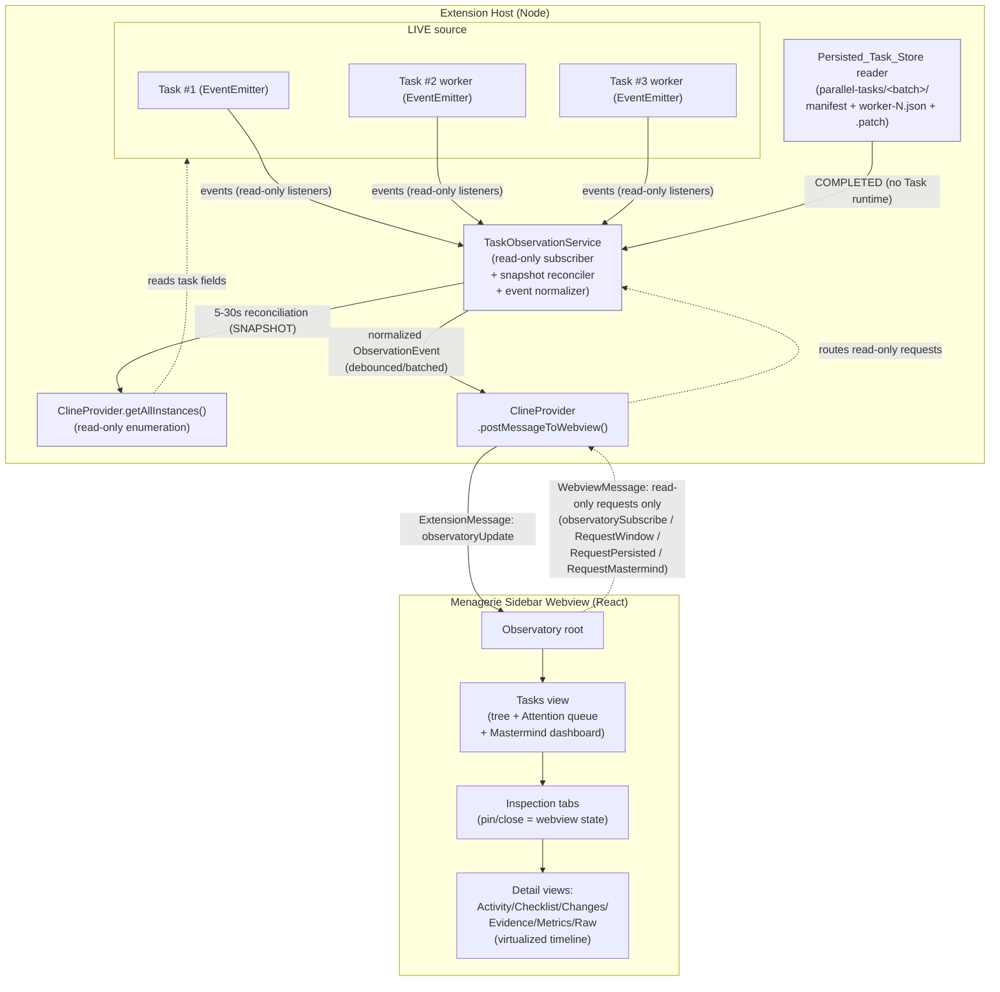

# Design Document

## Overview

The Task Observatory is a read-only task-inspection workspace rendered inside the existing Menagerie sidebar webview (the React app driven by `ClineProvider`). It replaces the detail experience in `src/activate/taskBoard.ts` — a VS Code `TreeView` plus a `vscode.WebviewPanel` opened in `ViewColumn.Beside`, driven by a 5-second `setInterval` — with an event-driven, in-sidebar surface.

The design rests on three structures that already exist in the codebase and must not be reinvented:

1. **`Task extends EventEmitter<TaskEvents>`** (`src/core/task/Task.ts`). Tasks already emit the lifecycle and activity events the Observatory needs (`Message`, `TaskActive`, `TaskInteractive`, `TaskResumable`, `TaskIdle`, `TaskStarted`, `TaskAborted`, `TaskAskResponded`, `TaskUserMessage`, `TaskTokenUsageUpdated`, `TaskToolFailed`, `QueuedMessagesUpdated`). The new `TaskObservationService` subscribes to these as a **read-only listener**; it adds no mutation path.
2. **`ClineProvider.getAllInstances()`** (`src/core/webview/ClineProvider.ts`) enumerates every provider/task in the extension host **without focusing any chat**. This is exactly the read-only collection pattern `collectTaskBoard()` already uses, and it is the basis for the reconciliation snapshot and for status derivation.
3. **`ClineProvider.postMessageToWebview(message: ExtensionMessage)`** pushes typed messages into the single React webview. The Observatory flows data to the webview through a **new `ExtensionMessage` variant** (`observatoryUpdate`) over this existing channel; it does **not** create a second webview or a `vscode.WebviewPanel`.

The feature's governing guarantee is the **Zero-Lifecycle-Side-Effect invariant** (Requirement 4): no inspection action — selecting, switching, pinning, closing, filtering, expanding, opening a patch, inspecting evidence — may focus, activate, pause, cancel, resume, answer, re-route, or otherwise mutate any task. The design makes this structurally enforceable rather than merely conventional: the extension-to-webview messages the Observatory may send are an explicit read-only allowlist, and a test seam over `postMessage` and over `ClineProvider`'s mutation methods proves zero mutating calls.

Three inspection source states feed the Observatory, labeled on every inspected task (Requirement 9.3):

- **LIVE_State** — a current in-process `Task` reachable via `getAllInstances()`, updated by the event stream.
- **SNAPSHOT_State** — data from a periodic read-only reconciliation pass (5–30 s) rather than directly from events.
- **COMPLETED_State** — data read only from the persisted `parallel-tasks/<batch-id>/` store, with **no `Task` runtime constructed**.

### Research Notes and Grounding

- **Emitted events are the natural <=500 ms source.** `Task.ts` emits `Message` on `{action:"created"}` (line 1408) and `{action:"updated"}` (line 1459), and lifecycle transitions `TaskInteractive`/`TaskResumable`/`TaskIdle`/`TaskActive` at the ask boundaries (lines 1718–1829). Subscribing to these removes the need for the 5 s poll (Requirement 8.2).
- **Status derivation is already a defined function.** `collectTaskBoard()` derives status from `history?.status`/`say==="completion_result"` → completed, else `task.abort` → stopped, else unanswered `ask` → waiting, else `isStreaming` → streaming, else working. The Observatory reuses this exact rule (Requirement 2, Requirement 4.9) and extends it with `queued` for admitted-but-not-started workers.
- **Ask-state fields exist.** `interactiveAsk`/`resumableAsk`/`idleAsk` (Task.ts lines 378–380) and the last `clineMessage` being an unanswered, non-partial `ask` identify the waiting state (Requirement 2.4, 11.1).
- **Persisted store format is fixed.** `parallel-tasks/<batch-id>/` holds `manifest.json`, `worker-N.json`, `worker-N.patch` and is **not** auto-resumed after restart (`docs/architecture/native-parallel-tasks.md`). The Observatory reads these as plain files (Requirement 9.1–9.4).
- **Message types live in `packages/types/src/vscode-extension-host.ts`** (`ExtensionMessage` and `WebviewMessage`). New Observatory message variants are added there so the webview and host share typed contracts (per AGENTS.md persisted-setting/message-type guidance). The webview is the React app under `webview-ui/src`.

### Compatibility Commitments

- Retain the `zoo-code.*` command identifiers (`zoo-code.getTaskBoard`, `zoo-code.taskBoardShowDetails`, `zoo-code.showTaskBoard`, `zoo-code.exportTaskBoard`) internally, re-registered as compatibility/debug commands (Requirement 1.3, 1.4).
- The old `onDidChangeSelection` + `TreeItem.command` focus-on-selection behavior is **removed from the inspection path** — this is the specific defect the Observatory fixes (Requirement 4.10).
- New user-visible strings use "Menagerie" (Requirement 1.5).
- Do not change the on-disk formats of `task-boards/` or `parallel-tasks/` (Non-Goals).

## Architecture

### Component Diagram



The arrow from the webview back to the host (`WebviewMessage`) is intentionally thin: it carries **only read-only, request-data messages**. No arrow exists from the Observatory to any task's `run`/`resume`/`abortTask`/`cancelCurrentRequest`/`dispose` path, nor to active-chat selection or `handleWebviewAskResponse`.

### Data Flow

1. **Attach.** On activation, `TaskObservationService` enumerates `getAllInstances()`, and for each current `Task` attaches read-only listeners for the relevant `RooCodeEventName.*` events. It also hooks task creation/disposal so listeners are attached for new tasks and detached when a task disposes (see detach discipline below).
2. **Normalize.** Each raw event is wrapped in a `try/catch` and translated into a transport-neutral `ObservationEvent`. Derivation of status uses only read-only field access on the `Task`.
3. **Batch and post.** Normalized events are coalesced per task over a short debounce window (default 80 ms, cap chosen so committed-event-to-webview latency stays well under the 500 ms budget of Requirement 8.3) and posted as one `observatoryUpdate` `ExtensionMessage`.
4. **Reconcile.** A fixed-interval timer (configurable 5–30 s, default 10 s) runs `collectTaskBoard()`-style read-only collection, produces `SNAPSHOT_State` rows, and posts a reconciliation `observatoryUpdate`. The webview replaces any event-derived state that diverges from the snapshot (Requirement 8.4, 8.5).
5. **Render.** The React Observatory applies updates to its store and renders the Tasks view, tabs, and virtualized detail. It requests bounded timeline windows and persisted-worker data via read-only `WebviewMessage`s as the user scrolls or opens tabs.

### Failure Isolation

Every listener body and the reconciliation pass are wrapped so a thrown observer never propagates into `Task` execution. The `Task` already defends its own emit sites (Task.ts comments at lines 1595 and 2236 note that a synchronous throw from a `Message` listener must not break the task); the Observatory honors that by never throwing out of a listener and by routing all observer errors to an error channel rather than rethrowing (Requirement 8.6, 4.12). If normalization or posting fails, the service logs, surfaces an Observatory-scoped error indication to the webview, and leaves task execution untouched — with **no fallback that resumes, aborts, disposes, or re-activates any task**.

### Listener Lifecycle (attach/detach without blocking disposal)

- Listeners are stored in a per-task `Disposable` record keyed by `taskId`. Because `Task` is a Node `EventEmitter`, the service holds the handler functions, not strong structural references that would keep a disposed task alive beyond its intended lifetime.
- On task creation (observed via the provider's creation hook / `getAllInstances()` delta on reconciliation), the service attaches handlers and records the disposer.
- On `TaskAborted`/disposal, the service runs the disposer (removes all listeners via `off`) and drops the record. The reconciliation pass also reconciles the listener set against `getAllInstances()` so a missed disposal cannot leak listeners.
- The service never calls any method that would advance or stop a task; attaching and detaching listeners are the only interactions with the `Task` object.

## Components and Interfaces

### Extension-host components

#### `TaskObservationService` (`src/services/observatory/TaskObservationService.ts`)

Read-only subscriber, normalizer, batcher, and reconciler. Responsibilities:

- `start(provider: ClineProvider)` / `dispose()` — lifecycle; registers as a `vscode.Disposable` in the extension context.
- `attachTo(task: Task)` / `detachFrom(taskId: string)` — manage per-task read-only listeners.
- `handleEvent(...)` private handlers for each subscribed `RooCodeEventName` → `ObservationEvent`.
- `reconcile()` — periodic SNAPSHOT pass using the existing `collectTaskBoard()` collection pattern.
- `postBatch()` — debounced flush to `postMessageToWebview({ type: "observatoryUpdate", ... })`.
- `deriveStatus(task): ObservedTaskStatus` — total function matching `collectTaskBoard` rules (see Data Models).
- No public method mutates a task. The class does not import or hold references to `Task.run`, `abortTask`, `cancelCurrentRequest`, `resumeTask`, or `handleWebviewAskResponse`.

#### `PersistedTaskStoreReader` (`src/services/observatory/PersistedTaskStoreReader.ts`)

Reads `parallel-tasks/<batch-id>/manifest.json`, `worker-N.json`, `worker-N.patch` from global storage and maps them to `ObservedTask`/`TimelineEvent` with `source: COMPLETED`. It performs **only file reads and JSON parsing** and never constructs a `Task` (Requirement 9.4). It correlates each `worker-N` with any live `Task` whose `parallelParentTaskId` + worker index match, under one `logicalWorkerId` (Requirement 9.5).

#### `ErrorClassifier` (`src/services/observatory/ErrorClassifier.ts`)

Pure function `classify(signal): ErrorClassification`. Maps task error signals and `TaskToolFailed` sequences to the fixed enum (Requirement 12). Loop detection and polling exclusion are described under Error Handling.

#### `ObservatoryMessageRouter` (within `webviewMessageHandler`)

Handles the read-only `WebviewMessage` variants (`observatorySubscribe`, `observatoryRequestWindow`, `observatoryRequestPersisted`, `observatoryRequestMastermind`, `observatoryRefresh`). Each handler reads data and calls `postMessageToWebview`; none calls a lifecycle-mutating operation.

#### Compatibility command registration (`src/activate/taskBoard.ts`, trimmed)

Retains the `zoo-code.*` commands and the `task-boards/<id>.json` snapshot writer for debug/compatibility, but **removes** the `onDidChangeSelection`/`TreeItem.command` focus-on-selection behavior and the `ViewColumn.Beside` detail panel as the primary inspection surface.

### Webview (React) components (`webview-ui/src/components/observatory/`)

- `ObservatoryRoot` — subscribes on mount (sends `observatorySubscribe`), owns the observatory store, applies `observatoryUpdate` messages, renders Tasks view + tab bar + active detail.
- `TaskTree` — renders the parent/worker hierarchy with per-task state indicators (Requirement 2).
- `AttentionQueue` — "Needs You" list of waiting tasks (Requirement 11).
- `MastermindDashboard` — parent-level summary (Requirement 10).
- `InspectionTabBar` + `InspectionTab` — multiple open tabs, pin, close; **all pure webview state** (Requirement 3). Closing a tab dispatches a local store action and sends **no** host message that mutates a task (Requirement 4.8).
- `SummaryHeader` — sticky header with the fixed field set (Requirement 5).
- `DetailTabs` — Activity / Checklist / Changes / Evidence / Metrics / Raw (Requirement 6).
- `VirtualTimeline` — windowed/virtualized event list with overscan ≤ 20, ≤ 500 events in memory, lazy per-event expansion, tool-result collapse (Requirement 7).
- `ErrorBadge` — renders `ErrorClassification` next to error detail (Requirement 12.4).

### Message Contracts

New `ExtensionMessage` variants (host → webview), all read-only payloads:

- `observatoryUpdate` — `{ reason: "event" | "snapshot"; tasks: ObservedTask[]; events?: ObservationEvent[]; source: ... }`
- `observatoryWindow` — a bounded `TimelineEvent[]` window for a requested task/offset.
- `observatoryPersisted` — a `COMPLETED_State` `ObservedTask` + timeline for a requested batch/worker.
- `observatoryMastermind` — a `SummaryHeader`-level `MastermindSummary`.
- `observatoryError` — Observatory-scoped failure indication (Requirement 8.6, 7.8).

New `WebviewMessage` variants (webview → host), the **complete read-only allowlist** the Observatory may send:

- `observatorySubscribe` — begin receiving updates.
- `observatoryRequestWindow` — `{ taskId; offset; limit }` request a bounded timeline window.
- `observatoryRequestPersisted` — `{ batchId; workerId }` request COMPLETED data.
- `observatoryRequestMastermind` — `{ parentTaskId }`.
- `observatoryRefresh` — request a fresh read-only collection pass.

The Observatory webview **never** sends `newTask`, `resumeTask`, `cancelTask`, `askResponse`, `clearTask`, mode/profile-switch, "reveal editor", or active-chat-selection messages. This allowlist is the enforceable form of Requirement 4.

## Data Models

All models are defined in `packages/types/src/observatory.ts` and referenced from `ExtensionMessage`/`WebviewMessage` in `vscode-extension-host.ts`.

```typescript
/** Inspection source for a task (Requirement 9.3). */
export type ObservationSource = "LIVE" | "SNAPSHOT" | "COMPLETED"

/** Task state indicators (Requirement 2.3). Derived from Task fields. */
export type ObservedTaskStatus =
  | "queued"
  | "working"
  | "streaming"
  | "waiting" // waiting for user input
  | "completed"
  | "failed"
  | "cancelled" // cancelled or stopped

/** One inspected task (parent or worker), from any source. */
export interface ObservedTask {
  id: string // taskId
  parentId?: string // parallelParentTaskId ?? parentTaskId
  logicalWorkerId?: string // stable worker identity across live+persisted (Req 9.5)
  isParallelWorker: boolean
  status: ObservedTaskStatus
  source: ObservationSource
  header: SummaryHeader
  errorClassification?: ErrorClassification
}

/** Sticky summary header fields (Requirement 5.2). Empty-value sentinel, never omitted (5.3). */
export interface SummaryHeader {
  status: ObservedTaskStatus
  mode: string | null // getTaskMode() for LIVE
  route: string | null
  profile: string | null // getTaskApiConfigName() for LIVE
  model: string | null // api.getModel().id for LIVE
  reasoning: string | null
  contextUsed: number | null
  contextLimit: number | null
  startedAt: number | null
  lastActivityAt: number | null
  workspace: string | null // task.cwd
  parentId: string | null
  workerId: string | null
}

/** Transport-neutral normalization of a RooCodeEventName.* emission. */
export interface ObservationEvent {
  taskId: string
  kind:
    | "message" // RooCodeEventName.Message (created|updated)
    | "active" | "interactive" | "resumable" | "idle" | "started" | "aborted"
    | "askResponded" | "userMessage" | "tokenUsage" | "toolFailed" | "queued"
  committedAt: number // used to measure the <=500ms budget (Req 8.3)
  seq: number // monotonic per task; webview applies in order
  payload: unknown // kind-specific, normalized read-only snapshot
}

/** One row in the virtualized timeline, with collapse/preview metadata (Req 7.4). */
export interface TimelineEvent {
  id: string
  taskId: string
  ts: number
  label: string // human-readable (e.g. "Menagerie · tool", "You")
  kind: "say" | "ask" | "tool" | "api" | "reasoning"
  outcome?: "success" | "error" | "pending"
  lineCount: number
  byteSize: number
  collapsedByDefault: boolean // true when lineCount > 50 || byteSize > 10000
  preview: string // compact summary shown while collapsed
  detailRef?: string // opaque ref; full detail fetched lazily on expand (Req 7.2)
}

/** Discriminated union for each detail view (Requirement 6). */
export type DetailView =
  | { view: "activity"; events: TimelineEvent[] }
  | { view: "checklist"; todos: TodoItem[] } // sourced from Task.todoList (Req 6.3)
  | { view: "changes"; files: ChangedFile[]; patchRefs: string[]; gitSummary: string }
  | { view: "evidence"; tests: EvidenceItem[]; commands: EvidenceItem[]; refs: EvidenceItem[] }
  | { view: "metrics"; metrics: TaskMetrics }
  | { view: "raw"; events: TimelineEvent[] } // complete underlying events (Req 6.7)

export interface ChangedFile { path: string; status: string; additions?: number; deletions?: number }
export interface EvidenceItem { label: string; detailRef?: string; outcome?: "success" | "error" | "pending" }
export interface TaskMetrics {
  tokensIn: number | null
  tokensOut: number | null
  latencyMs: number | null
  route: string | null
  model: string | null
  contextPressure: number | null
  reasoningEscalation: string | null
  toolCounts: Record<string, number>
}

/** Parent batch overview (Requirement 10.2). */
export interface MastermindSummary {
  parentTaskId: string
  workerCounts: Record<ObservedTaskStatus, number>
  laneStatus: { workerId: string; status: ObservedTaskStatus }[]
  contextPercent: number | null
  tierCeiling: string | null
  artifacts: string[]
  blockers: string[]
}

/** Error categories (Requirement 12.1). */
export type ErrorClassification =
  | "TRANSIENT"
  | "MODEL"
  | "TOOL"
  | "VALIDATION"
  | "AUTH"
  | "INFRASTRUCTURE"
  | "LOOP"
  | "USER_INPUT_REQUIRED"
```

### Status Derivation (total function matching `collectTaskBoard`)

`deriveStatus` mirrors the existing rule precisely and is total over all `Task`-field combinations:

```text
if (history.status === "completed" || lastMessage.say === "completion_result") -> completed
else if (task.abort === true && no recorded completion)                        -> cancelled
else if (lastMessage is ask && !isAnswered && !partial)                        -> waiting
else if (task.isStreaming === true)                                            -> streaming
else if (admitted worker with no activity yet)                                 -> queued
else                                                                           -> working
```

`failed` is derived for persisted/live tasks whose terminal record carries a failure (`parallelWorkerFailure`, or a manifest worker outcome of failure). For a COMPLETED task, derivation runs over the persisted `worker-N.json` fields rather than a live `Task`.

### Logical Worker Identity

`logicalWorkerId = \`${batchId}:worker-${index}\``. The `PersistedTaskStoreReader` assigns it from the manifest; the live correlation matches a `Task` with `parallelParentTaskId` and the worker index recorded in the batch manifest. The webview groups the LIVE and COMPLETED records of one logical worker under this id so the same tab survives completion (Requirement 9.5), re-labeling `source` LIVE → COMPLETED without reconstructing a task.

## Correctness Properties

*A property is a characteristic or behavior that should hold true across all valid executions of a system — essentially, a formal statement about what the system should do. Properties serve as the bridge between human-readable specifications and machine-verifiable correctness guarantees.*

The following properties are derived from the acceptance-criteria prework. Redundant facets have been consolidated: the many "zero Lifecycle_Mutating_Operations" clauses collapse into one comprehensive property over the full inspection-action alphabet, and the status-state clauses collapse into one derivation-totality property.

### Property 1: Observation never mutates task state (P0 safety)

*For any* sequence of inspection actions drawn from the full alphabet {select tab, switch tab, pin tab, close tab, refresh, filter, expand event, open patch, inspect evidence, open Mastermind dashboard, select from Attention queue, forward an event}, executed against any set of observed tasks, the Observatory performs **zero** Lifecycle_Mutating_Operations: it issues no `task.run`, resume, `abortTask`, `cancelCurrentRequest`, `dispose`, active-chat switch, `handleWebviewAskResponse`, reveal-editor, parent/child-relationship change, or model-routing change; it sends no webview→host message outside the read-only allowlist; and each observed task's lifecycle fields (status, parent/child relationship, active-chat selection, model routing) are identical before and after the sequence.

**Validates: Requirements 4.1, 4.2, 4.3, 4.4, 4.5, 4.6, 4.7, 4.8, 4.9, 4.10, 4.11, 8.1, 10.3, 11.3, 11.4, 3.5**

### Property 2: Timeline window never exceeds bounds

*For any* ingest sequence of timeline events and any viewport size, the number of event components mounted in the DOM never exceeds the visible-viewport count plus an overscan of at most 20 above and below, and the number of events retained in memory for the active Inspection_Tab never exceeds 500 (events outside the window are evicted rather than retained).

**Validates: Requirements 7.1, 7.6**

### Property 3: Opening a COMPLETED inspection never constructs a Task

*For any* COMPLETED_State inspection opened from the Persisted_Task_Store, the `Task` constructor is invoked zero times; the inspection is produced solely from file reads and JSON parsing of `manifest.json`/`worker-N.json`/`worker-N.patch`.

**Validates: Requirements 9.4**

### Property 4: Status derivation is a total function matching collectTaskBoard

*For any* combination of task fields (`history.status`, last `clineMessage` type/`say`/`isAnswered`/`partial`, `abort`, `isStreaming`, admitted-worker flag), `deriveStatus` returns exactly one of {queued, working, streaming, waiting, completed, failed, cancelled}, and the result matches the precedence rules used by `collectTaskBoard()`.

**Validates: Requirements 2.3, 2.4, 2.5, 2.6**

### Property 5: Task hierarchy groups children under their parent

*For any* set of observed tasks with `parentId` (`parallelParentTaskId ?? parentTaskId`) links, the rendered tree nests every child task directly under the task identified by its `parentId`, and tasks without a `parentId` appear as roots.

**Validates: Requirements 2.1, 2.2**

### Property 6: Expanding an event renders only that event's detail

*For any* set of events and any subset marked expanded, exactly the expanded events have their full detail content rendered, and every non-expanded event renders only its compact preview.

**Validates: Requirements 7.2**

### Property 7: Filtering shows exactly the matching events

*For any* event set and any filter predicate, the rendered timeline contains exactly the events satisfying the predicate and excludes every non-matching event.

**Validates: Requirements 7.3**

### Property 8: Tool-result collapse threshold and summary

*For any* tool result, the result is collapsed by default if and only if its rendered line count exceeds 50 or its byte size exceeds 10,000; when collapsed, its summary includes the line count, the byte size, and the outcome, and offers Preview, Expand, and Open-raw affordances.

**Validates: Requirements 7.4**

### Property 9: Summary header completeness with explicit empty values

*For any* ObservedTask, the rendered summary header contains every required field (Status, Mode, Route, Profile, Model, Reasoning, Context used, Context limit, Started, Last activity, Workspace, Parent id, Worker id); any field with no available value renders an explicit empty-value indicator and is never omitted, so the rendered field count is constant across all tasks.

**Validates: Requirements 5.2, 5.3**

### Property 10: Reconciliation converges state to the snapshot

*For any* event-derived Observatory state and any reconciliation snapshot, after reconciliation the state equals the snapshot for every field in which the two diverge (snapshot wins).

**Validates: Requirements 8.5**

### Property 11: Persisted-store parsing round-trips

*For any* valid set of persisted records (`manifest.json`, `worker-N.json`, `worker-N.patch`), the Persisted_Task_Store reader parses them into an ObservedTask whose fields equal the values that were serialized (round-trip of the persisted schema).

**Validates: Requirements 9.2**

### Property 12: Source labeling is total and matches origin

*For any* inspected task, its `source` is exactly one of {LIVE, SNAPSHOT, COMPLETED} and equals the origin from which its data was produced.

**Validates: Requirements 9.3**

### Property 13: Logical worker identity is stable across completion

*For any* worker, its live record and its persisted record map to the same `logicalWorkerId`, so the worker is inspectable under one identity before and after completion.

**Validates: Requirements 9.5**

### Property 14: External mutations are reflected, not suppressed

*For any* Lifecycle_Mutating_Operation initiated by a source other than the Observatory during an inspection sequence, the Observatory neither suppresses, intercepts, nor alters that operation, and the resulting state appears in the next read-only collection pass.

**Validates: Requirements 4.13**

### Property 15: Mastermind summary aggregates workers correctly

*For any* set of Worker_Tasks under a Parent_Task, the Mastermind_Dashboard's worker counts and lane status equal the true tallies computed from those workers' derived statuses.

**Validates: Requirements 10.2**

### Property 16: Attention queue contains exactly the waiting tasks

*For any* set of observed tasks with mixed statuses, the Attention_Queue contains exactly the tasks in the waiting-for-user-input state and no others.

**Validates: Requirements 11.1**

### Property 17: Error classification is total

*For any* reported error signal, the classifier returns exactly one of {TRANSIENT, MODEL, TOOL, VALIDATION, AUTH, INFRASTRUCTURE, LOOP, USER_INPUT_REQUIRED}.

**Validates: Requirements 12.1**

### Property 18: Polling activity is never classified as an error

*For any* signal representing repeated polling of an external system (e.g., Kubernetes status polling), the classifier never assigns an error category to that activity.

**Validates: Requirements 12.2**

### Property 19: Repeated 401 without credential change is LOOP

*For any* sequence of repeated 401 responses with no intervening credential change, the classifier returns LOOP; introducing a credential change in the sequence prevents the LOOP classification.

**Validates: Requirements 12.3**

## Error Handling

### Observatory-scoped containment

All failures in observation, normalization, posting, reconciliation, persisted-store reading, and rendering are contained within the Observatory and never propagate into task execution (Requirement 8.6, 4.12):

- **Listener bodies** are wrapped in `try/catch`. A thrown handler is logged and converted to an `observatoryError` message; it is never rethrown into the `Task` emit site. This honors the existing Task.ts contract that a synchronous throw from a `Message` listener must not break the task.
- **Normalization/post failures** cause the service to skip the offending batch, emit `observatoryError`, and continue. No retry performs a task write.
- **Reconciliation failures** are logged and surfaced; the previous event-derived state is retained until the next successful pass.
- **Per-event render failures** in the virtualized timeline are caught at the event boundary (React error boundary per event row): the failing row shows an inline error indicator identifying the failure, and all other rows continue to render without freezing the tab (Requirement 7.8).
- **Collection/render errors during an inspection action** abort that action, surface an error indication, and perform zero Lifecycle_Mutating_Operations — explicitly no fallback that resumes, aborts, disposes, or re-activates any task (Requirement 4.12).

### Error classification mapping (Requirement 12)

`ErrorClassifier.classify` maps signals to the fixed enum:

| Signal | Classification |
| --- | --- |
| Network timeout/5xx that later succeeds; single retryable failure | TRANSIENT |
| Model/provider error (bad response, model unavailable) | MODEL |
| `TaskToolFailed` with a tool-execution error (single/non-repeating) | TOOL |
| Schema/argument/validation rejection | VALIDATION |
| 401/403 authentication/authorization failure (first occurrence) | AUTH |
| Worktree/filesystem/process/environment failure | INFRASTRUCTURE |
| Repeated identical failure with no state change (see loop detection) | LOOP |
| Unanswered `ask` blocking progress | USER_INPUT_REQUIRED |

**Loop detection.** A LOOP is derived from a repetition signal, not a single error:

- Repeated `TaskToolFailed` emissions with the **same tool and same error** and **no intervening state change** (no new `Message`, no `TaskActive` progress, no checklist change) over a threshold count → LOOP (Requirement 12.1 refinement).
- Repeated **401** responses with **no intervening credential change** → LOOP (Requirement 12.3). A detected credential change resets the loop counter and reverts classification to AUTH for a fresh failure.

**Polling exclusion.** Repeated activity that represents **polling an external system** (e.g., Kubernetes status checks) is recognized as normal progress, not failure, and is **never** classified as an error (Requirement 12.2). The classifier distinguishes polling (successful or expected-pending responses that advance an external wait) from a stuck failure loop (identical errors with no state change).

The classification is displayed next to the inspected task's error detail via `ErrorBadge` (Requirement 12.4).

## Testing Strategy

Property-based testing **is** appropriate for this feature: the core guarantees are universal properties over large input spaces (arbitrary inspection-action sequences, arbitrary task-field combinations, arbitrary timeline sizes, arbitrary error-signal sequences, persisted-record round-trips). The timing clauses (Requirements 7.7, 8.3) and the pure UI-presence clauses are **not** suitable for PBT and are covered by example/integration tests instead.

Test placement follows AGENTS.md test-pyramid guidance — prove each behavior at the lowest layer that can fail for it.

### Property-based tests

- **Library.** Use `fast-check` (already the project's TS property-testing choice). Do **not** hand-roll property testing.
- **Iterations.** Each property test runs a minimum of 100 generated cases.
- **Tagging.** Each property test carries a comment of the form `// Feature: task-observatory, Property {number}: {property_text}` referencing the design property it implements.
- **One test per property.** Each correctness property above is implemented by a single property-based test.

Placement of the property tests:

- **Extension-host package-local unit tests** (`src/services/observatory/__tests__/`): Property 1 (zero-mutation — spies over `postMessageToWebview` and over `ClineProvider` mutation methods, generating random inspection-action sequences; asserts no mutating call and no message outside the read-only allowlist), Property 3 (no `Task` construction — spy over the `Task` constructor), Property 4 (status derivation totality against `collectTaskBoard` rules), Property 10 (reconciliation convergence), Property 11 (persisted-store round-trip), Property 12 (source labeling), Property 13 (logical worker identity), Property 14 (external mutation reflected), Property 15 (Mastermind aggregation), Property 16 (attention queue membership), Properties 17–19 (error classification totality, polling exclusion, 401 LOOP).
- **webview-ui tests** (`webview-ui/src/components/observatory/__tests__/`): Property 2 (bounded mount/memory window), Property 5 (hierarchy grouping), Property 6 (lazy expansion), Property 7 (filter), Property 8 (collapse threshold), Property 9 (header completeness with empty indicators), and the webview facet of Property 1 (closing/switching tabs sends no mutating message — zero-mutation message discipline over the webview message bus).

### Unit and example tests

Example-based unit/webview tests cover the specific, low-variability clauses: Tasks-view mount (1.1), no `createWebviewPanel` on the inspection path (1.2, spy), compat/debug command registration and retained `zoo-code.*` ids (1.3, 1.4, smoke), "Menagerie" strings (1.5), tab open/pin/close interactions (3.1, 3.3, 3.4), sticky header presence (5.1), LIVE header field sourcing from `getTaskMode`/`getTaskApiConfigName`/`api.getModel().id` (5.4), the six detail views render (6.1–6.7), API-metadata compact/raw toggle (7.5), reconciliation timer interval within [5 s, 30 s] and SNAPSHOT tagging (8.4), removal of the 5 s poll (8.2), completed-worker inspectability from persisted files (9.1), Mastermind presence (10.1), queue-select opens a tab (11.2), and error badge rendering (12.4).

### Edge-case tests

- Per-event render failure isolation (7.8): inject a failing event among many; assert inline error on that event and continued rendering of the rest.
- Error-path zero-mutation (4.12, 8.6): inject collection/delivery/render failures within the action generator; assert zero mutating calls and a surfaced Observatory error.

### Integration / timing tests

- Commit-to-webview latency (8.3): measure a few committed events end-to-end; assert ≤ 500 ms with margin.
- Large-history responsiveness (7.7): with a ≥ 50,000-character fixture, assert the first render update begins promptly after a scroll/filter/expand interaction (loose bound; environment-dependent).

### Extension-host E2E (`apps/vscode-e2e`) — boundary-only, high-value smoke

Reserved for behavior the lower layers cannot represent (per AGENTS.md): 

1. **Three parallel workers inspected while running** with **zero lifecycle side effects** — start a 3-worker batch, open each as an Inspection_Tab, exercise select/switch/expand/filter, and assert all three continue running uncancelled and the active chat is unchanged (real extension-host proof of Property 1 across the real messaging boundary).
2. **Persisted-worker inspection after restart** — with an interrupted batch's `parallel-tasks/<batch-id>/` on disk and no auto-resume, open a COMPLETED inspection and assert it renders from persisted files with no `Task` runtime created (real-boundary proof of Requirements 9.1, 9.4).

Protocol/derivation/virtualization/classification assertions are kept at the unit and webview layers, not duplicated in E2E.

## Compatibility and Migration

- The `zoo-code.*` command identifiers (`zoo-code.getTaskBoard`, `zoo-code.taskBoardShowDetails`, `zoo-code.showTaskBoard`, `zoo-code.exportTaskBoard`) remain registered as compatibility/debug commands; the focus-on-selection behavior (`onDidChangeSelection` + `TreeItem.command`) is removed from the inspection path.
- The on-disk formats of `task-boards/<id>.json` and `parallel-tasks/<batch-id>/` are unchanged; the Observatory only reads the latter.
- New message types are added to `packages/types/src/vscode-extension-host.ts` as additive `ExtensionMessage`/`WebviewMessage` variants, preserving existing message contracts.
